# Lab 06: JWT authentication bypass via kid header path traversal

This lab uses a **JWT-based mechanism** for handling sessions.

👉 The server uses the **`kid` parameter** in the JWT header to fetch the relevant key from its filesystem.

🎯 **Goal:** Forge a JWT that grants access to the **admin panel** at `/admin`, then delete the user **carlos**.

🔑 **Credentials for login:**

```
Username: wiener
Password: peter
```

---

## 🛠️ Solution

> ⚡ Note: In this solution, we’ll point the kid parameter to the standard file /dev/null.
> 
> 
> In practice, you can point it to **any file with predictable contents**.
> 

---

## 🔑 Step 1: Generate a Suitable Signing Key

1. 📥 In **Burp Suite**, load the **JWT Editor** extension from the BApp store.
2. 🔑 Log in to the lab using the given credentials and send the post-login `GET /my-account` request to **Burp Repeater**.
3. 🚪 Change the path to `/admin` and send the request.
    - ✅ Observe that the **admin panel is only accessible as administrator**.
4. 🗝️ Go to **JWT Editor → Keys tab**.
5. ➕ Click **New Symmetric Key**.
6. In the dialog, click **Generate** to create a new key in **JWK format**.
    - (No need to select a key size; it will be auto-updated).
7. ✏️ Replace the generated value for the **`k` property** with a **Base64-encoded null byte**:
    
    ```
    AA==
    ```
    
    (This is a workaround because Burp won’t allow signing with an empty string).
    
8. ✅ Save the key.
    
    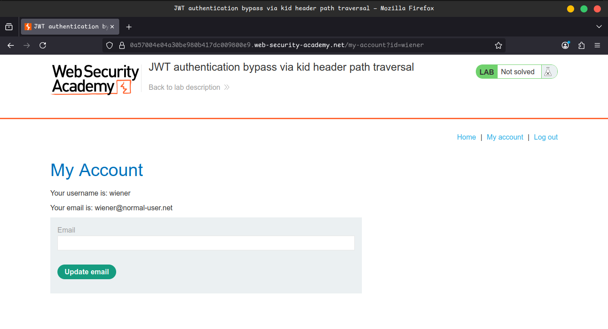
    
    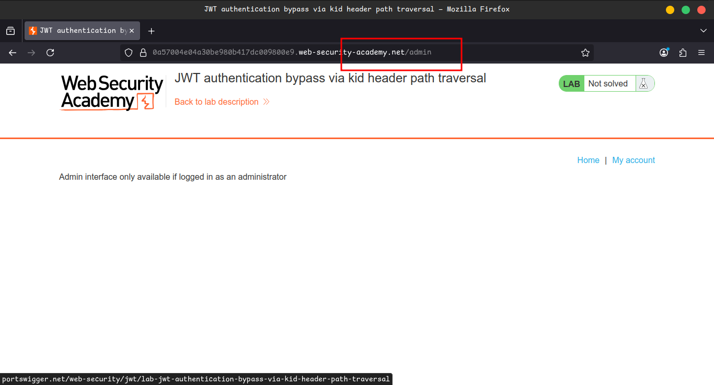
    
    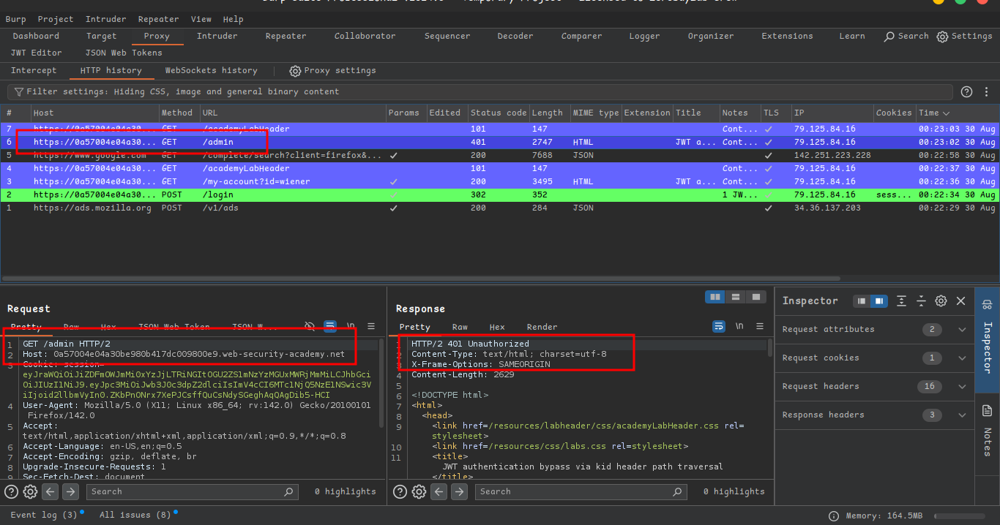
    
    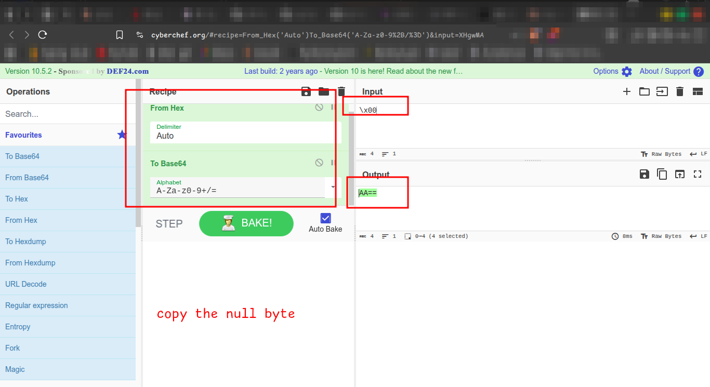
    

---

## ✍️ Step 2: Modify and Sign the JWT

1. Go back to the `GET /admin` request in Burp Repeater.
2. Switch to the **JWT message editor tab**.
3. 📝 In the **JWT header**, change the `kid` parameter to a path traversal sequence pointing to `/dev/null`:
    
    ```
    ../../../../../../../dev/null
    ```
    
4. In the **JWT payload**, change the `sub` claim to:
    
    ```
    administrator
    ```
    
5. At the bottom, click **Sign** → select the **symmetric key** generated earlier.
    - ✅ Ensure **Don’t modify header** is selected.
6. 🚀 Send the request → You should now have **access to the admin panel**.
    
    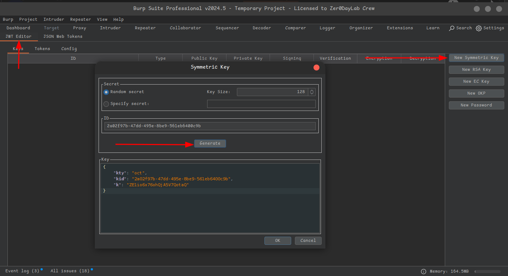
    
    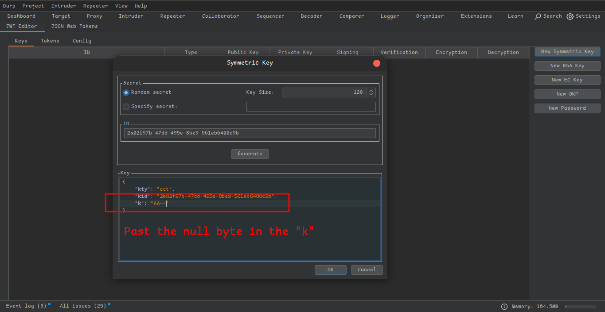
    
    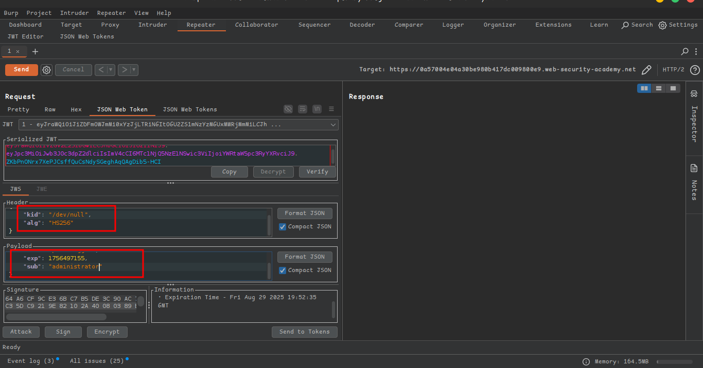
    
    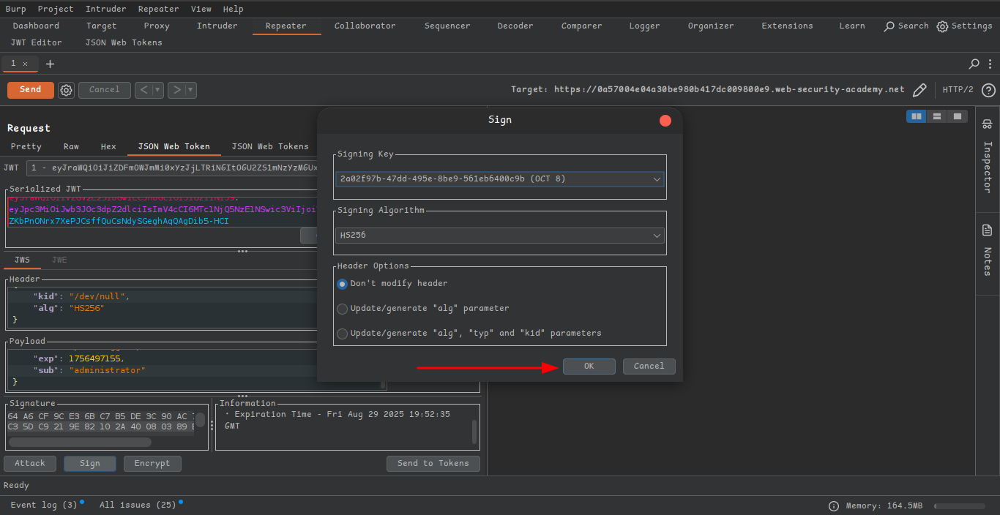
    
    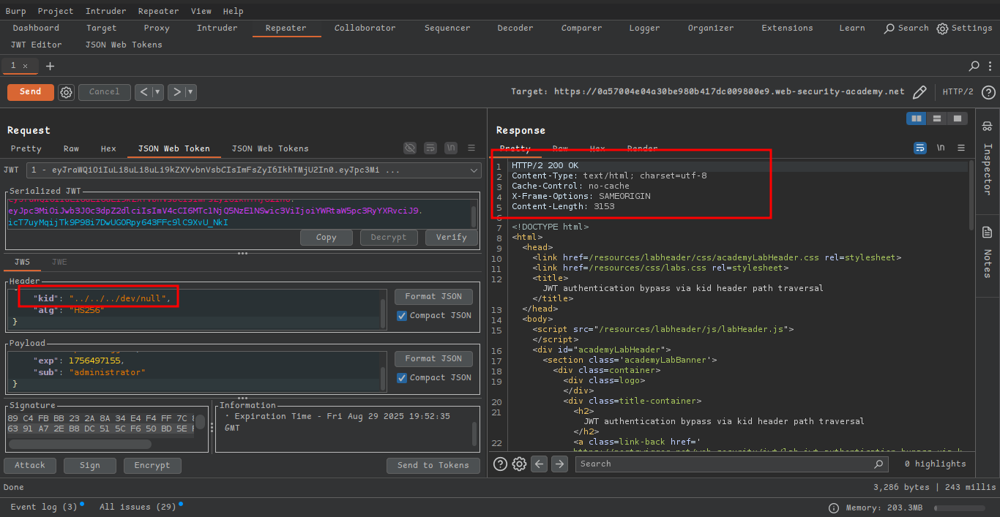
    
    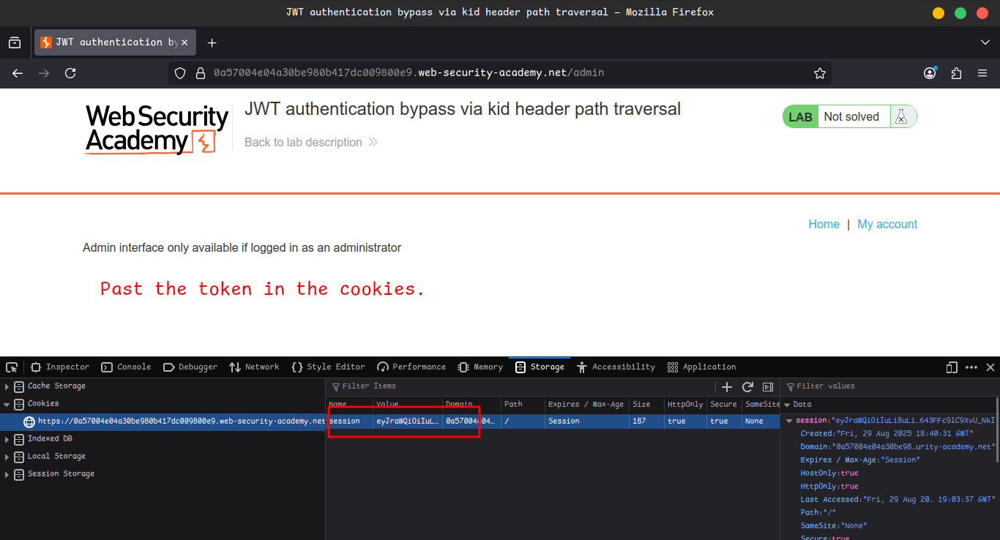
    

---

## 🗑️ Step 3: Delete User carlos

1. In the response, locate the URL for deleting Carlos:
    
    ```
    /admin/delete?username=carlos
    ```
    
2. Send a request to this endpoint.
3. 🎉 The lab is solved!
    
    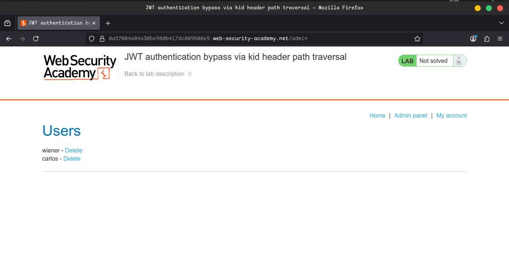
    
    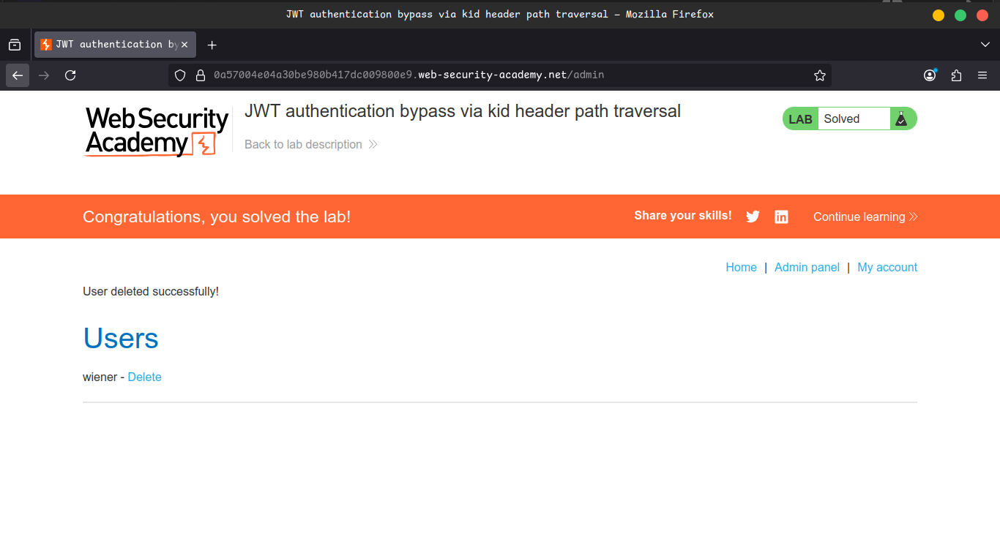
    

---

## 📺 Community Solutions

- ▶️ [YouTube Walkthrough](https://youtu.be/78FIFrOi4Os)