# Lab 07: JWT authentication bypass via algorithm confusion

This lab uses a **JWT-based session mechanism** signed with a **robust RSA key pair**.

⚠️ However, due to **implementation flaws**, it is vulnerable to **algorithm confusion attacks**.

🎯 **Goal**: Obtain the server’s public key → Forge a malicious JWT → Access `/admin` → Delete the user `carlos`.

👤 **Login credentials**:

```
wiener:peter
```

💡 **Tip**: Practice JWTs with **Burp Suite** before attempting.

🔎 **Hint**: The server stores its public key as an **X.509 PEM file**.

---

## ⚙️ Solution

### 🔹 Part 1 - Obtain the Server's Public Key

1. In **Burp**, load the **JWT Editor extension** from the **BApp Store**.
2. Log in with `wiener:peter` and send the **GET /my-account** request to **Burp Repeater**.
3. Change the path to `/admin` → Send request →
    - ✅ Observe: Access is **restricted** to administrators.
4. In the browser, visit:
    
    ```
    /jwks.json
    ```
    
    - Observe: The server exposes a **JWK Set** containing a **single public key**.
5. Copy the **JWK object** inside the `keys` array (⚠️ do not copy surrounding brackets).
    
    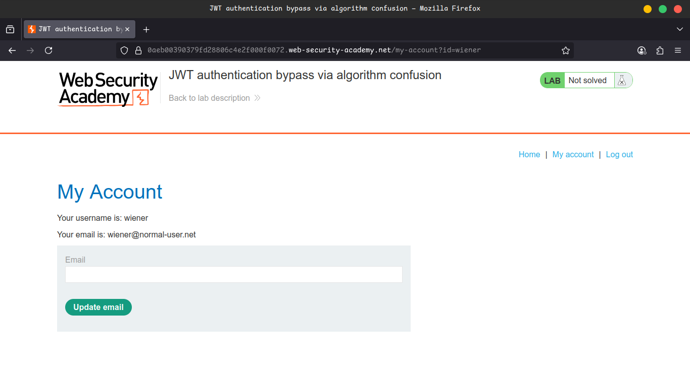
    
    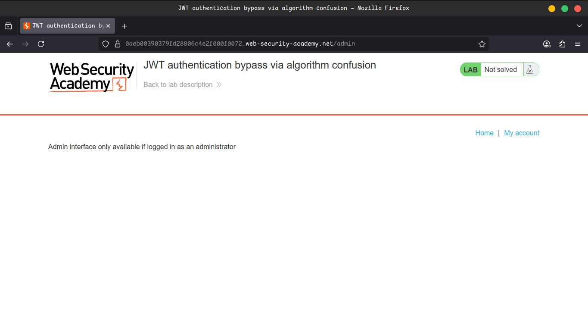
    
    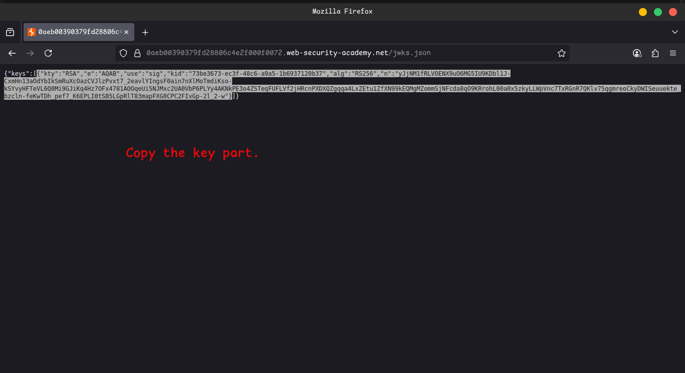
    

---

### 🔹 Part 2 - Generate a Malicious Signing Key

1. In Burp → **JWT Editor Keys tab** → Click **New RSA Key**.
    - Select **JWK option** → Paste the copied JWK → Save.
2. Right-click the new key → **Copy Public Key as PEM**.
3. In **Decoder tab** → Base64 encode this PEM → Copy the string.
4. Go back to **JWT Editor Keys** → Click **New Symmetric Key**.
    - Click **Generate** (creates JWK format).
    - Replace the value of the **`k` property** with the **Base64-encoded PEM** you just created.
    - Save the key.
    
    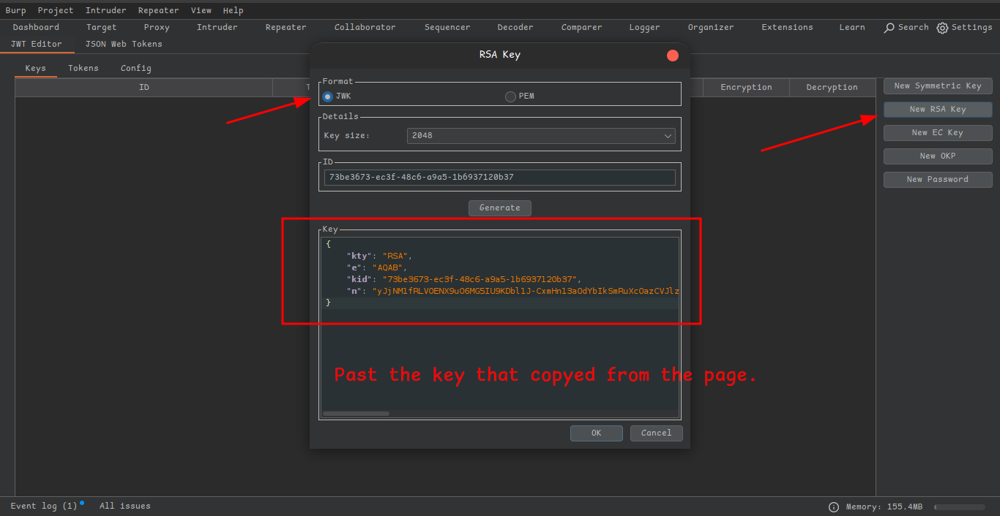
    
    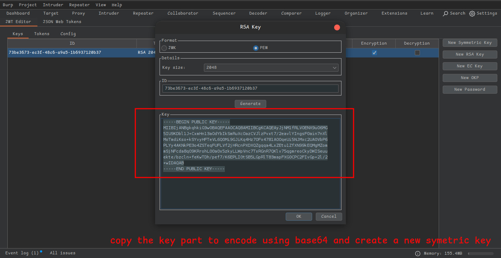
    
    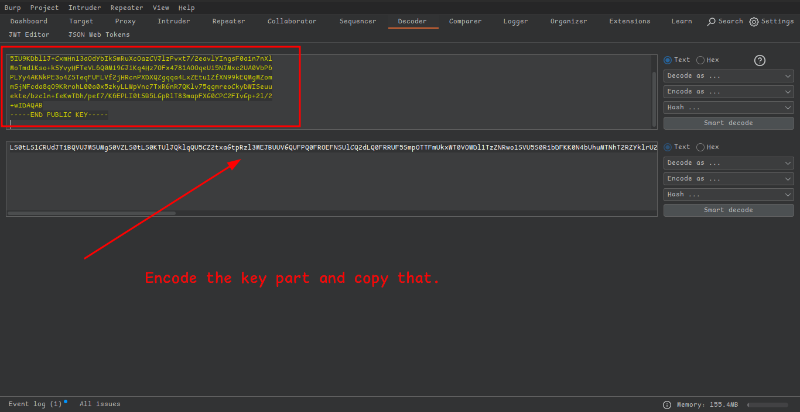
    
    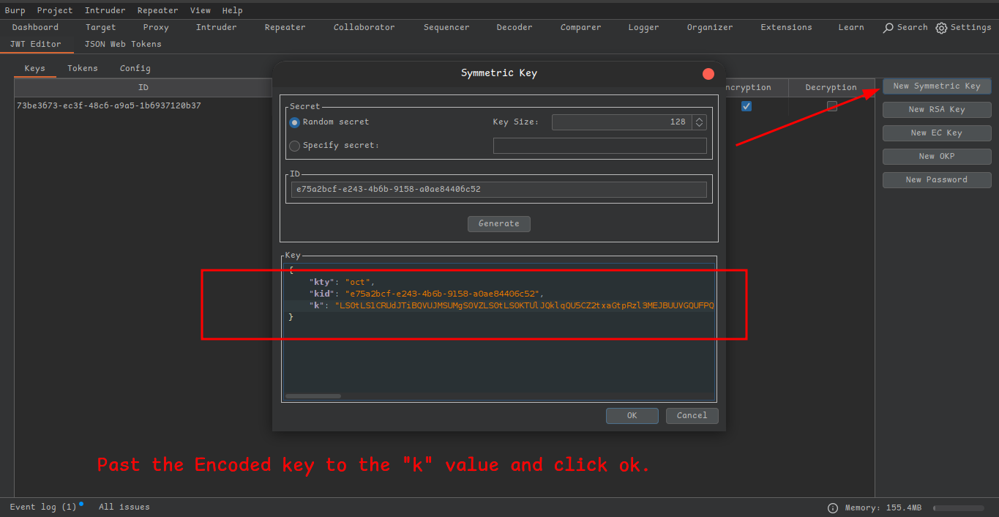
    

---

### 🔹 Part 3 - Modify and Sign the Token

1. In Burp Repeater → open **GET /admin** request → Switch to **JWT tab**.
2. In the **JWT header**:
    - Change `"alg": "RS256"` → `"alg": "HS256"`.
3. In the **payload**, modify:
    
    ```json
    "sub": "administrator"
    ```
    
4. At the bottom → Click **Sign** → Select the **symmetric key** generated earlier.
    - ✅ Ensure **Don't modify header** is checked → Click **OK**.
5. Send the modified request → 🎉 You now have **admin panel access**.
6. In the response, locate the delete endpoint:
    
    ```
    /admin/delete?username=carlos
    ```
    
    Send this request → 🏆 **Lab solved!**
    
    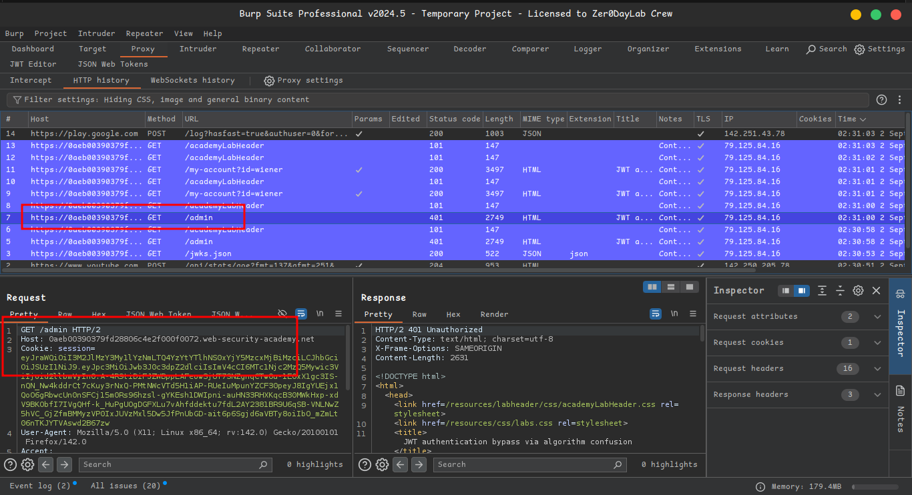
    
    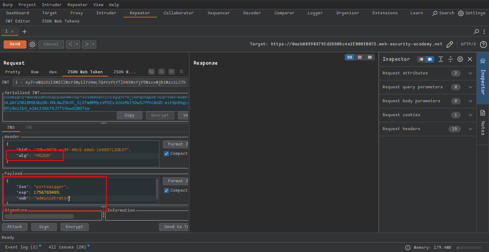
    
    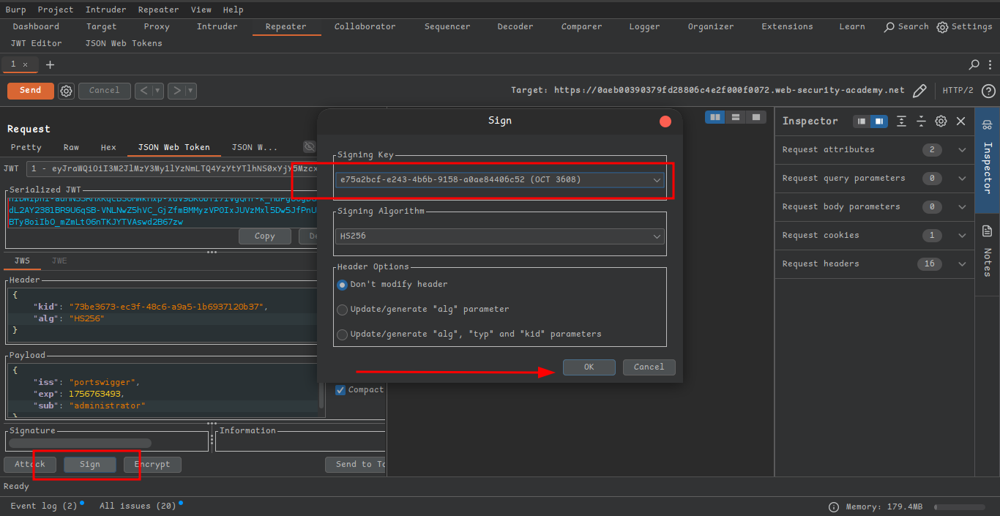
    
    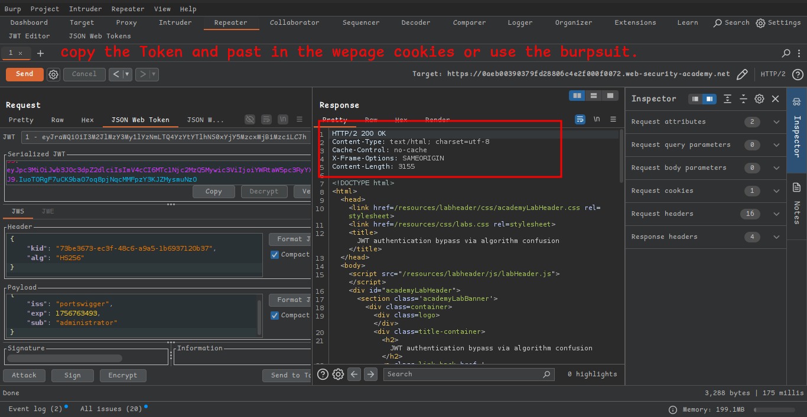
    
    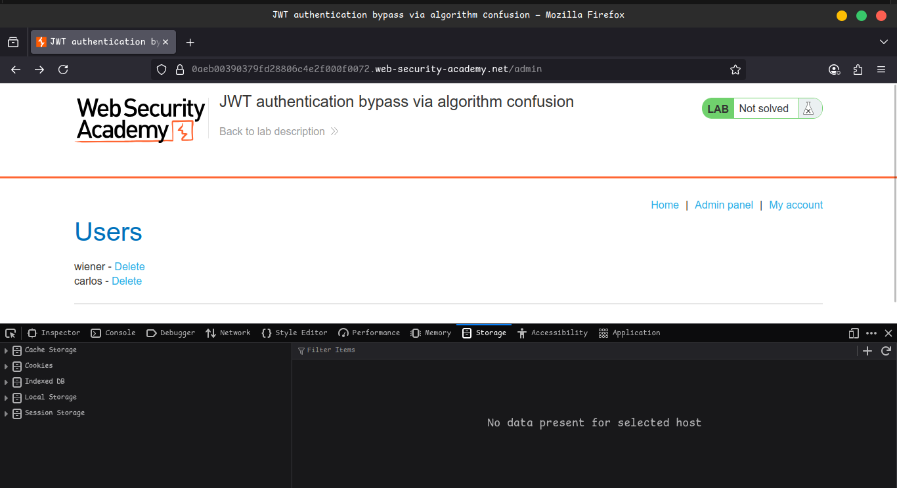
    
    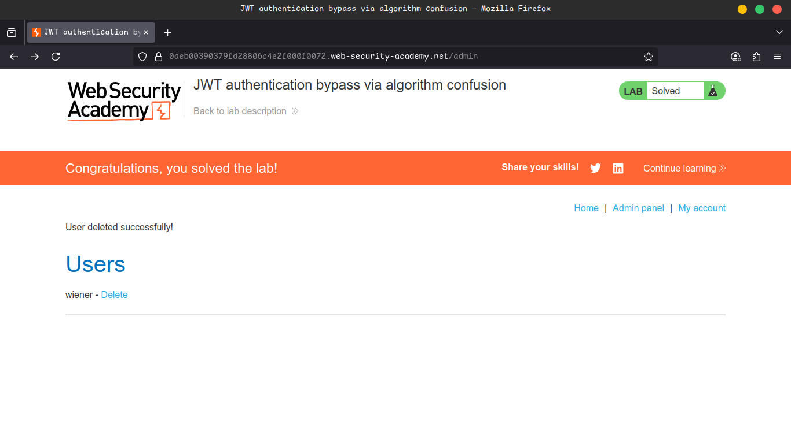
    

---

## 🎥 Community Solutions

- 🔗 [YouTube Walkthrough](https://youtu.be/d-X9CmpnJdE)