# Lab 08: JWT authentication bypass via algorithm confusion with no exposed key

This lab uses a **JWT-based session mechanism** signed with a **robust RSA key pair**.

⚠️ Due to **implementation flaws**, it is vulnerable to **algorithm confusion attacks**.

🎯 **Goal**: Obtain the server’s public key → Forge a malicious JWT → Access `/admin` → Delete user **carlos**.

👤 **Login credentials**:

```
wiener:peter
```

💡 **Tip**: Practice JWTs with **Burp Suite** before attempting.

🛠 **Helper Tool**: A simplified version of `jwt_forgery.py` is provided (see **Deriving public keys from existing tokens**).

🔎 **Hint**: The server stores its public key as an **X.509 PEM file**.

---

## ⚙️ Solution

---

## 🔹 Part 1 - Obtain Two JWTs Generated by the Server

1. In **Burp**, load the **JWT Editor extension** from the **BApp Store**.
2. Log in with `wiener:peter` → Send **GET /my-account** to **Burp Repeater**.
3. Modify the path to `/admin` → Send request →
    - ✅ Observe: Access is only allowed for **administrator**.
4. Copy your **JWT session cookie** and save it.
5. **Log out & log in again** → Copy the new JWT session cookie.
    
    👉 You now have **two valid JWTs** generated by the server.
    
    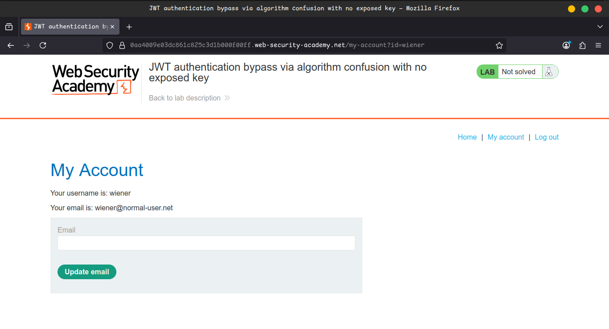
    
    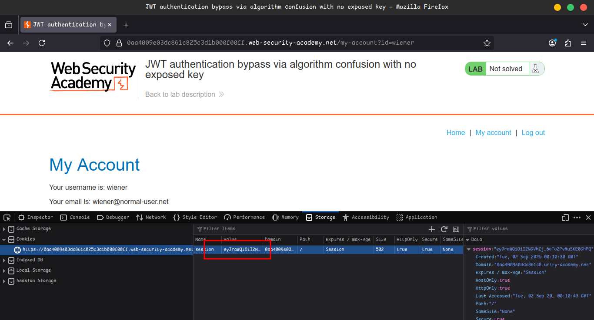
    
    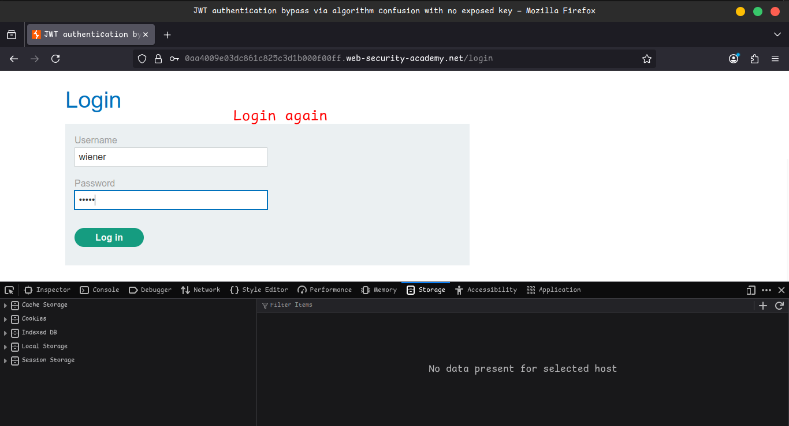
    
    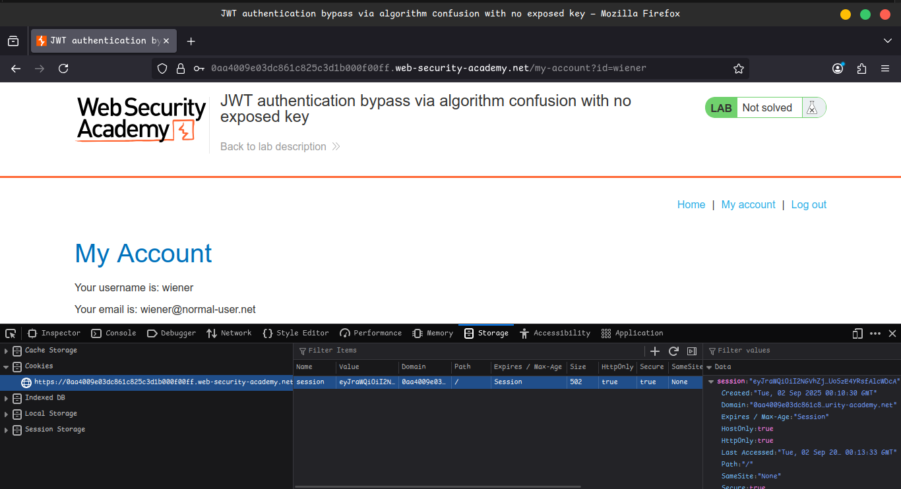
    

---

## 🔹 Part 2 - Brute-force the Server's Public Key

1. Run the following command in your terminal (replace `<token1>` and `<token2>` with your JWTs):
    
    ```bash
    docker run --rm -it portswigger/sig2n <token1> <token2>
    ```
    
    ⚠️ First run may take several minutes (Docker image pulls).
    
2. Output will include one or more values of **n** with:
    - 📜 Base64-encoded public key (**X.509 & PKCS1 formats**)
    - 🛠 Tampered JWT signed with each key
3. Copy the tampered JWT from the **first X.509 entry**.
4. In Burp Repeater:
    - Change path back to `/my-account`.
    - Replace your session cookie with this tampered JWT → Send request.
    
    ✅ **200 response** → Correct X.509 key.
    
    ❌ **302 redirect to /login** → Wrong key → Try next tampered JWT.
    
    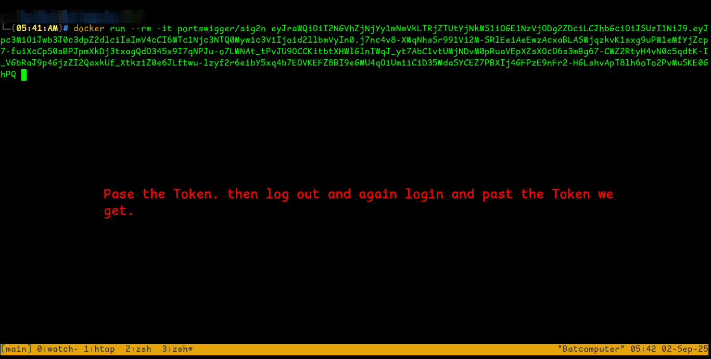
    
    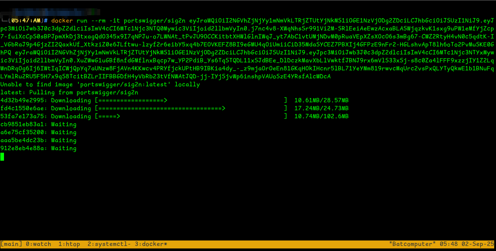
    
    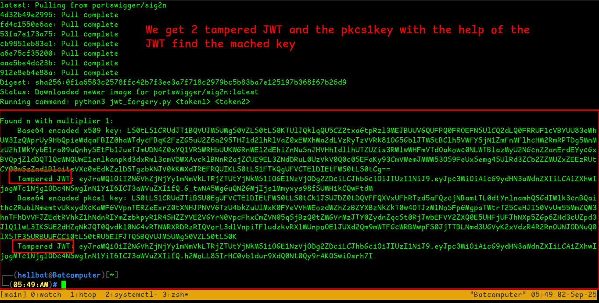
    
    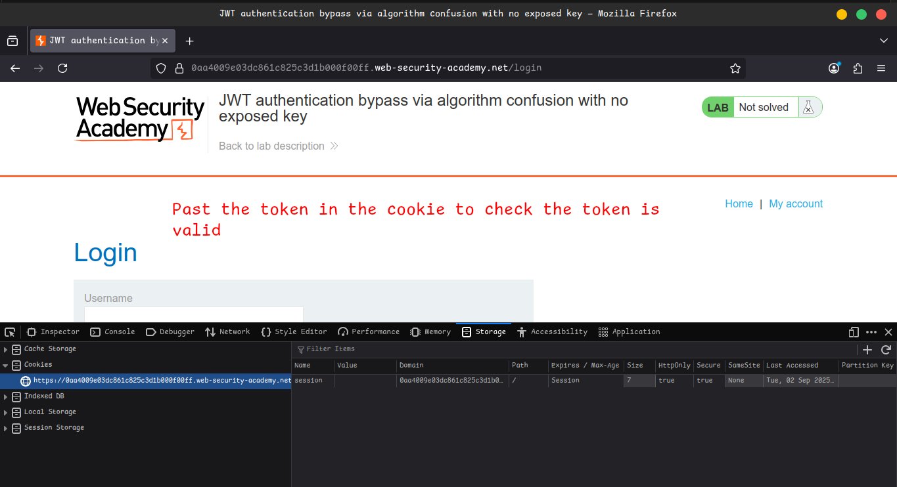
    
    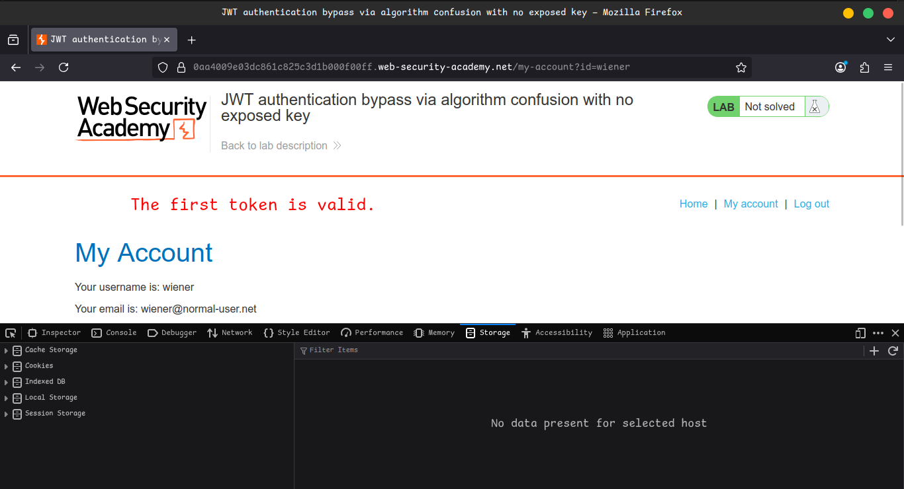
    
    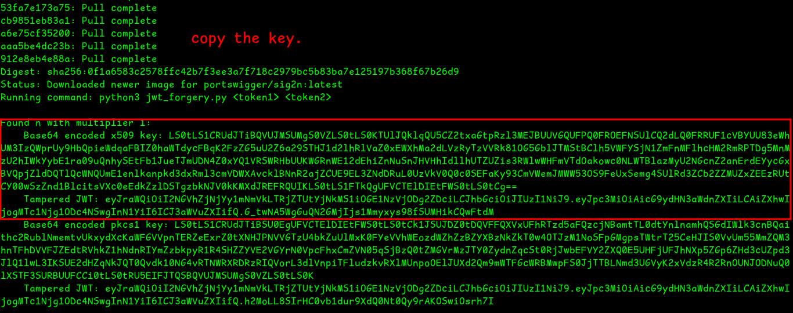
    

---

## 🔹 Part 3 - Generate a Malicious Signing Key

1. From your terminal output → Copy the **Base64-encoded X.509 key** (⚠️ not the tampered JWT).
2. In Burp → **JWT Editor Keys tab** → Click **New Symmetric Key**.
3. In the dialog → Click **Generate** (creates JWK format).
4. Replace the value of the **`k` property** with the **Base64-encoded X.509 key** you copied.
5. Save the key.
    
    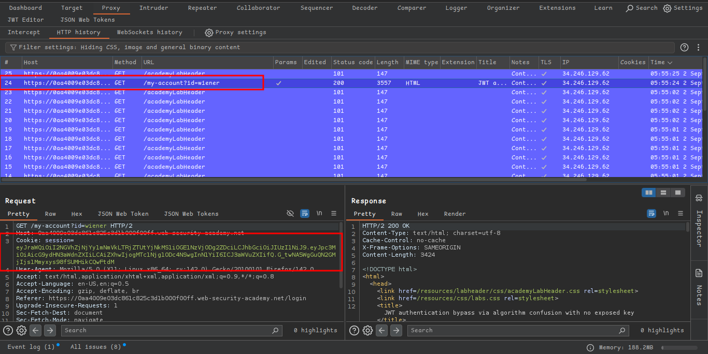
    
    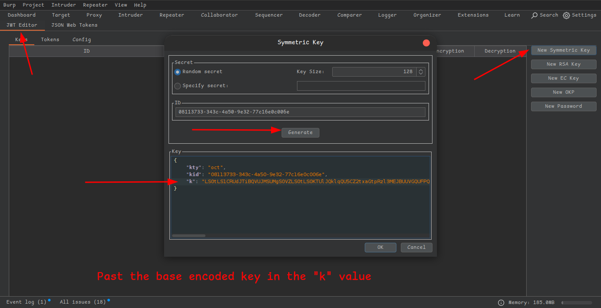
    

---

## 🔹 Part 4 - Modify and Sign the Token

1. In Burp Repeater → Change path to `/admin`.
2. Switch to the **JSON Web Token tab**.
3. In the header:
    
    ```json
    "alg": "HS256"
    ```
    
4. In the payload, modify:
    
    ```json
    "sub": "administrator"
    ```
    
5. At the bottom → Click **Sign** → Select the **symmetric key** you created.
    - ✅ Ensure **Don't modify header** is checked → Click **OK**.
6. Send the modified request → 🎉 You now have **admin access**.
7. In the response, find and send the delete request:
    
    ```
    /admin/delete?username=carlos
    ```
    
    🏆 **Lab Solved!**
    
    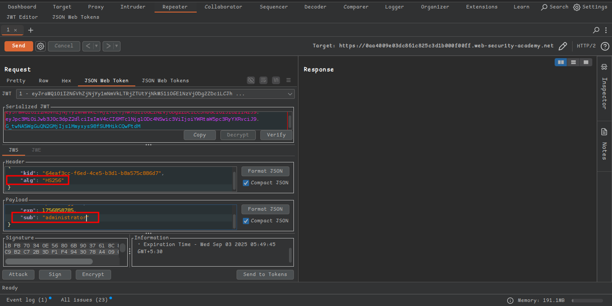
    
    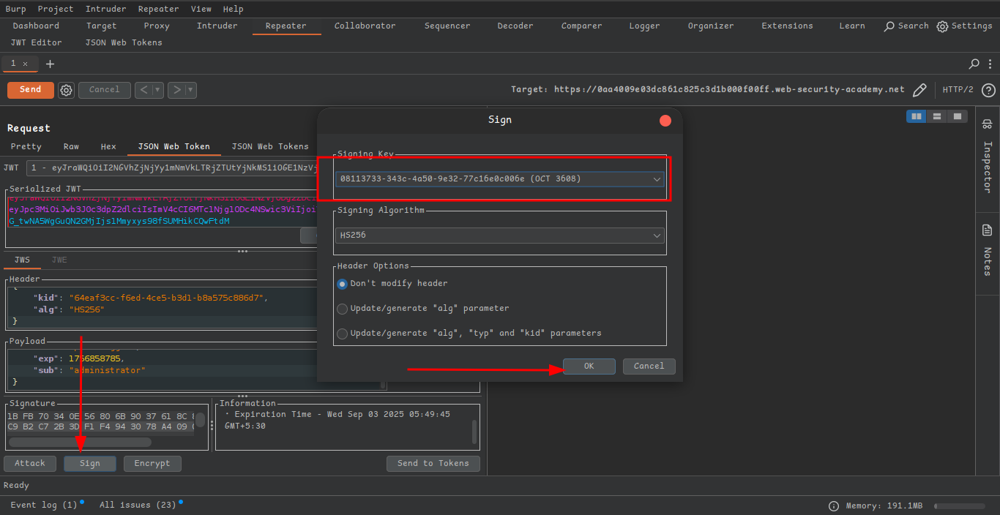
    
    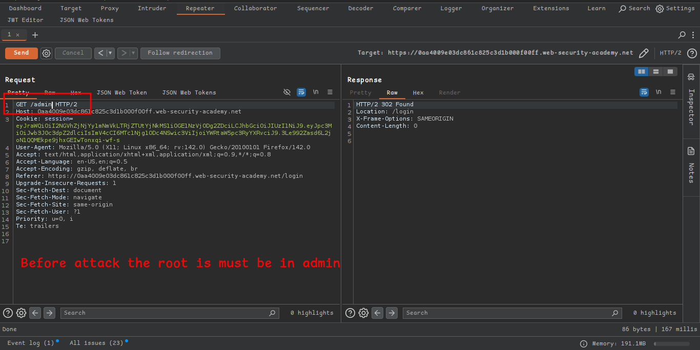
    
    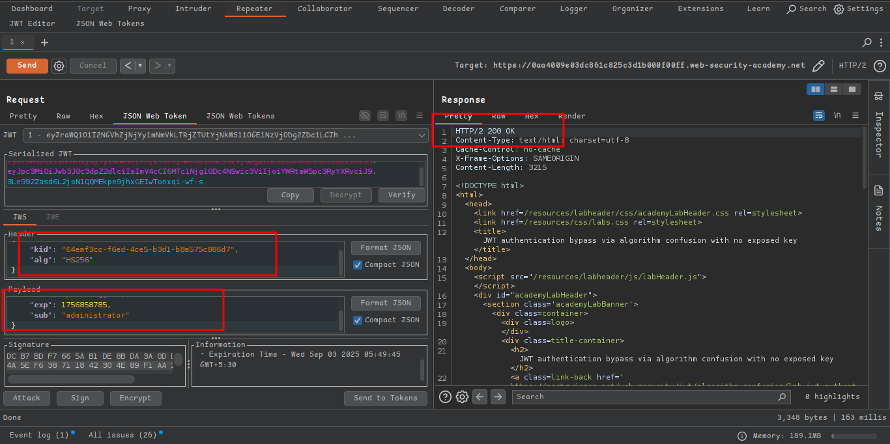
    
    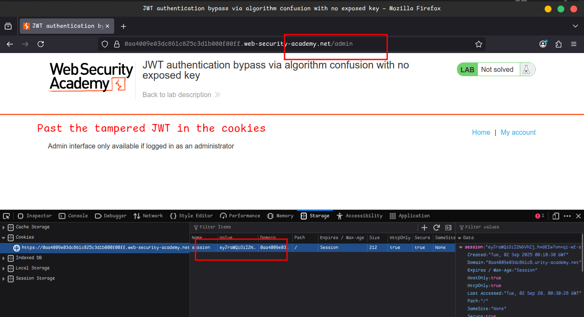
    
    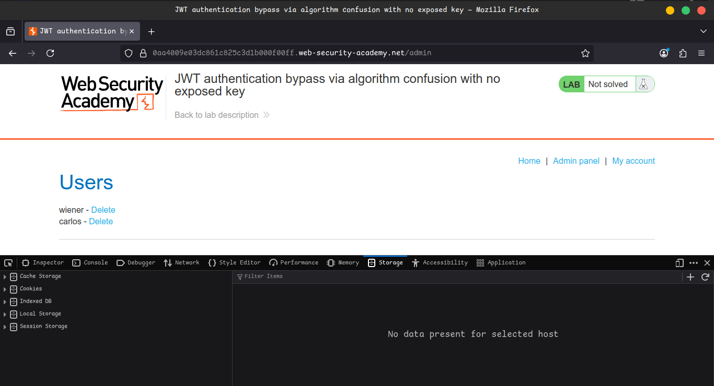
    
    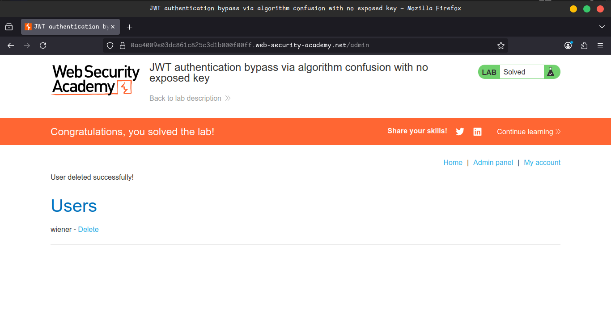
    

---

## 🎥 Community Solutions

- 🔗 [YouTube Walkthrough](https://youtu.be/4roTwhGSWZY)