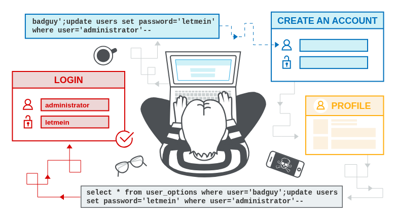

# 22. Second-order SQL injection

## 🛡️ SQL Injection Types: First-order vs Second-order

### 🔹 First-order SQL Injection

First-order SQL injection occurs when the application processes user input from an HTTP request and incorporates the input into a SQL query in an **unsafe way**.

---

### 🔸 Second-order SQL Injection

Second-order SQL injection occurs when the application takes user input from an HTTP request and **stores it for future use**. This is usually done by placing the input into a **database**, but no vulnerability occurs at the point where the data is stored.

Later, when handling a different HTTP request, the application retrieves the stored data and incorporates it into a SQL query in an **unsafe way**.

> 💡 For this reason, second-order SQL injection is also known as stored SQL injection.
> 

Second-order SQL injection often occurs in situations where **developers are aware of SQL injection vulnerabilities**, and so **safely handle the initial placement** of the input into the database.

However, when the data is **later processed**, it is **deemed to be safe**, since it was previously placed into the database safely.

At this point, the data is handled in an **unsafe way**, because the developer **wrongly deems it to be trusted**.