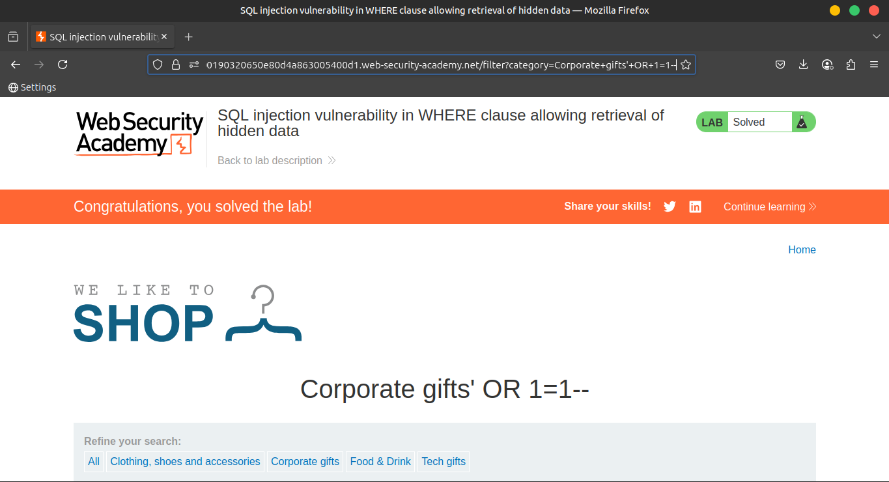

# Lab 1: SQL injection vulnerability in WHERE clause allowing retrieval of hidden data

This lab contains a **SQL injection vulnerability** in the

🗂️ **product category filter**.

🧩 When the user selects a category, the application carries out a **SQL query** like the following:

```
SELECT * FROM products WHERE category = 'Gifts' AND released = 1
```

### 🎯 **Objective**

To **solve the lab**, perform a **SQL injection attack** that causes

the application to **display one or more unreleased products**.

---

💡 **Tip:**

By injecting SQL code that manipulates the `released` condition, you can bypass the filter and reveal hidden products. Let me know if you'd like help crafting the payload or seeing example solutions.

### **Solution**

### 🛠️ **1. Use Burp Suite to Intercept the Request**

Launch **Burp Suite** and intercept the request that sets the

🗂️ **product category filter**.

---

### ✏️ **2. Modify the `category` Parameter**

Change the `category` parameter to the following value:

```sql
'+OR+1=1--
```

🧨 This injects a SQL payload that **bypasses the filter**, causing the query to return **all products**, including unreleased ones.

---

### 📄 **3. Submit the Request**

✅ Submit the modified request.

🔍 **Verify** that the response now contains **one or more unreleased products**.



---

### **Community solutions**

> [https://youtu.be/jTHz9Rz7oAo](https://youtu.be/jTHz9Rz7oAo)
>