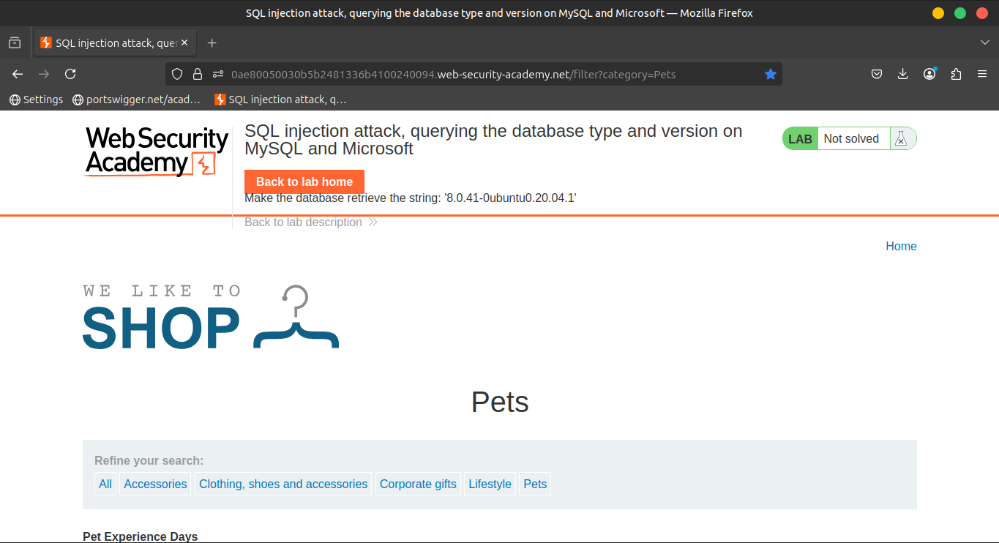
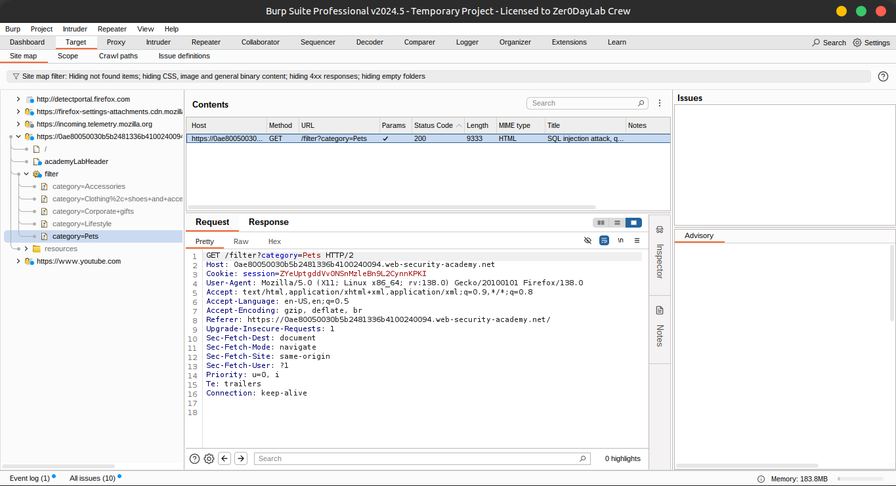
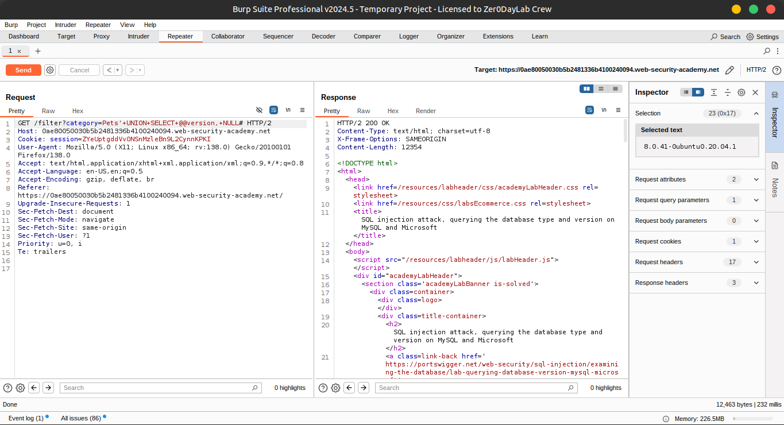
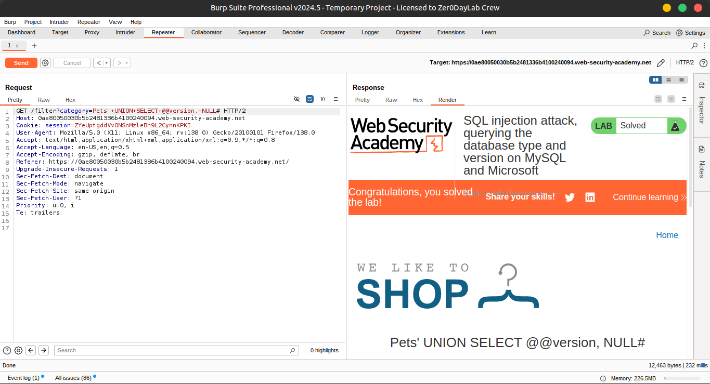
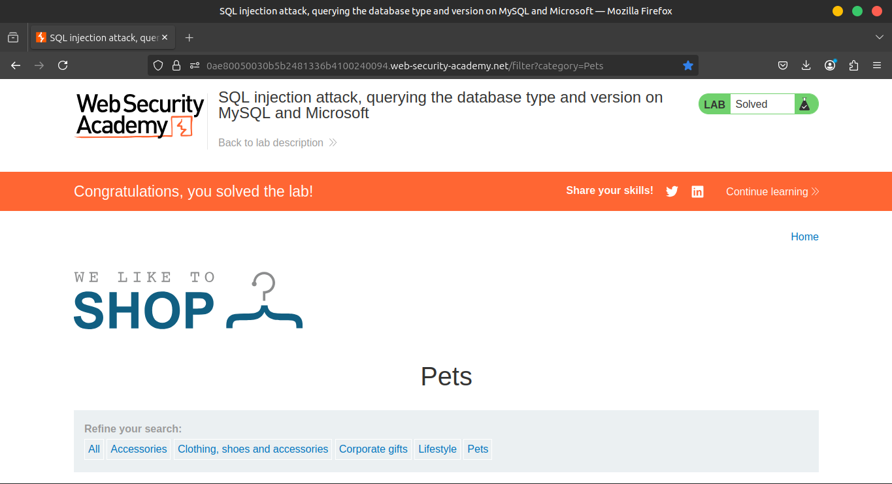

# Lab 7: SQL injection attack, querying the database type and version on MySQL and Microsoft

### 🧪 Lab Overview

This lab contains a **SQL injection vulnerability** in the **product category filter**.

You can exploit this flaw by performing a **UNION-based SQL injection** to retrieve the results from an injected query.

🎯 **Objective:**

Display the **database version string**.

### **Solution**

### 1️⃣ Intercept the Request

Use **Burp Suite** to **intercept and modify** the request that sets the product category filter.

---



### 2️⃣ Identify Columns and Data Types

Determine the number of columns returned by the SQL query and which of them support **text data**.

💡 Use this **payload** in the `category` parameter:

```sql
'+UNION+SELECT+'abc','def'#
```



✔️ This confirms that the query is returning **two columns**, both of which can handle **string data**.

### 3️⃣ Display the Database Version

🎯 Use the following SQL injection **payload** to retrieve and display the **database version**:

```sql
'+UNION+SELECT+@@version,+NULL#
```







When successful, this query reveals valuable metadata by displaying the current **DBMS version** in the application's response.

### **Community solutions**

> [https://youtu.be/4UxUpsCZQfI](https://youtu.be/4UxUpsCZQfI)
>