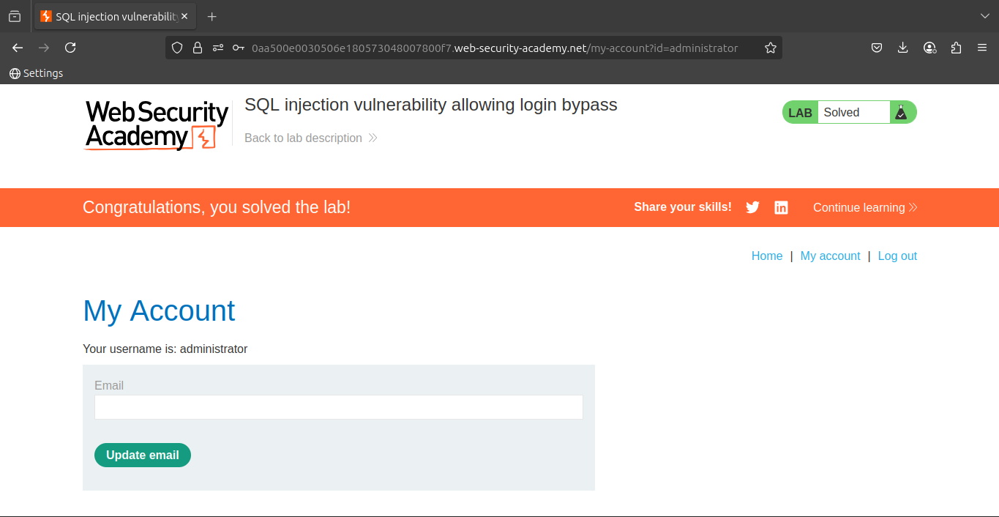

# Lab 2: SQL injection vulnerability allowing login bypass

### 🐞 **Vulnerability Overview**

This lab contains a **SQL injection vulnerability** in the

🔑 **login function**.

---

### 🎯 **Objective**

To **solve the lab**, perform a **SQL injection attack** that logs in to the application as the **`administrator`** user.

### **Solution**

### 🔐 **1. Use Burp Suite to Intercept the Login Request**

Open **Burp Suite** and use it to **intercept** the request sent when submitting the **login form**.

---

### ✏️ **2. Modify the `username` Parameter**

Change the `username` parameter to the following value:

```sql
administrator'—
```

💥 This payload **terminates** the original SQL query and **comments out** the rest, effectively bypassing the password check and logging in as the **administrator**.



### **Community solutions**

> [https://youtu.be/mS0A9e_oy8A](https://youtu.be/mS0A9e_oy8A)
>