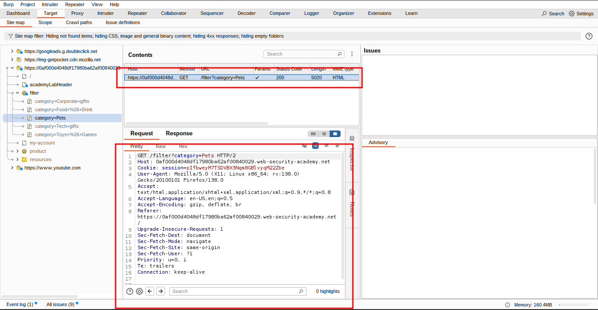
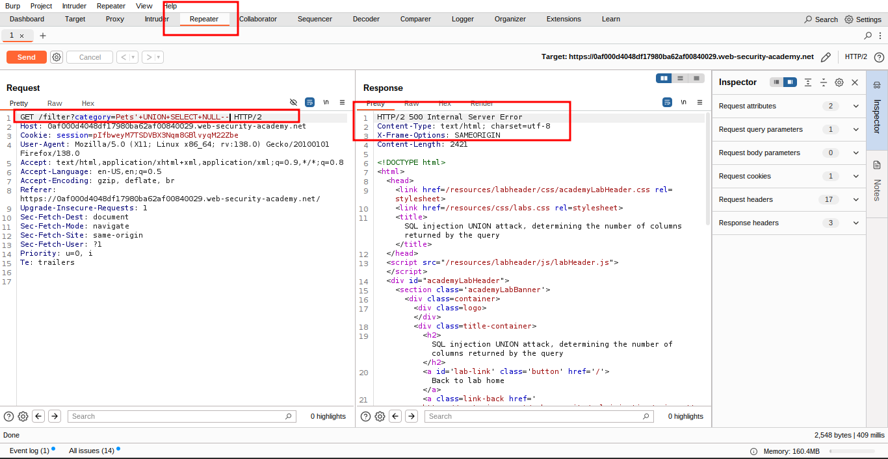
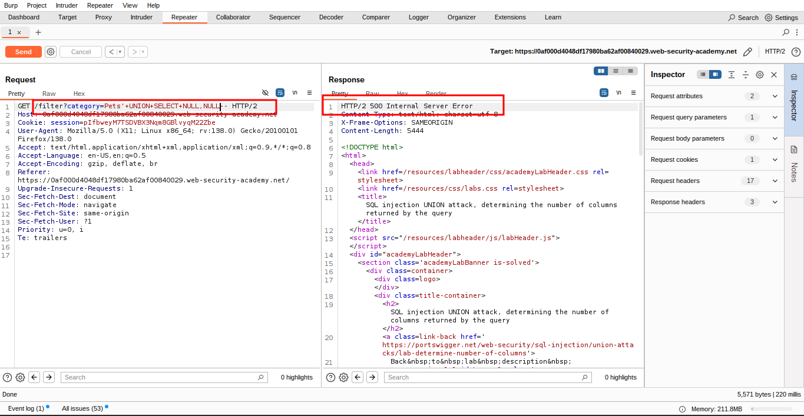
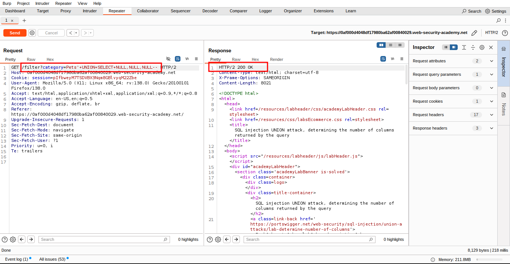
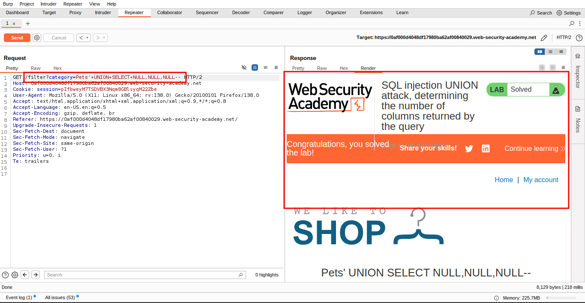

# Lab 3: SQL injection UNION attack, determining the number of columns returned by the query

### 🐞 **Vulnerability Overview**

This lab contains a **SQL injection vulnerability** in the

📂 **product category filter**.

🧩 The results from the SQL query are returned in the application's response, allowing you to use a **UNION attack** to retrieve data from other tables.

---

### 🧭 **Step 1: Determine the Number of Columns**

🎯 The **first step** in performing a UNION attack is to **determine the number of columns** being returned by the query.

You’ll then use this technique in later labs to build a complete attack.

---

### 🔍 **Objective**

To **solve the lab**, perform a **SQL injection UNION attack** that returns an **additional row containing `NULL` values**, helping you identify the correct number of columns.

---

### **Solution**

### 🧰 **1. Use Burp Suite to Intercept the Request**

Intercept the request that sets the **product category filter** using **Burp Suite**.




### ✏️ **2. Modify the `category` Parameter with a UNION SELECT**

Update the `category` parameter to:

```sql
'+UNION+SELECT+NULL—
```



### ➕ **3. Add Another NULL Value**

Modify the `category` parameter again, this time using:

```sql
'+UNION+SELECT+NULL,NULL—
```



### 🔁 **4. Keep Adding NULLs Until the Error Disappears**

Continue this process — adding more `NULL` values — until the error disappears.

✅ When the injection works, the response will include **additional content** containing the NULL values.





### **Community solutions**

> [https://youtu.be/GP6CK03nDvw](https://youtu.be/GP6CK03nDvw)
>