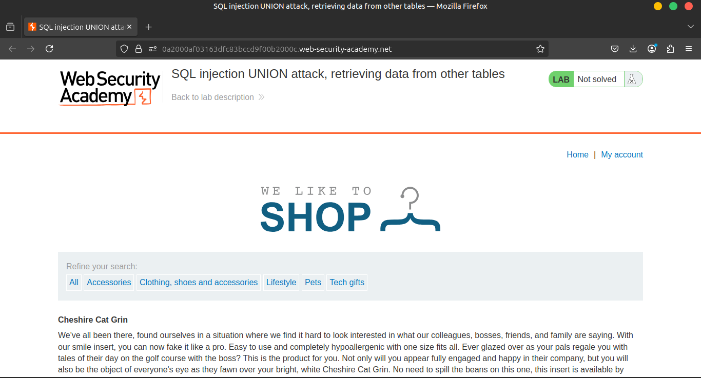
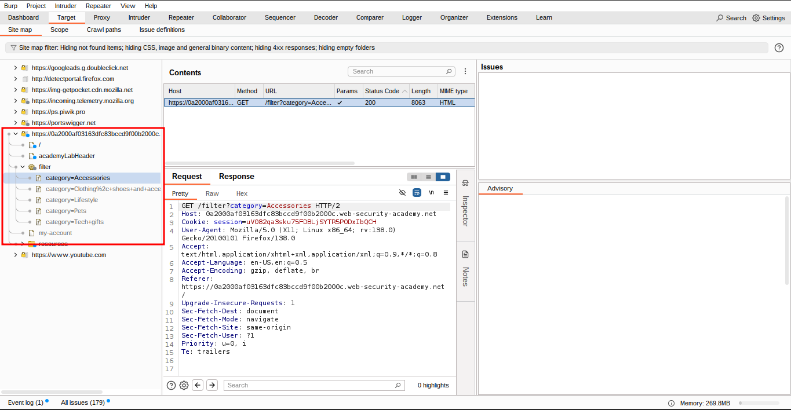
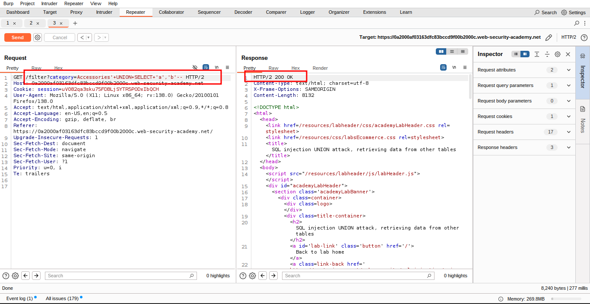
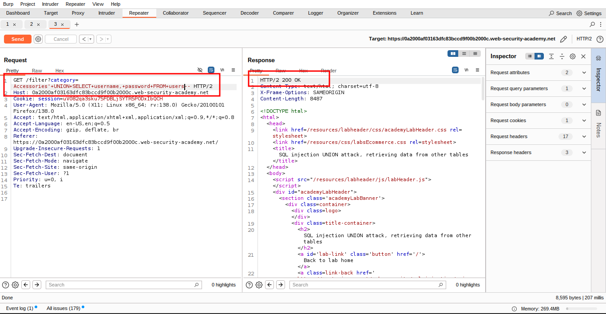
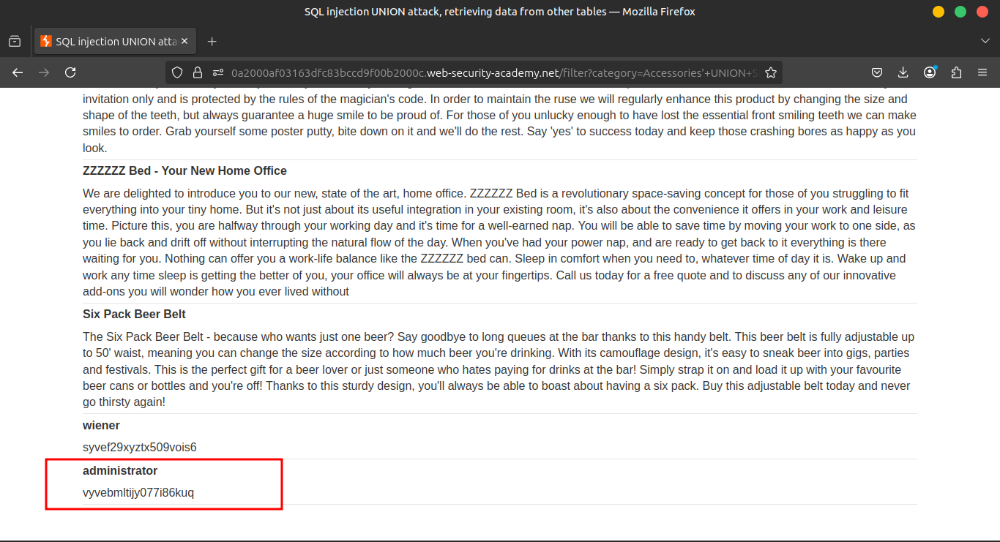
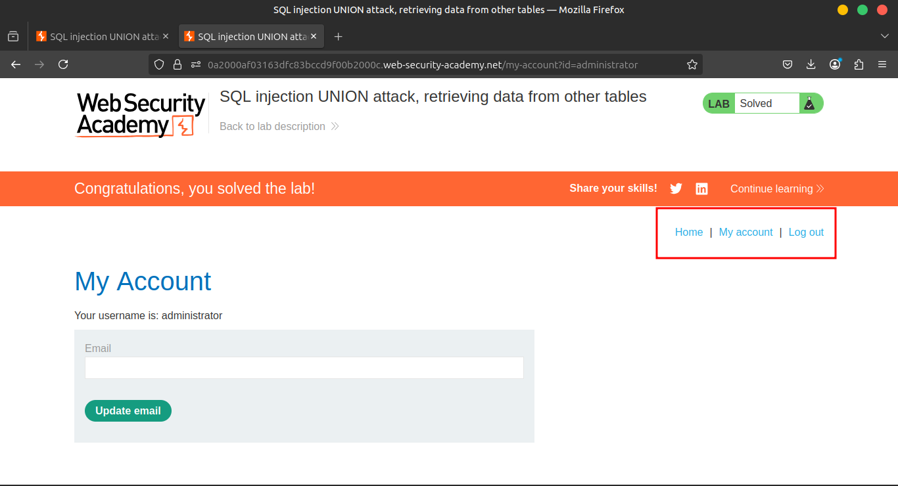

# Lab 5: SQL injection UNION attack, retrieving data from other tables

### 🔍 **Lab Overview**

This lab contains a **SQL injection vulnerability** in the 🗂️ **product category filter**.

📤 The results from the SQL query are returned in the application's response, so you can perform a **UNION attack** to retrieve data from **other tables**.

---

### 🧠 **Goal**

To construct such an attack, you need to combine some of the techniques you learned in **previous labs**.

🛢️ The database contains a table called:

```
users
```

🧩 And this table includes the columns:

- `username`
- `password`

---

### 🎯 **Objective**

To **solve the lab**, perform a **SQL injection UNION attack** that:

1. Retrieves **all usernames and passwords** from the `users` table 🧾
2. Use the obtained credentials to **log in as the `administrator` user** 👨‍💻

---

💡 **Tip:**

Use your knowledge of identifying:

- The correct number of columns,
- Columns compatible with string values,
- Proper syntax for UNION-based injection

to build a payload like:

```sql
'+UNION+SELECT+username,password,NULL+FROM+users--
```

(assuming there are 3 columns and the third can be NULL)

---

🧪 **Final Step**

Log in using the extracted credentials for the user:

```
administrator
```

### **Solution**

### 🛠️ 1. Intercept the Request Using Burp Suite

Use **Burp Suite** to **intercept and modify** the request that sets the **product category filter**.





### 🧪 2. Determine Number and Type of Columns

🧠 Test the **number of columns** and check which ones accept **text data** by using the following payload in the `category` parameter:

```
'+UNION+SELECT+'abc','def'--
```



### 🧾 3. Retrieve Data from `users` Table

🎯 Use the following payload to **extract usernames and passwords** from the `users` table:

```
'+UNION+SELECT+username,+password+FROM+users--
```





### 

### 🧾 4. Verify the Response

✅ Confirm that the **application's response** includes:

- `usernames`
- `passwords`

These credentials can then be used for further testing or solving the lab.



### **Community solutions**

> [https://youtu.be/ushDHoJbwEc](https://youtu.be/ushDHoJbwEc)
>