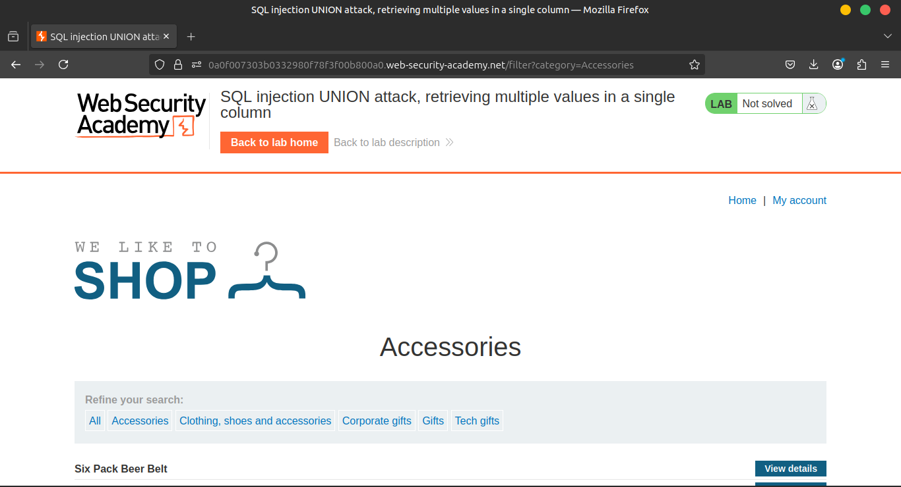
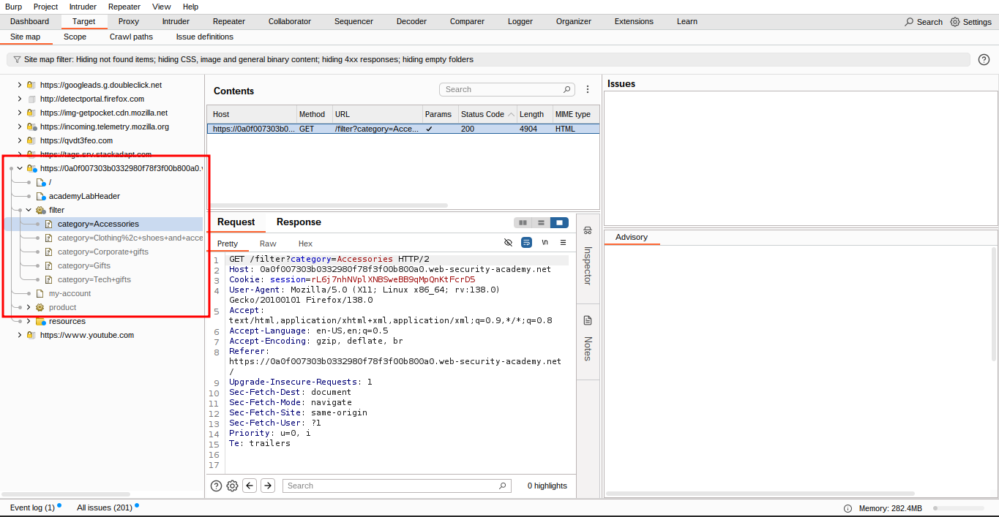
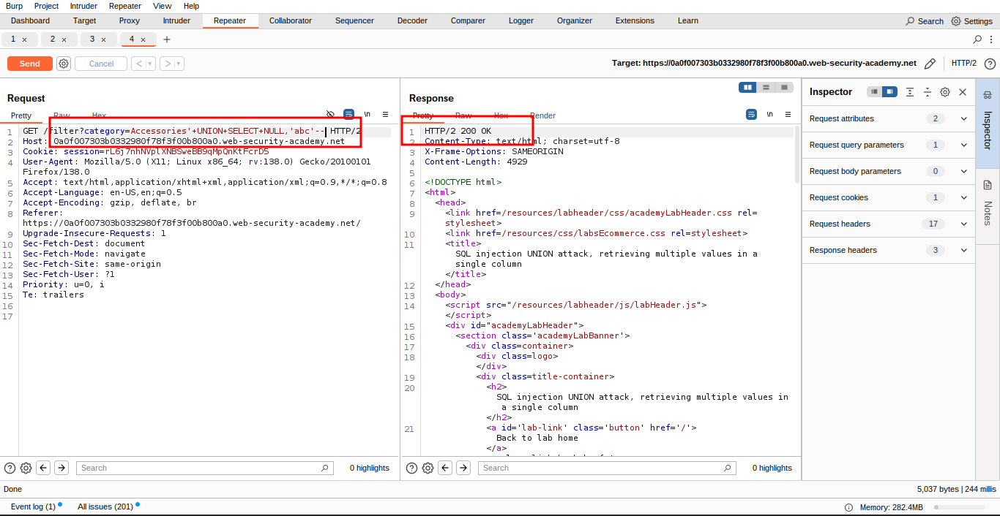
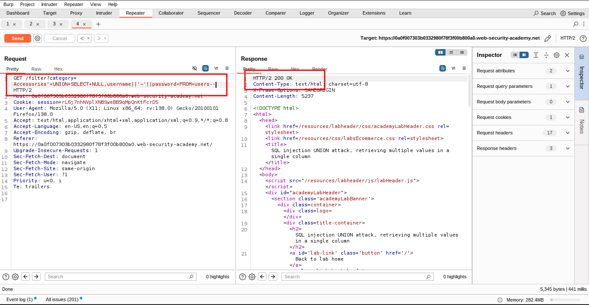
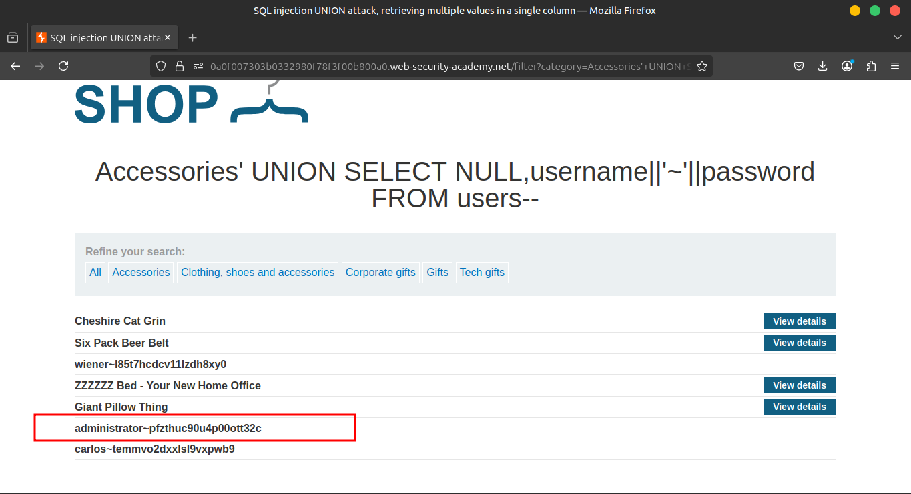
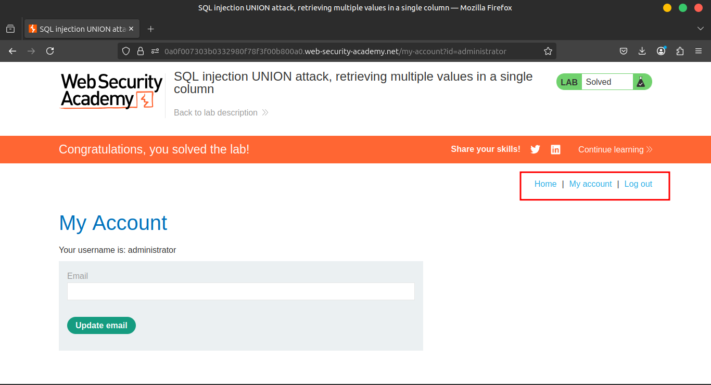

# Lab 6: SQL injection UNION attack, retrieving multiple values in a single column

### 🧪 Lab Description

This lab contains a **SQL injection vulnerability** in the **product category filter**. The results from the query are returned in the application's response, so you can use a **UNION attack** to retrieve data from other tables.

🗄️ The database contains a separate table named:

```
users
```

With the following columns:

- `username`
- `password`

---

### 🎯 Objective

To solve the lab:

1. Perform a **SQL injection UNION attack** that retrieves **all usernames and passwords**.
2. Use the extracted information to **log in as the `administrator` user**.

---

### 🧰 Tips

- Use tools like **Burp Suite** to intercept and manipulate the request payloads.
- Begin by determining the **number of columns** and **which ones support string data**.
- Construct the correct UNION payload to exfiltrate the `username` and `password` data.

### **Solution**

### 🛠️ Step-by-Step Instructions

### 1️⃣ Use Burp Suite to intercept and modify the request that sets the **product category filter**.





### 2️⃣ Determine the number of columns being returned and which columns support text 🧩

🧪 Use this payload in the `category` parameter:

```sql
'+UNION+SELECT+NULL,'abc'--
```

✔️ This helps confirm that the query returns **two columns**, and only **one** of them supports **string data**.



3. Use the following payload to retrieve the contents of the `users` table:

### 3️⃣ Use the following UNION payload to extract data from the `users` table 📤

```sql
'+UNION+SELECT+NULL,username||'~'||password+FROM+users--
```

📌 This concatenates the `username` and `password` with a tilde `~` delimiter.



4. Verify that the application's response contains usernames and passwords.



### 4️⃣ ✅ Verify that the application's response contains **usernames and passwords**

Once confirmed, use the credentials to log in as `administrator` and complete the lab! 🔐



### **Community solutions**

> [https://youtu.be/lu_8CT0JwZs](https://youtu.be/lu_8CT0JwZs)
>