# Lab: Blind SQL injection with conditional responses 

This lab contains a blind SQL injection vulnerability. The application uses a tracking cookie for analytics, and performs a SQL query containing the value of the submitted cookie.

The results of the SQL query are not returned, and no error messages are displayed. But the application includes a `Welcome back` message in the page if the query returns any rows.

The database contains a different table called `users`, with columns called `username` and `password`. You need to exploit the blind SQL injection vulnerability to find out the password of the `administrator` user.

To solve the lab, log in as the `administrator` user.

### Hint

You can assume that the password only contains lowercase, alphanumeric characters. 

### **Solution**

1. Visit the front page of the shop, and use Burp Suite to intercept and modify the request containing the `TrackingId` cookie. For simplicity, let's say the original value of the cookie is `TrackingId=xyz`.

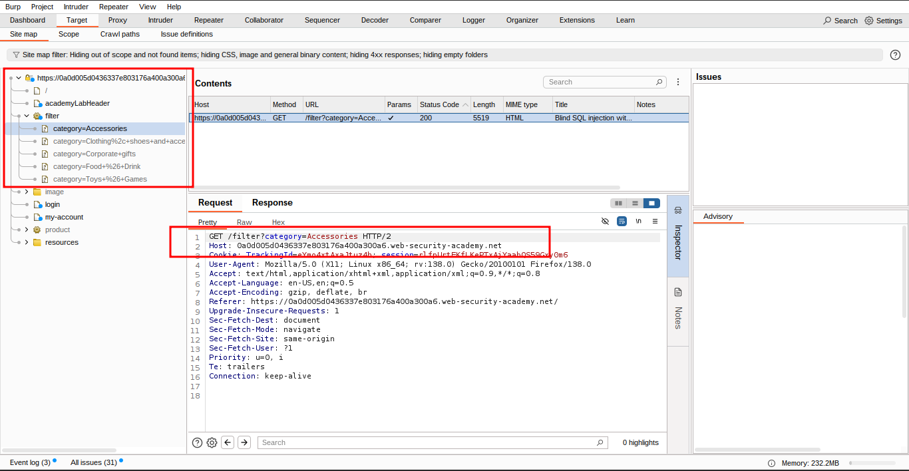

2. Modify the `TrackingId` cookie, changing it to: `TrackingId=xyz' AND '1'='1` Verify that the `Welcome back` message appears in the response.

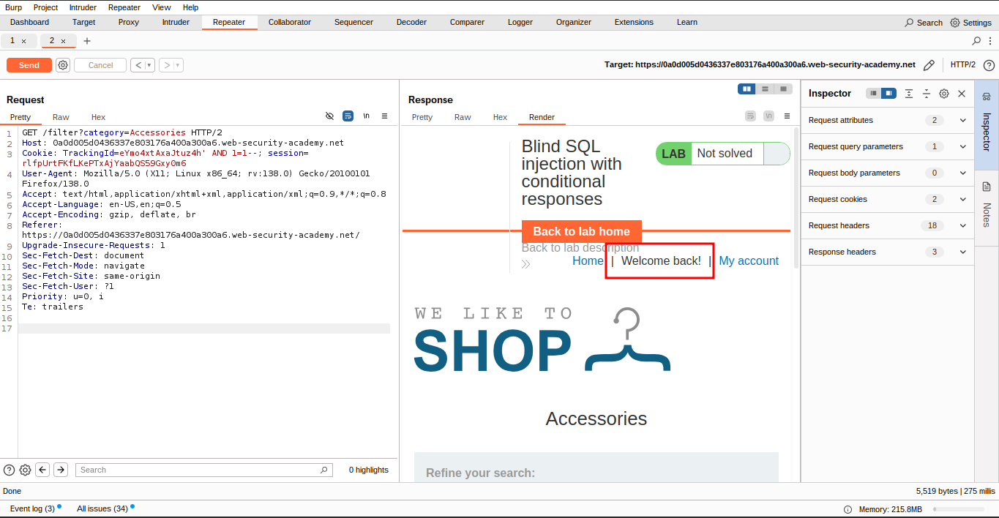

3. Now change it to: `TrackingId=xyz' AND '1'='2`Verify that the `Welcome back` message does not appear in the response. This demonstrates how you can test a single boolean condition and infer the result.

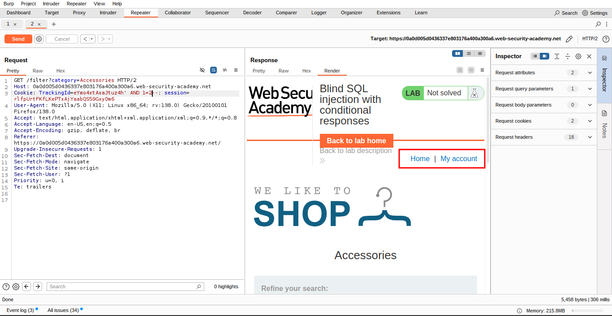

4. Now change it to: 

```sql
TrackingId=xyz' AND (SELECT 'a' FROM users LIMIT 1)='a 
```

Verify that the condition is true, confirming that there is a table called `users`.

5. Now change it to: 

```sql
TrackingId=xyz' AND (SELECT 'a' FROM users WHERE username='administrator')='a 
```

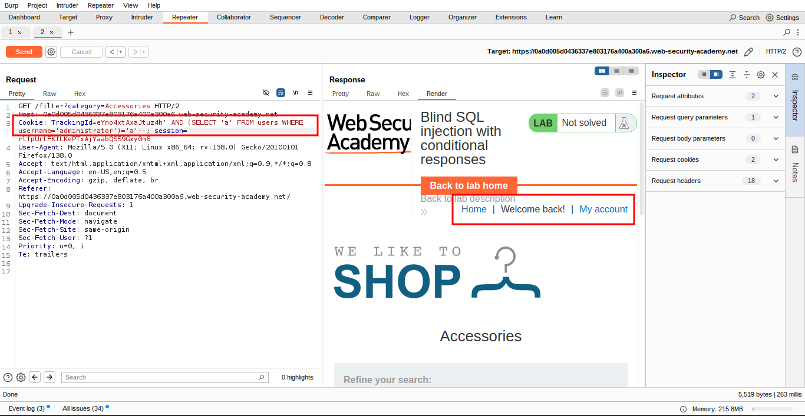

Verify that the condition is true, confirming that there is a user called `administrator`.

6. The next step is to determine how many characters are in the password of the `administrator` user. To do this, change the value to: 

```sql
TrackingId=xyz' AND (SELECT 'a' FROM users WHERE username='administrator' AND LENGTH(password)>1)='a
```

This condition should be true, confirming that the password is greater than 1 character in length.

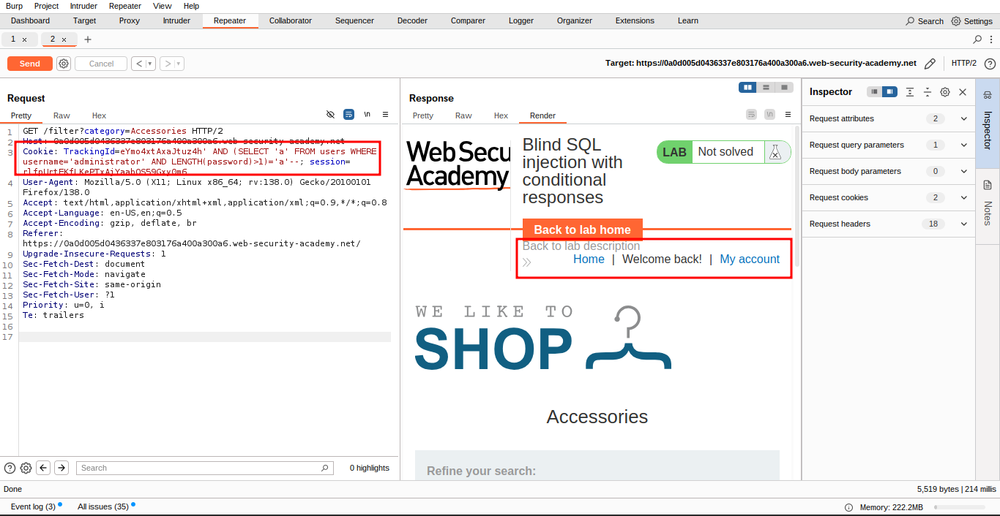

7. Send a series of follow-up values to test different password lengths. Send: 

```sql
TrackingId=xyz' AND (SELECT 'a' FROM users WHERE username='administrator' AND LENGTH(password)>2)='aTrackingId=xyz' AND (SELECT 'a' FROM users WHERE username='administrator' AND LENGTH(password)>3)='a
```

Then send:

And so on. You can do this manually using Burp Repeater, since the length is likely to be short. When the condition stops being true (i.e. when the `Welcome back` message disappears), you have determined the length of the password, which is in fact 20 characters long.

8. After determining the length of the password, the next step is to test the character at each position to determine its value. This involves a much larger number of requests, so you need to
use Burp Intruder. Send the request you are working on to Burp Intruder, using the context menu.


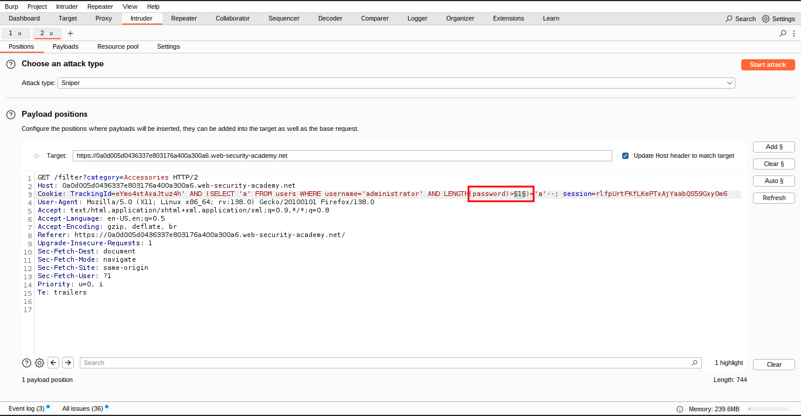

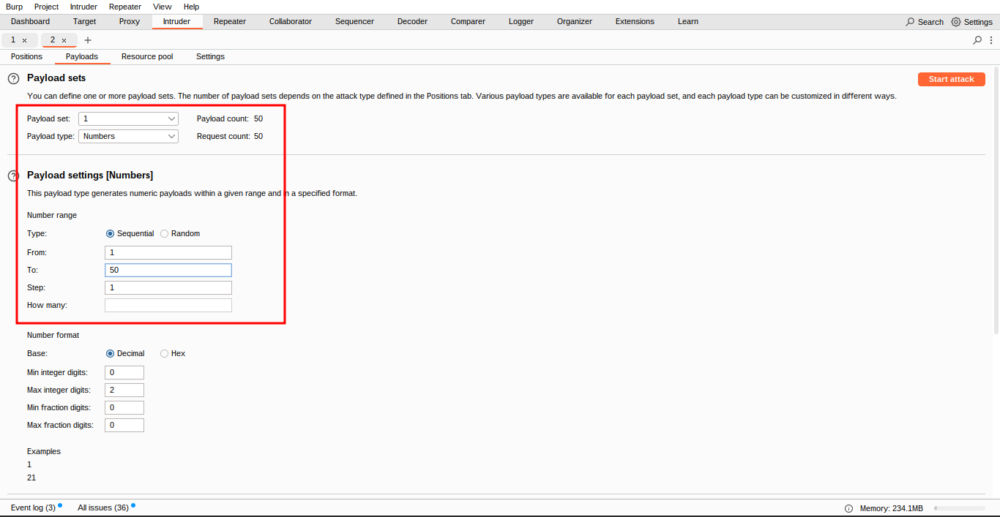

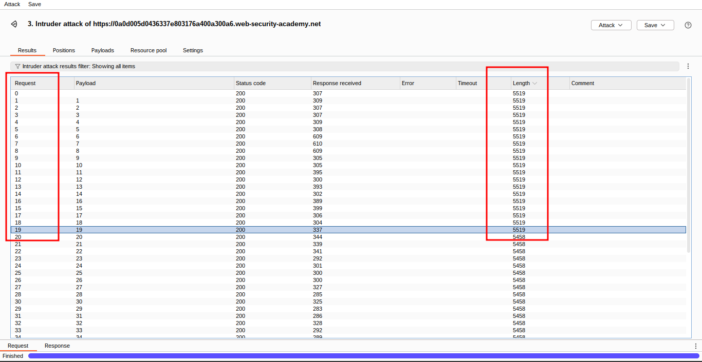

9. In Burp Intruder, change the value of the cookie to: 

```sql
TrackingId=xyz' AND (SELECT SUBSTRING(password,1,1) FROM users WHERE username='administrator')='a
```

This uses the `SUBSTRING()` 
function to extract a single character from the password, and test it against a specific value. Our attack will cycle through each position and possible value, testing each one in turn.

10. Place payload position markers around the final `a` character in the cookie value. To do this, select just the `a`, and click the **Add §** button. You should then see the following as the cookie value (note the payload position markers): 

```sql
TrackingId=xyz' AND (SELECT SUBSTRING(password,1,1) FROM users WHERE username='administrator')='§a§
```

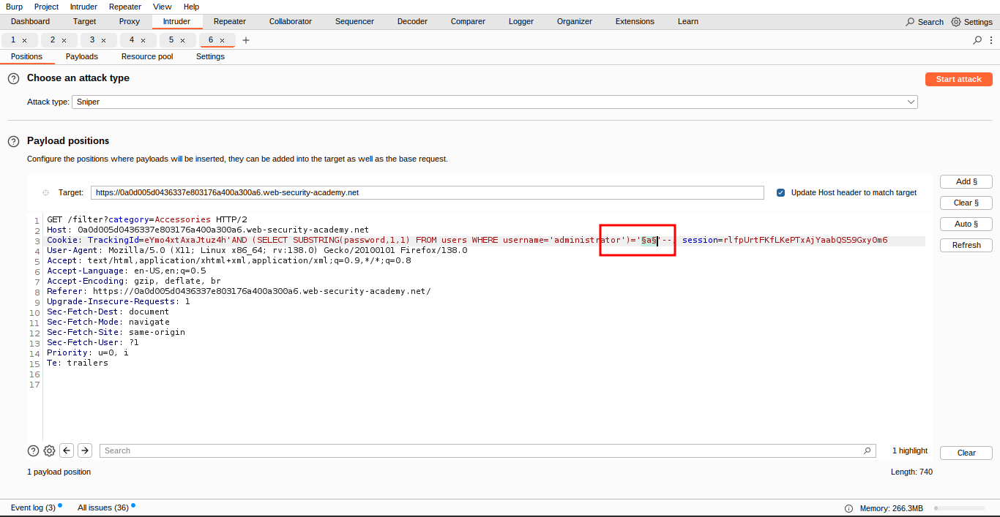

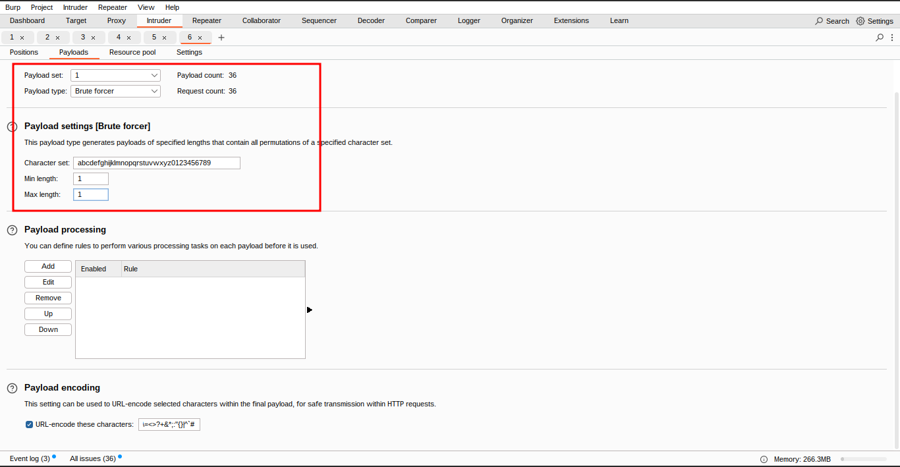

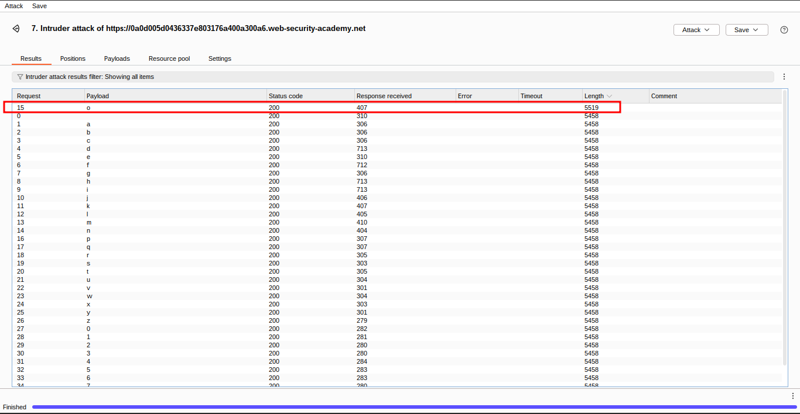


11. To test the character at each position, you'll need to send suitable payloads in the payload position that you've defined. You can assume that the password contains only lowercase
alphanumeric characters. In the **Payloads** side panel, check that **Simple list** is selected, and under **Payload configuration** add the payloads in the range a - z and 0 - 9. You can select these easily using the **Add from list** drop-down.
12. To be able to tell when the correct character was submitted, you'll need to grep each response for the expression `Welcome back`. To do this, click on the  **Settings** tab to open the **Settings** side panel. In the **Grep - Match** section, clear existing entries in the list, then add the value `Welcome back`.
13. Launch the attack by clicking the  **Start attack** button.
14. Review the attack results to find the value of the character at the first position. You should see a column in the results called `Welcome back`. One of the rows should have a tick in this column. The payload showing for that row is the value of the character at the first position.
15. Now, you simply need to re-run the attack for each of the other character positions in the password, to determine their value. To do this, go back to the **Intruder** tab, and change the specified offset from 1 to 2. You should then see the following as the cookie value: 

```sql
TrackingId=xyz' AND (SELECT SUBSTRING(password,2,1) FROM users WHERE username='administrator')='a
```

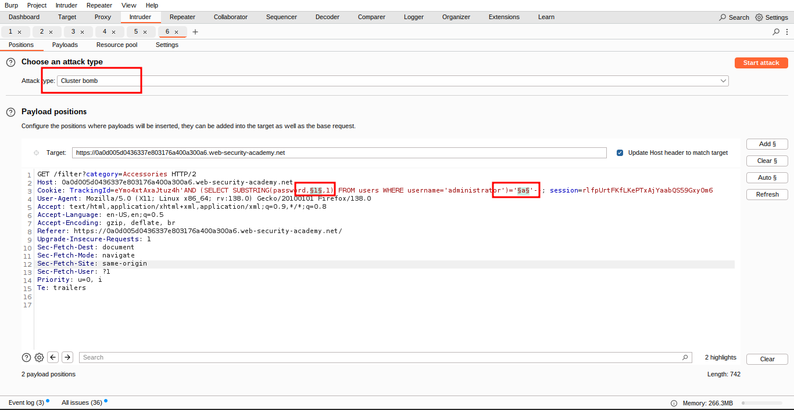

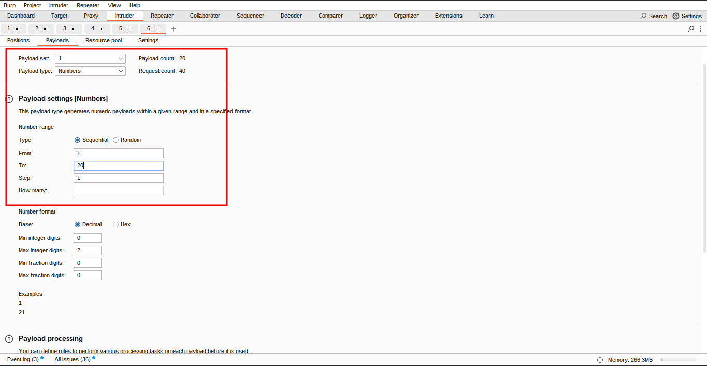

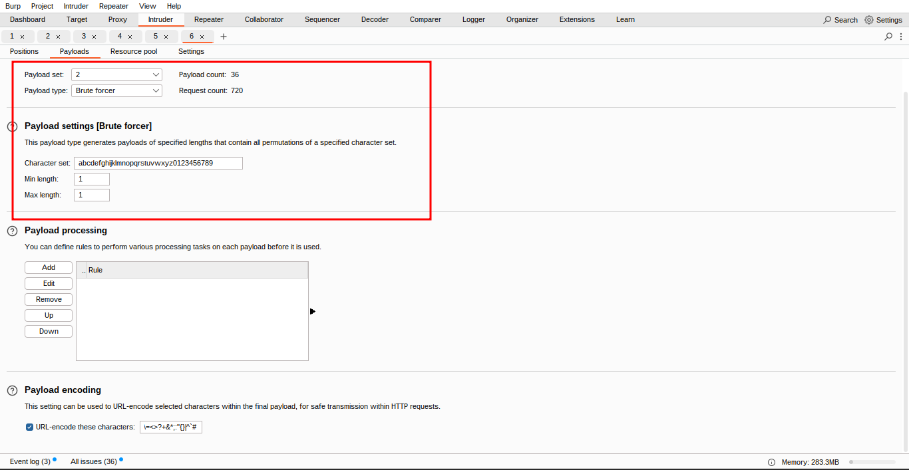

16. Launch the modified attack, review the results, and note the character at the second offset.
17. Continue this process testing offset 3, 4, and so on, until you have the whole password.

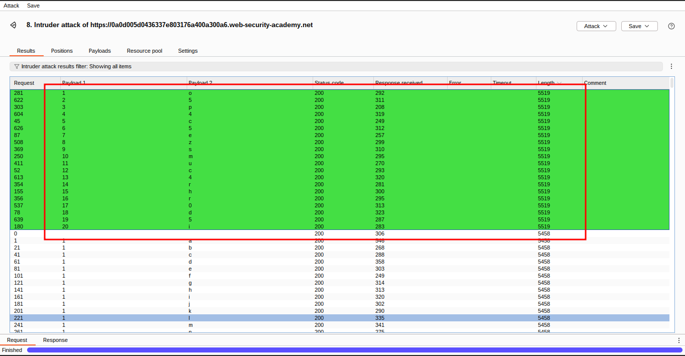

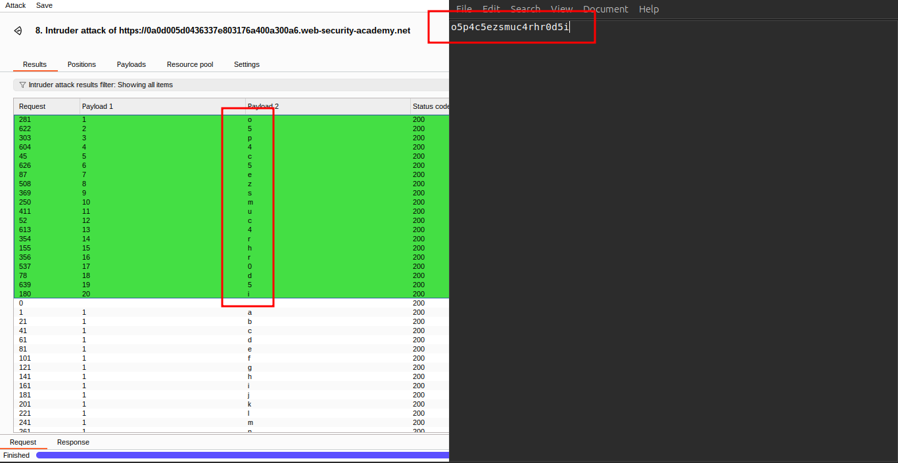

18. In the browser, click **My account** to open the login page. Use the password to log in as the `administrator` user.

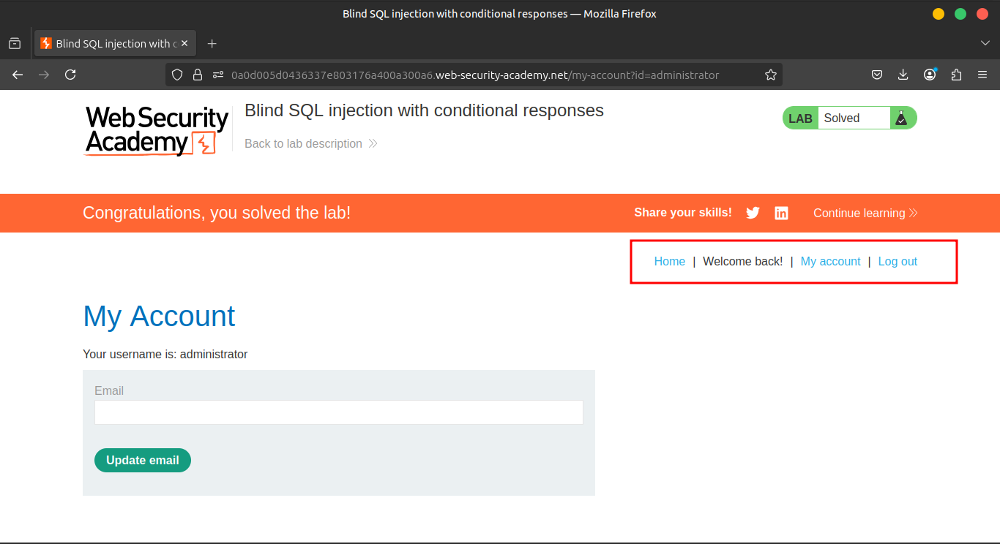

> Note
For more advanced users, the solution described here could be made more elegant in various ways. For example, instead of iterating over every character, you could perform a binary search of the character space. Or you could create a single Intruder attack with two payload positions and the cluster bomb attack type, and work through all permutations of offsets and character values.
> 

### **Community solutions**

> [https://youtu.be/W3zvXK9i75A](https://youtu.be/W3zvXK9i75A)
>
