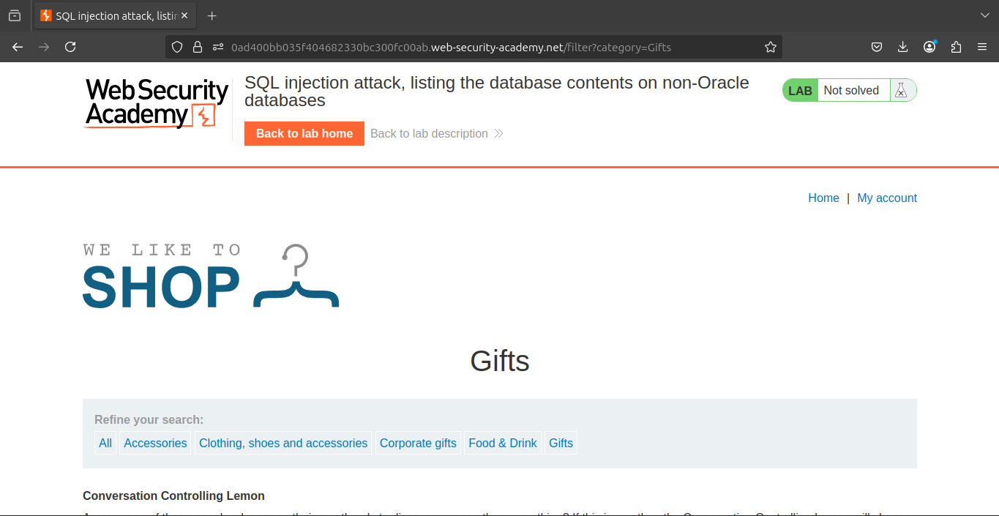
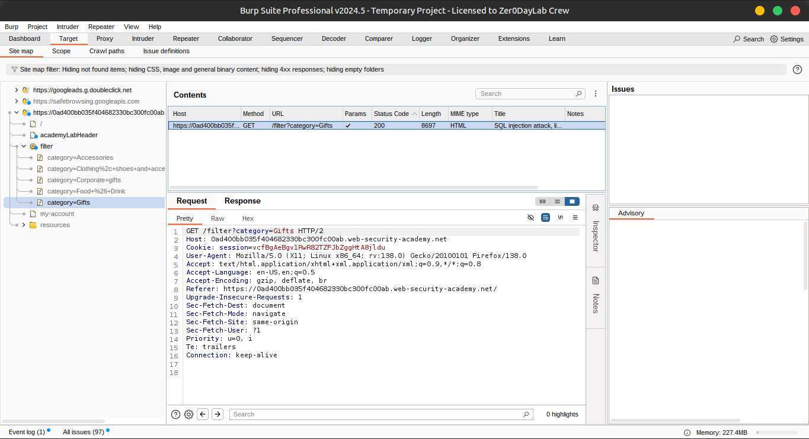
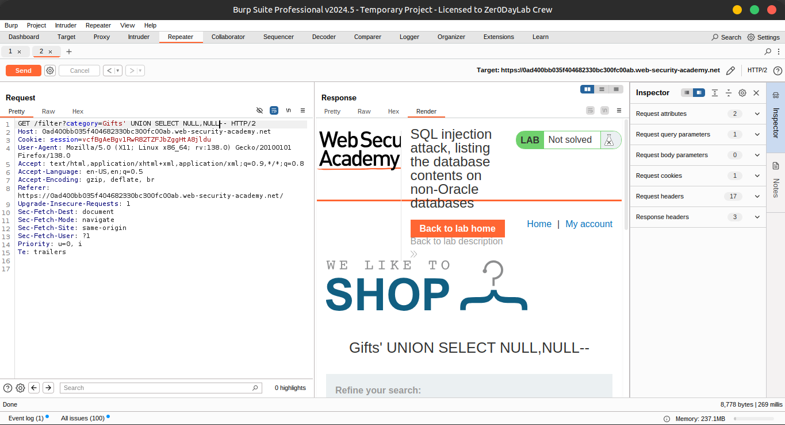
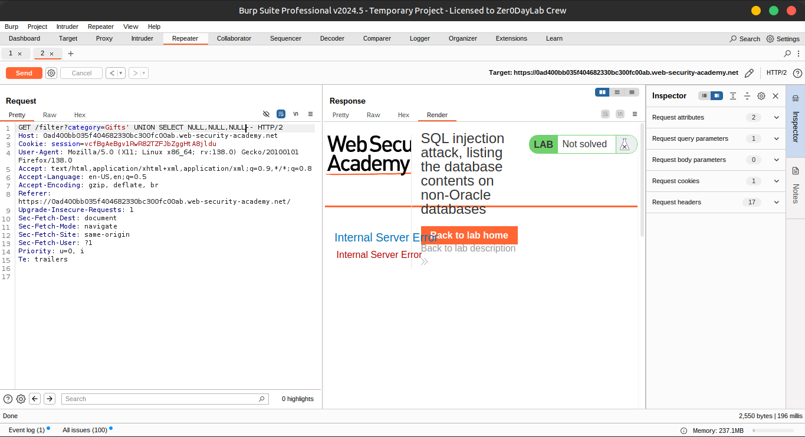
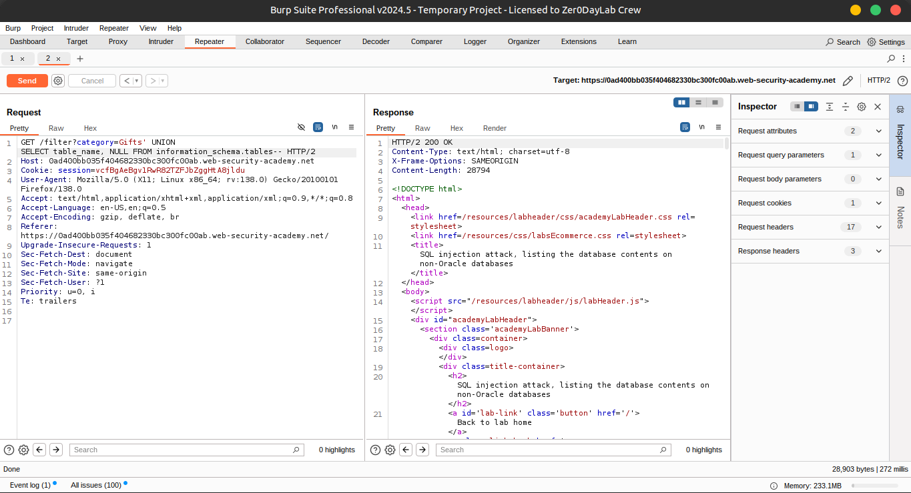
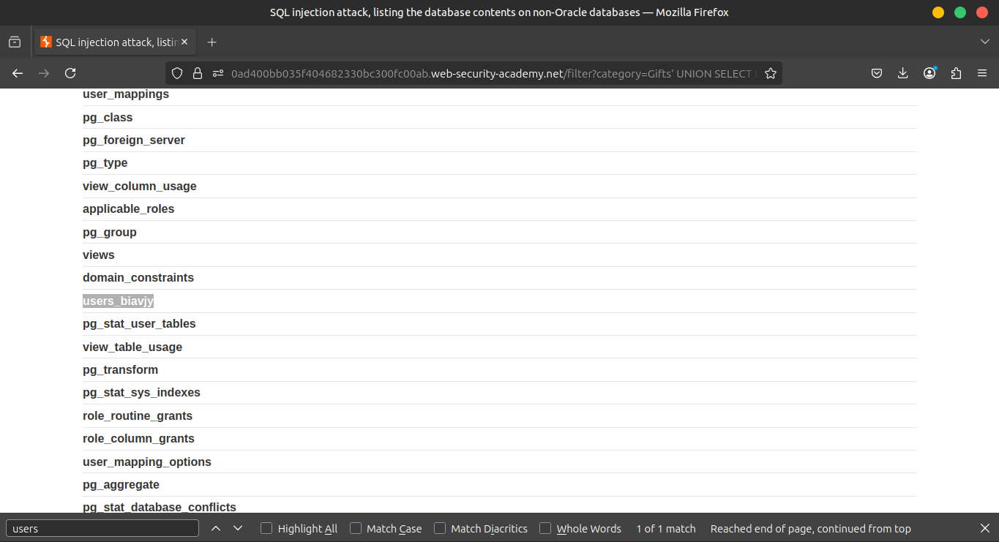
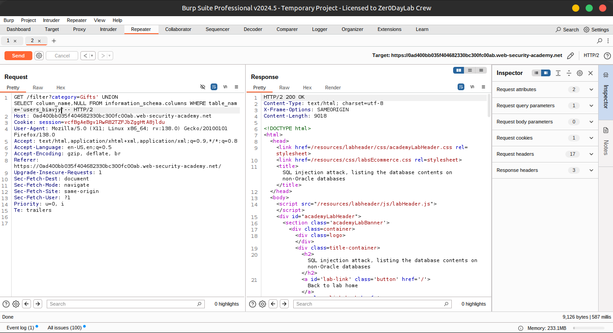
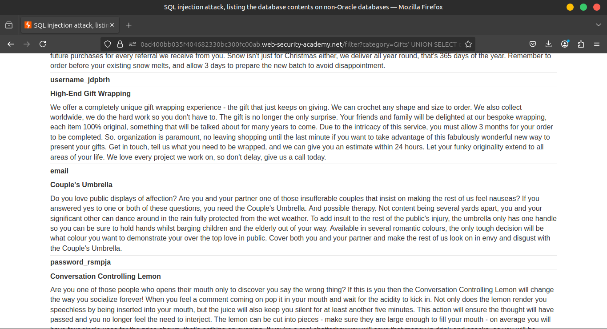
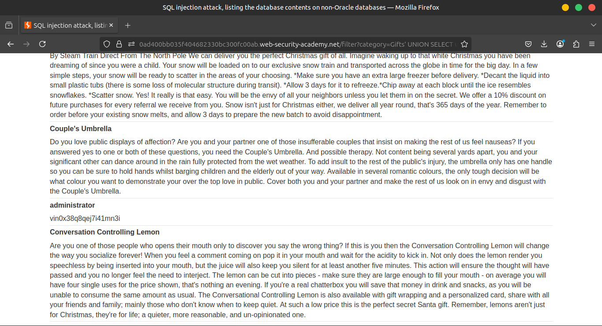
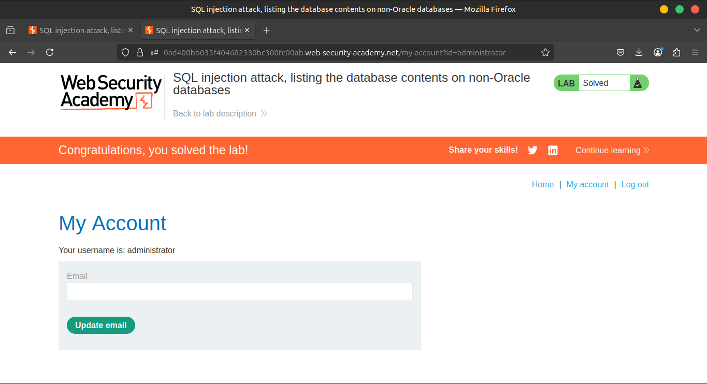

# Lab: SQL injection attack, listing the database contents on non-Oracle databases

This lab contains a SQL injection vulnerability in the product category filter. The results from the query are returned in the application's response so you can use a UNION attack to retrieve data 
from other tables.

The application has a login function, and the database contains a table that holds usernames and passwords. You need to determine the name of this table and the columns it contains, then 
retrieve the contents of the table to obtain the username and password of all users.

To solve the lab, log in as the `administrator` user.

### **Solution**

1. Use Burp Suite to intercept and modify the request that sets the product category filter.





2. Determine the number of columns that are being returned by the query and which columns contain text data. Verify that the query is returning two columns, both of which contain text, using a payload like the following in the `category` parameter:

```sql
     '+UNION+SELECT+NULL,NULL--
```





3. Use the following payload to retrieve the list of tables in the database:

```sql
     '+UNION+SELECT+table_name,+NULL+FROM+information_schema.tables--
```





4. Find the name of the table containing user credentials.                
5. Use the following payload (replacing the table name) to retrieve the details of the columns in the table:

```sql
'+UNION+SELECT++NULL+FROM+information_schema.columns+WHERE+table_name='users_abcdef'--
```





6. Find the names of the columns containing usernames and passwords.                
7. Use the following payload (replacing the table and column names) to retrieve the usernames and passwords for all users:

```sql
'+UNION+SELECT+username_abcdef,+password_abcdef+FROM+users_abcdef--
```




8. Find the password for the `administrator` user, and use it to log in.



### **Community solutions**

> [https://youtu.be/cC0_pFyvFtA](https://youtu.be/cC0_pFyvFtA)
>