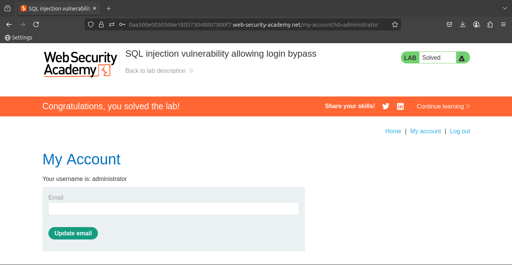

# Lab: SQL injection vulnerability allowing login bypass

This lab contains a SQL injection vulnerability in the login function.

To solve the lab, perform a SQL injection attack that logs in to the application as the `administrator` user.

### **Solution**

1. Use Burp Suite to intercept and modify the login request.
2. Modify the `username` parameter, giving it the value: `administrator'--`

### **Community solutions**

> [https://youtu.be/mS0A9e_oy8A](https://youtu.be/mS0A9e_oy8A)
>