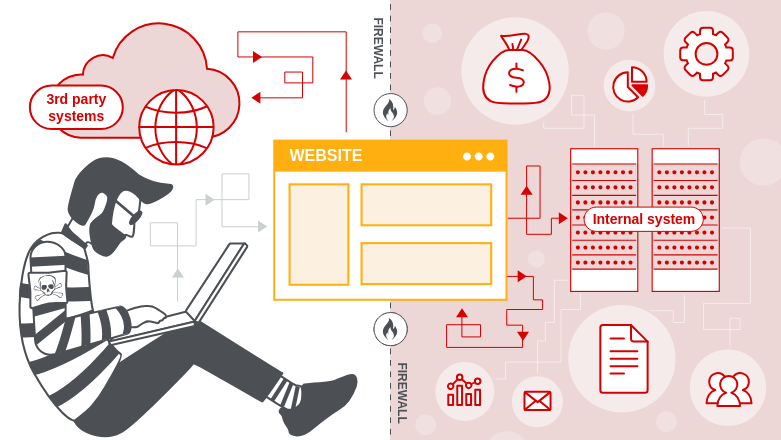

# 01. What is SSRF?

**Server-side request forgery (SSRF)** is a **web security vulnerability** that allows an attacker to make the **server-side application send requests** to **unintended locations**.

---

### 🧨 What Can Go Wrong?

In a typical SSRF attack, the attacker can:

- 🔁 **Cause the server** to connect to **internal-only services** inside the organization's infrastructure.
- 🌍 Force the server to connect to **external systems**, potentially leaking:
    - 🔑 Authorization credentials
    - 🕵️‍♂️ Sensitive data
    - 🌐 Server metadata or internal APIs

---

### 🕵️‍♂️ Impact of SSRF

- 📡 **Network pivoting** into internal systems
- 🔓 **Exposing protected resources**
- 🧵 **Enumeration of internal services**
- 🛑 **Bypassing IP-based restrictions**

---

💡 **Tip:** SSRF vulnerabilities are often found in features that fetch remote resources, like:

- 🖼️ Image URLs
- 🔍 Metadata fetchers
- 🌐 Webhooks or callbacks
- 🗂️ PDF converters or import tools

