# 02. Lab: Basic SSRF against another back-end system

### 🧪 Lab Objective

This lab has a **stock check feature** that fetches data from an internal system.

You need to:

- 🔍 **Scan the internal range `192.168.0.X`** on port `8080`
- 🎯 Locate the **admin interface**
- 🧨 Use it to **delete the user `carlos`** using an SSRF exploit

---

## 🛠️ Step-by-Step Solution

---

### 🛒 1. Intercept the Stock Check Request

- Visit any **product page**
- Click on **"Check stock"**
- In **Burp Suite**, intercept the request
- ➡️ **Send it to Intruder**
    
    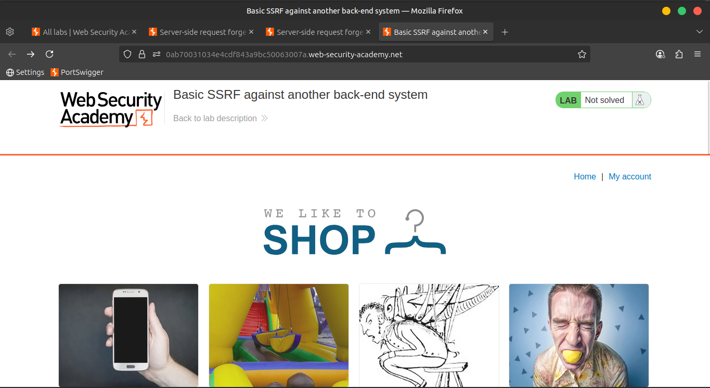
    
    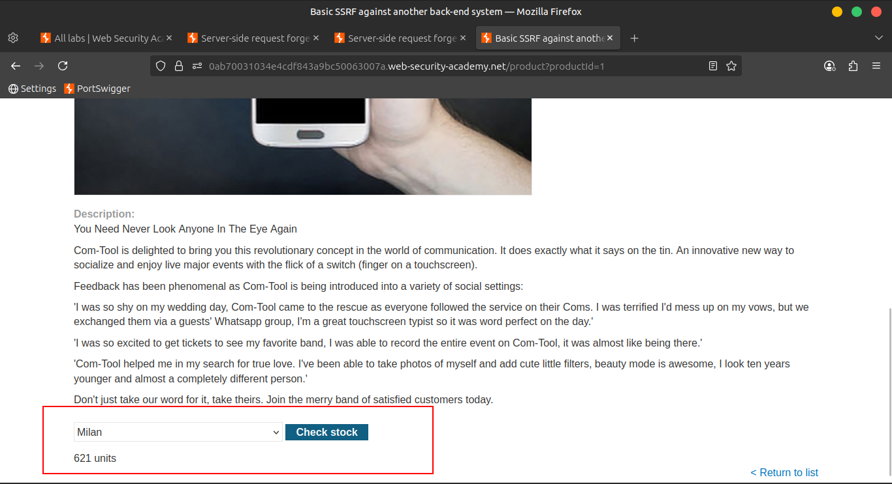
    
    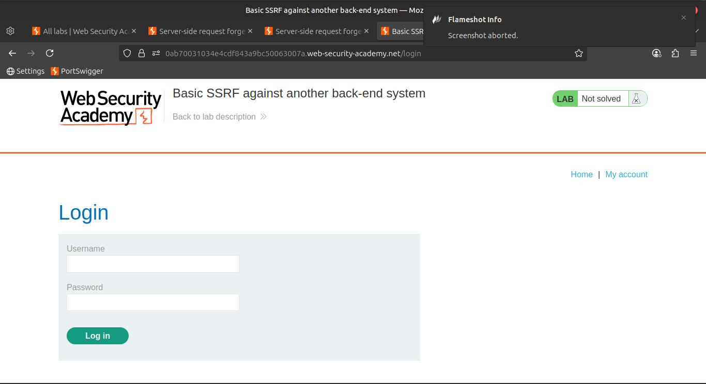
    
    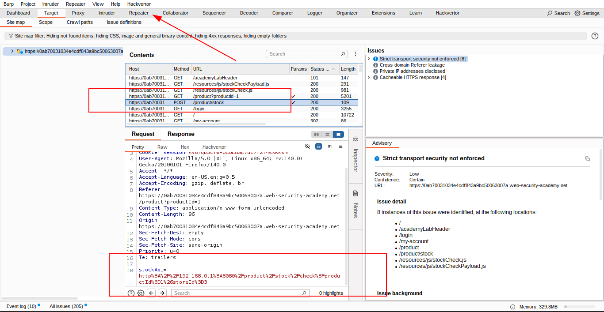
    
    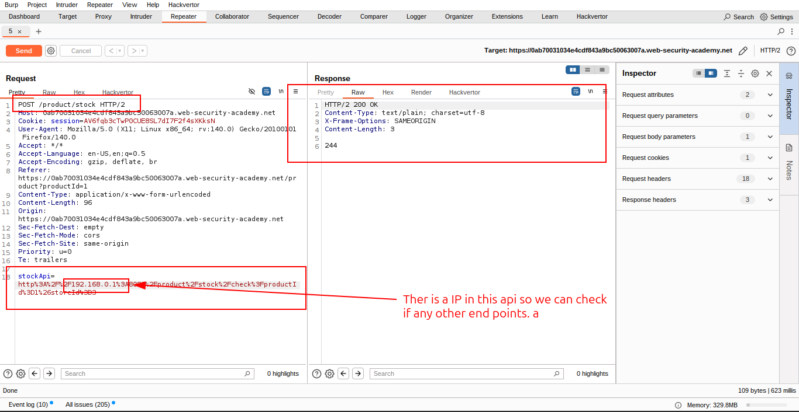
    

---

### 📡 2. Set Up the Intruder Payload

- Modify the `stockApi` parameter like this:
    
    ```
    http://192.168.0.1:8080/admin
    ```
    
- Highlight only the **last octet** of the IP (`1`) and click `Add §`

---

### 🔢 3. Configure Payloads

In the **Payloads** tab:

- Set **Payload Type** to: `Numbers`
- Configure the range:
    - **From**: `1`
    - **To**: `255`
    - **Step**: `1`
        
        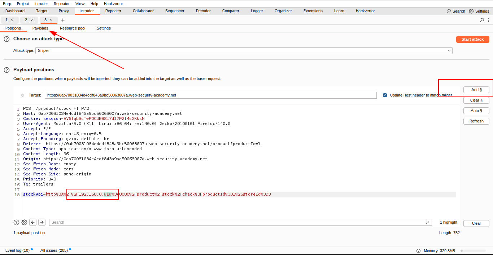
        
        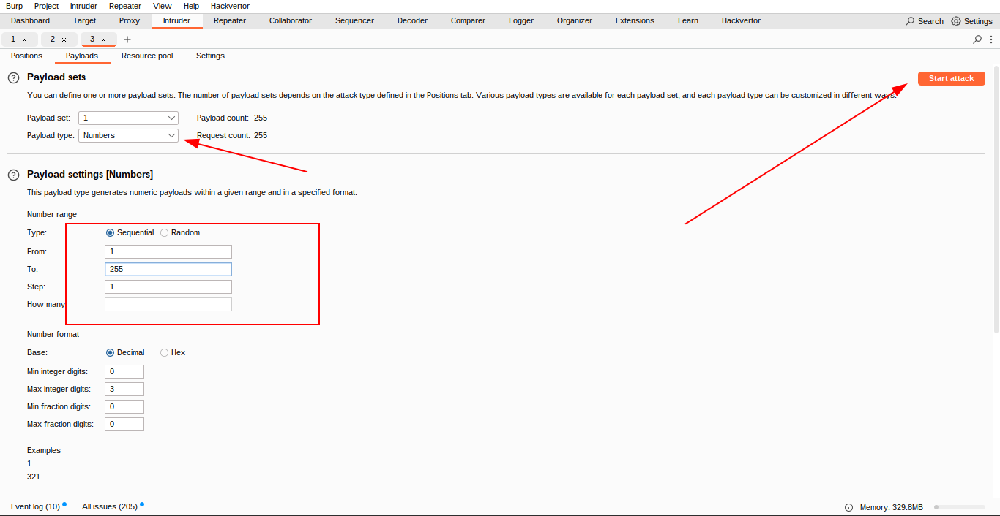
        
        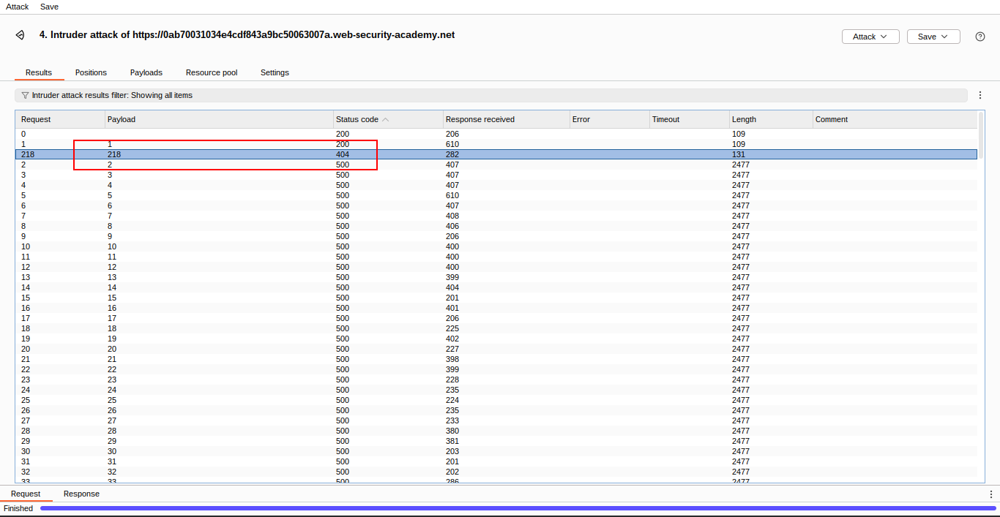
        
        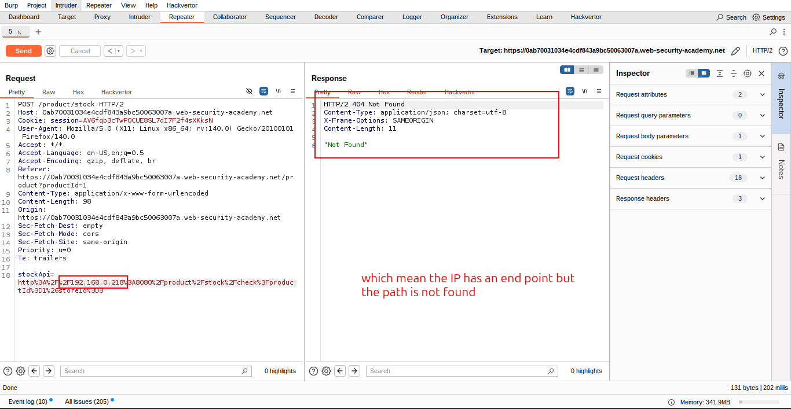
        
        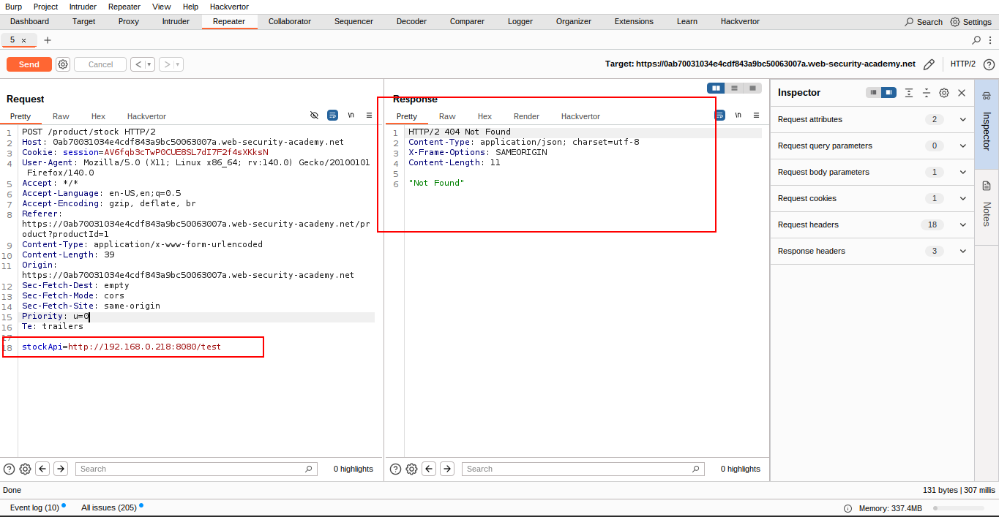
        
        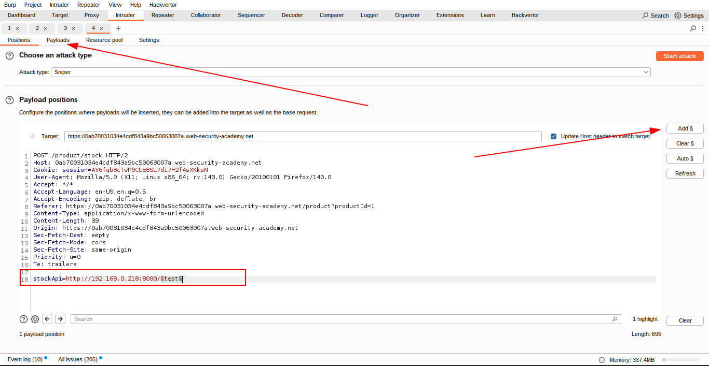
        
        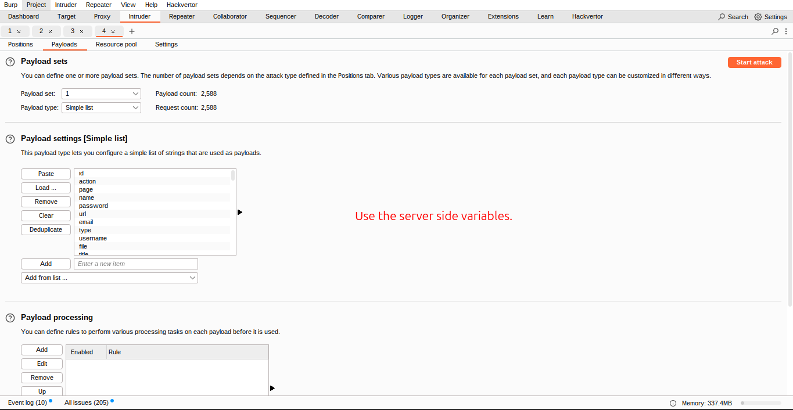
        
        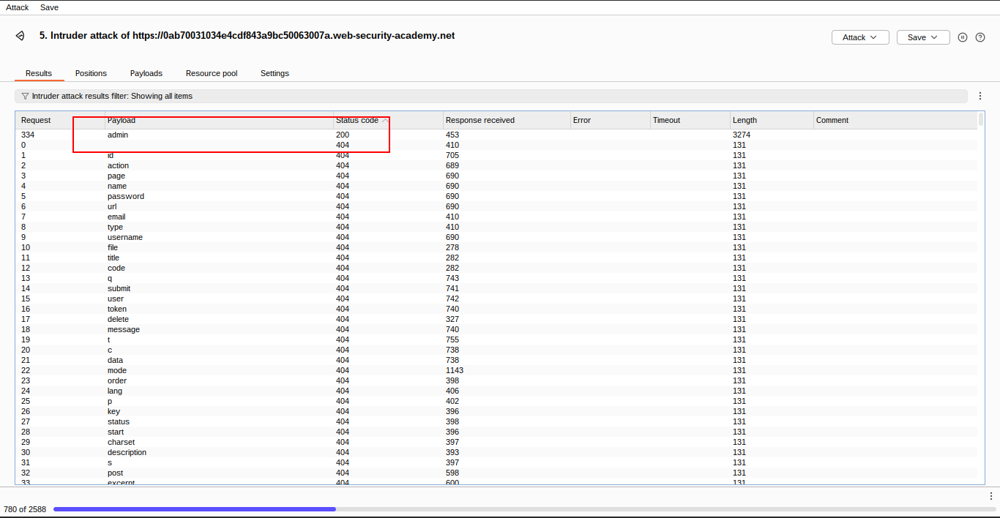
        

---

### 🚀 4. Launch the Scan

- Click **Start attack**

---

### 📊 5. Analyze the Results

- Click the **Status column** to sort results by **Status Code (ascending)**
- Look for a response with a **200 OK** — this indicates an **active admin interface**

---

### 📩 6. Send Working Request to Repeater

- Select the successful request
- 📤 **Send it to Burp Repeater**
    
    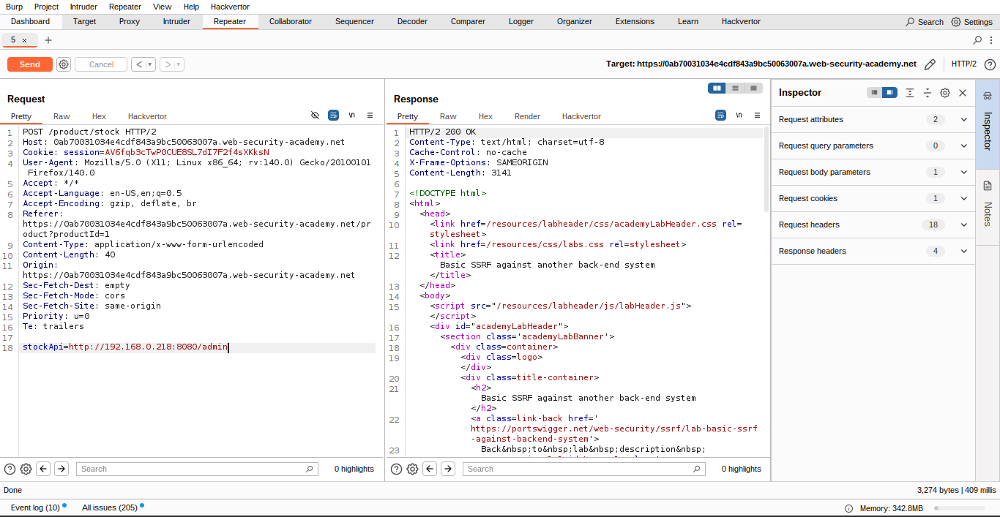
    
    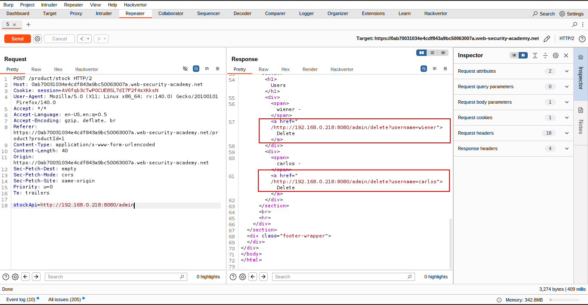
    

---

### 🧨 7. Trigger SSRF Deletion

- In Repeater, modify the `stockApi` path to:
    
    ```
    /admin/delete?username=carlos
    ```
    
- Send the request

✅ If successful, **Carlos will be deleted**, and you will **solve the lab**.

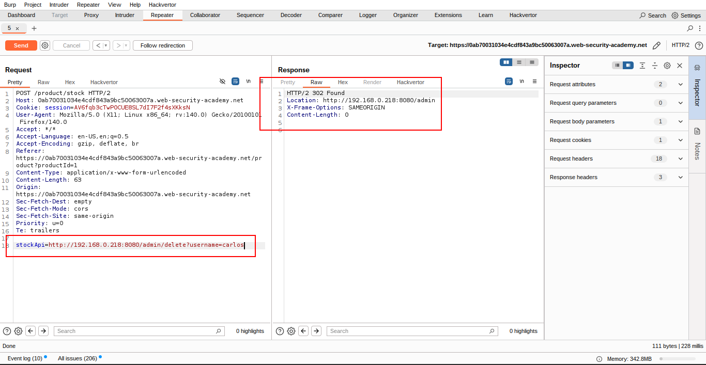

---

### 🎉 Lab Complete!

You've demonstrated:

- 🔍 Internal network scanning via SSRF
- 🧭 Enumeration of IP range
- 🧨 Exploitation of an internal admin endpoint
    
    
    

---

### 📽️ Community Walkthrough

🎬 [Watch on YouTube](https://youtu.be/Ku6CK3Aes8Y)