# 03. Lab: SSRF with blacklist-based input filter

### 🎯 Lab Objective

> This lab has a stock check feature that fetches data from an internal system.
> 

🔓 **Goal:**

Change the `stockApi` URL to access the admin interface at:

```
http://localhost/admin
```

Then, **delete the user `carlos`**.

🧱 The developer has deployed **two weak anti-SSRF defenses** that you will need to bypass.

---

## 🚀 Solution Steps

---

### 1️⃣ Visit a Product and Trigger Stock Check

- Browse to any product page.
- Click **"Check stock"**.
- 🔄 Intercept the request in **Burp Suite**.
    
    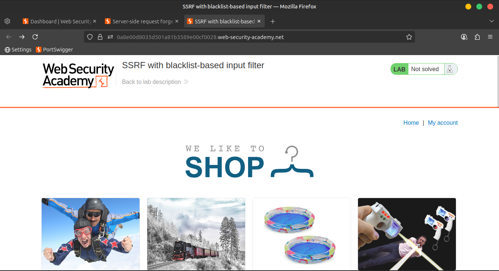
    
    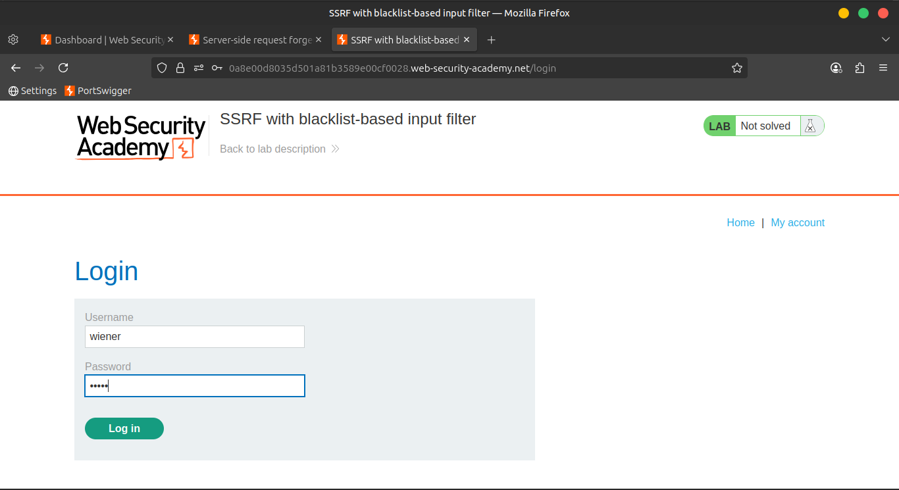
    
    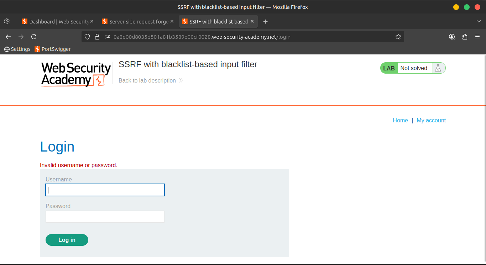
    
    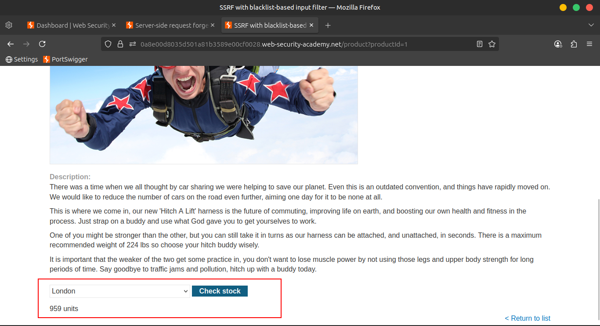
    
    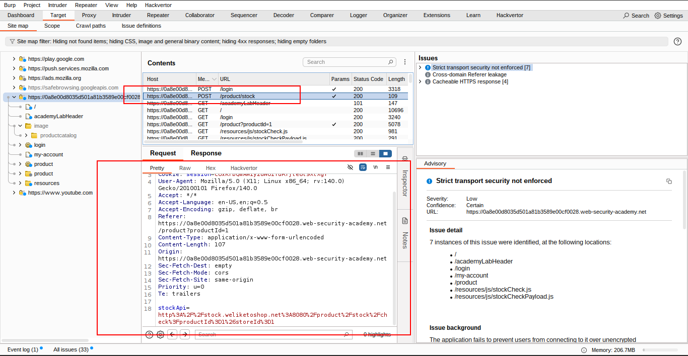
    

---

### 2️⃣ Send Request to Repeater

- In **Proxy > HTTP history**,
    
    right-click the stock check request →
    
    **Send to Repeater**
    

---

### 3️⃣ Attempt Access via `127.0.0.1`

Change the `stockApi` parameter to:

```
http://127.0.0.1/
```

🚫 **Blocked**

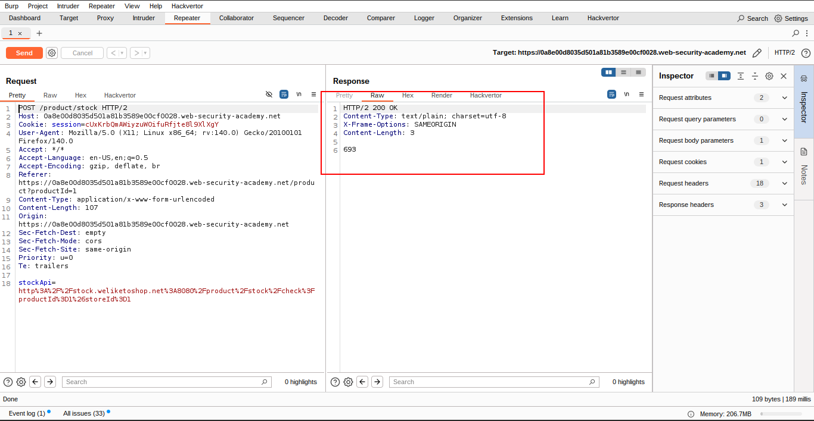

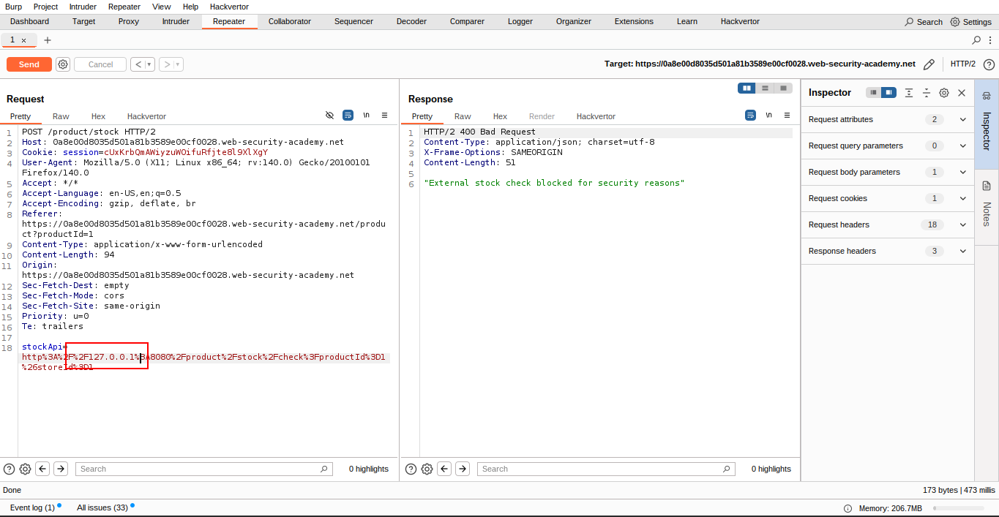

---

### 4️⃣ Bypass 127.0.0.1 Filter

Change the URL to:

```
http://127.1/
```

✅ **Bypassed**

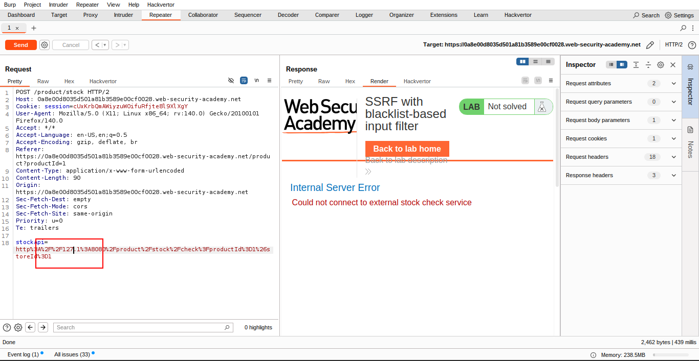

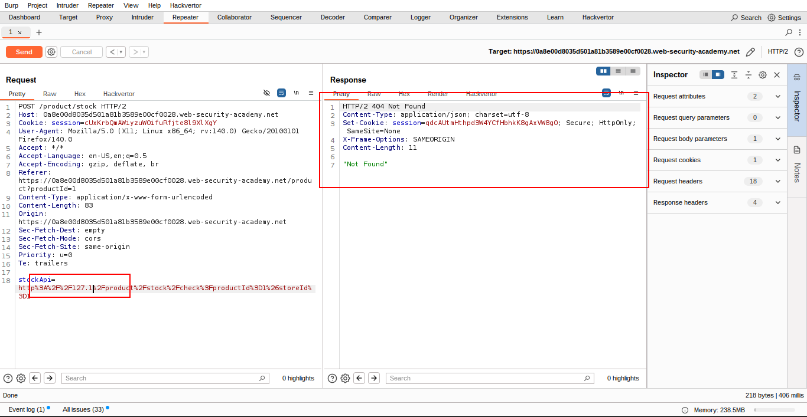

---

### 5️⃣ Attempt to Access Admin

Now try:

```
http://127.1/admin
```

🚫 **Blocked again**

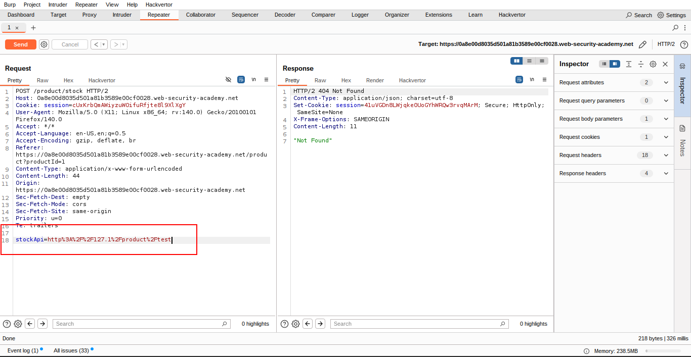

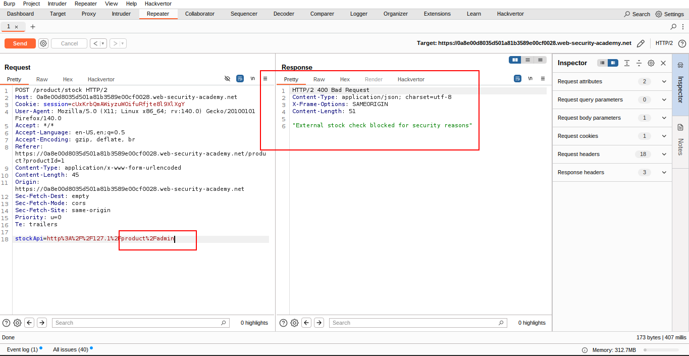

---

### 6️⃣ Double URL Encode to Bypass Filter

Obfuscate the "a" in `/admin`:

```
http://127.1/%2564dmin
```

🛠️ `%2561` = double-encoded `"a"`

✅ Successfully **access admin panel**

✅ **Delete user `carlos`** to solve the lab

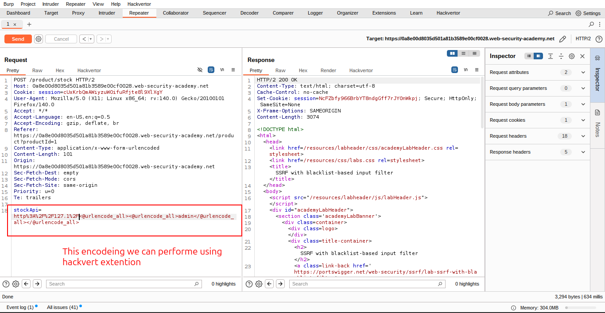

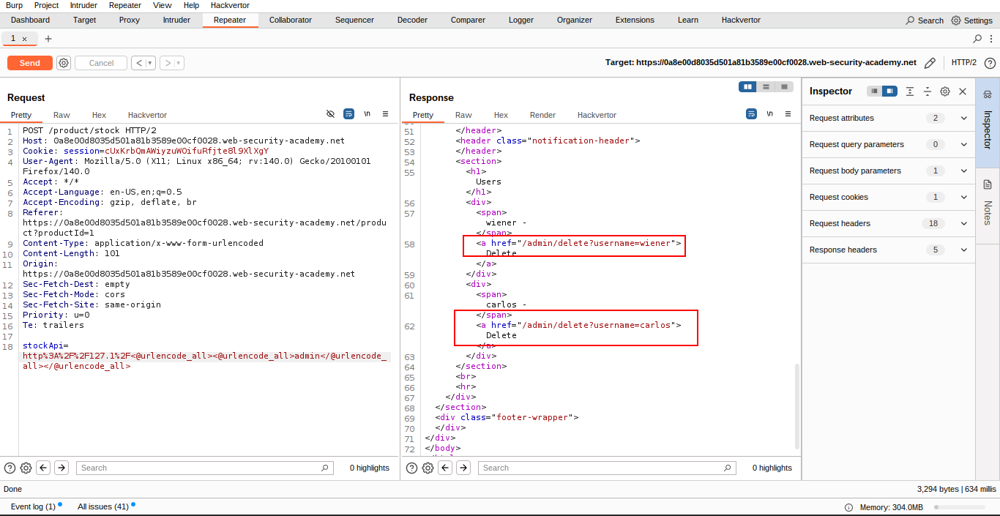

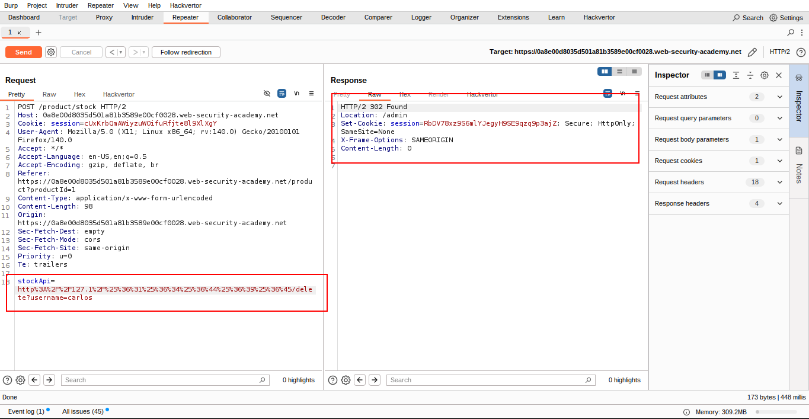

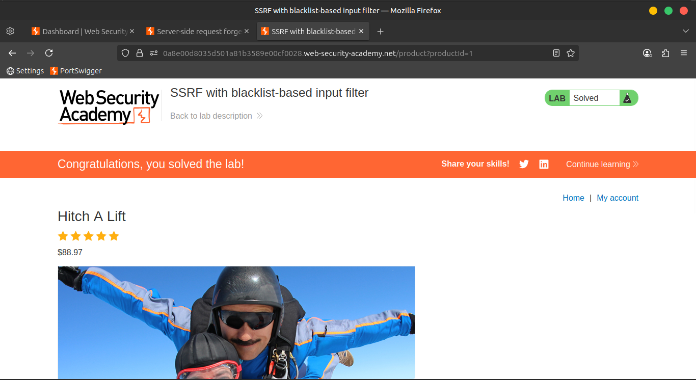

---

### 📺 Community Solutions

🎥 Watch it here: [YouTube](https://youtu.be/YGyEH3qDtWg)