# 04. Lab: SSRF with filter bypass via open redirection vulnerability

🧪 **Lab Scenario:**

This lab has a stock check feature that fetches data from an internal system.

To solve the lab, change the `stockApi` URL to access the **admin interface** at:

```
http://192.168.0.12:8080/admin
```

Then, **delete the user `carlos`**.

⚠️ The stock checker is restricted to access only the local application, so you'll need to find and exploit an **open redirect** within the application.

---

### ✅ Solution Steps

### 1️⃣ Intercept the Stock Check Request

- Visit a product page.
- Click **"Check stock"**.
- Intercept the request using **Burp Suite**.
- Send the request to **Burp Repeater**.
    
    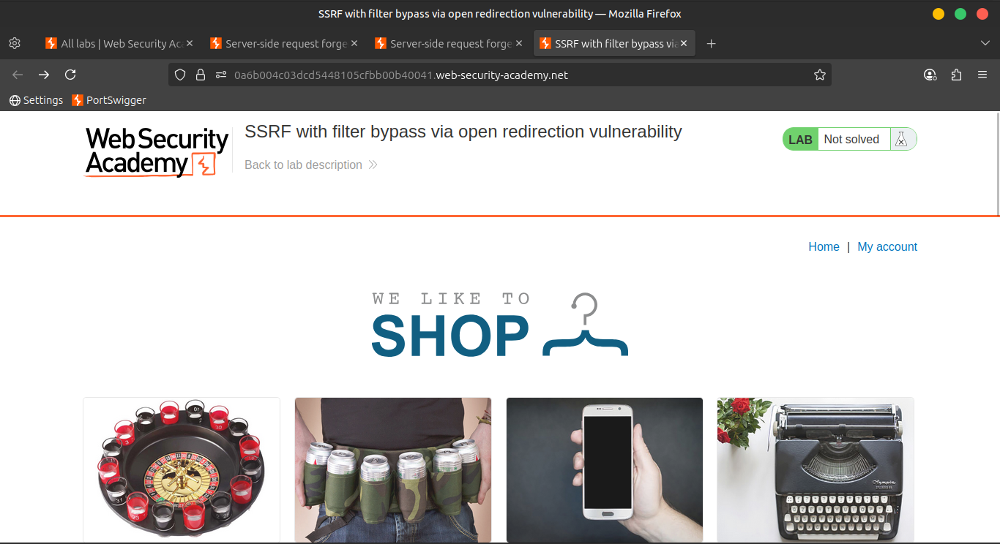
    
    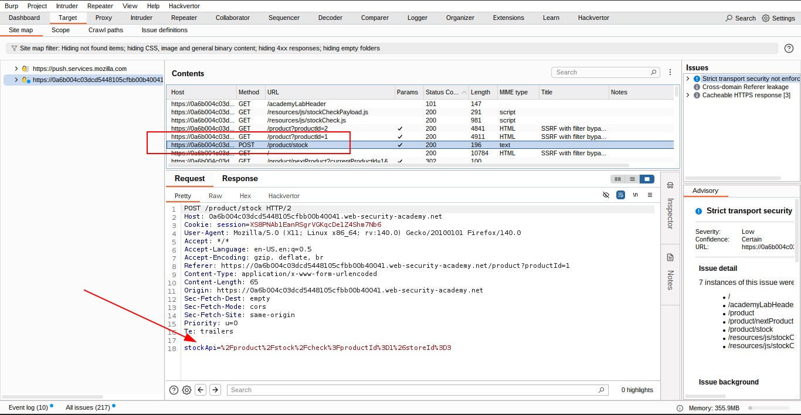
    

### 2️⃣ Test for SSRF Restrictions

- Modify the `stockApi` parameter with an external URL.
- ⚠️ Notice that the server **does not allow** direct access to external hosts.
    
    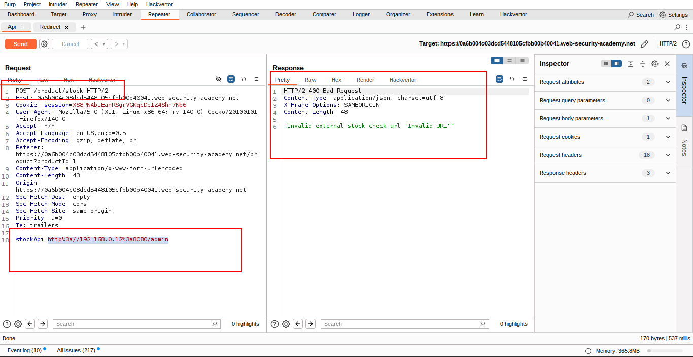
    

### 3️⃣ Discover the Open Redirect

- Click on **"next product"** in the application UI.
- Observe the `path` parameter being reflected in the `Location` header — 🟢 confirms **open redirection**.
    
    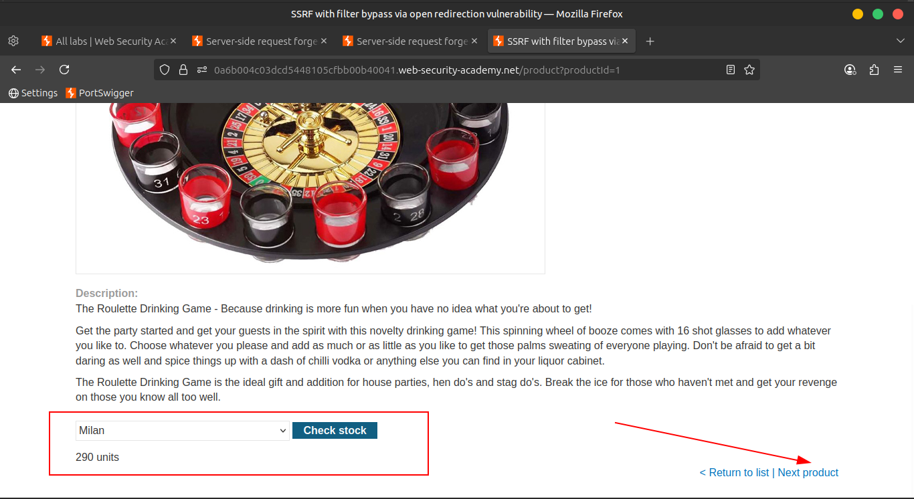
    
    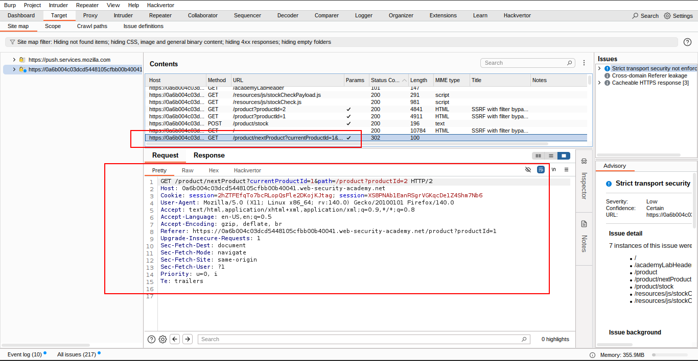
    
    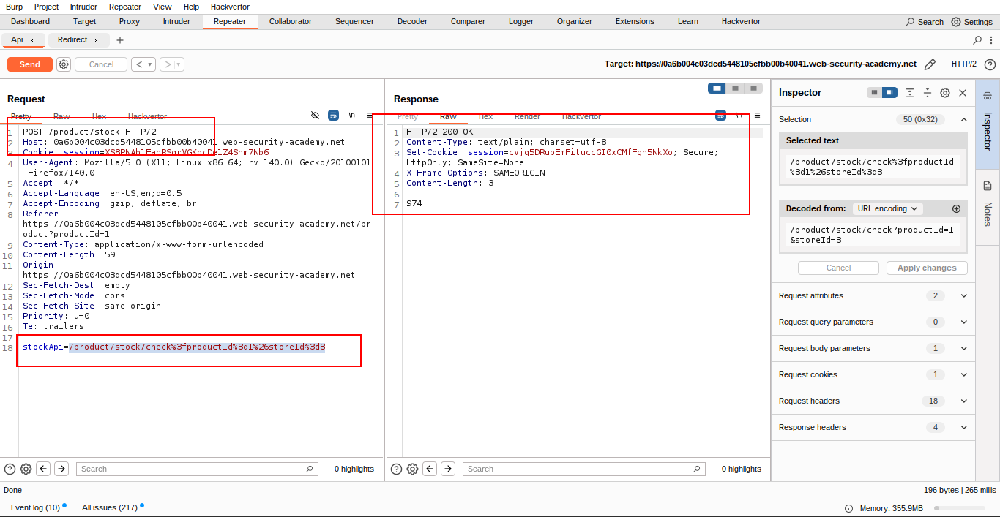
    
    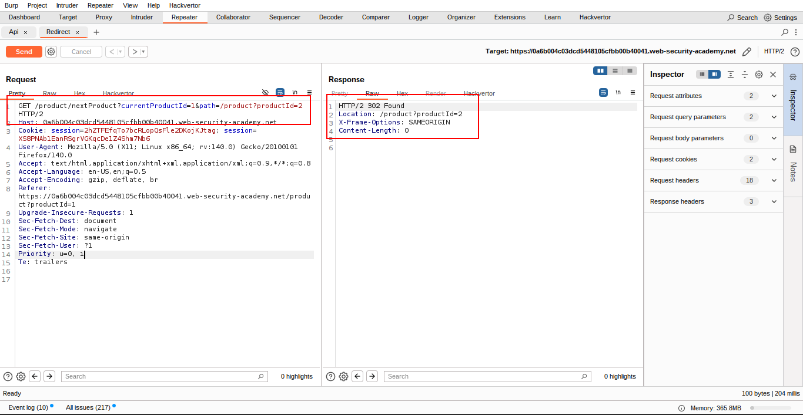
    
    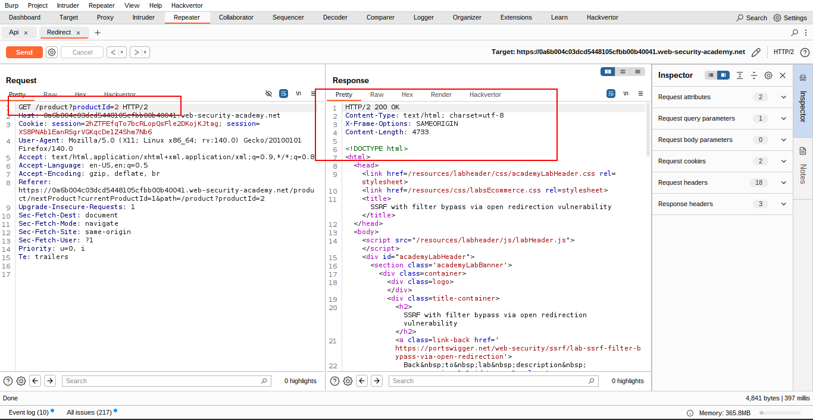
    
    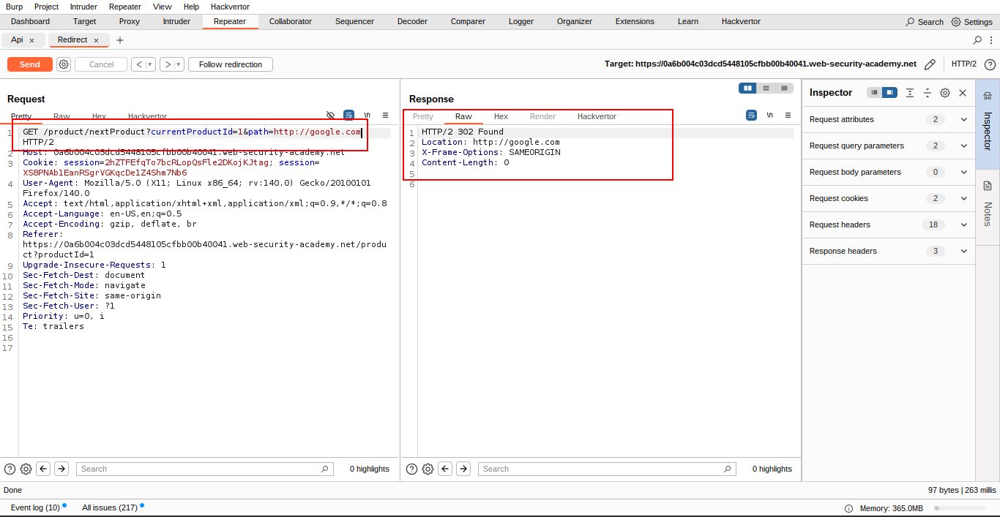
    

### 4️⃣ Exploit the Open Redirect via Stock Check

- Craft the redirect path to **point to the internal admin interface**:

```
/product/nextProduct?path=http://192.168.0.12:8080/admin
```

- Set this full path as the `stockApi` parameter in the stock check request.
- 🔄 The server follows the redirection and displays the **admin page**.
    
    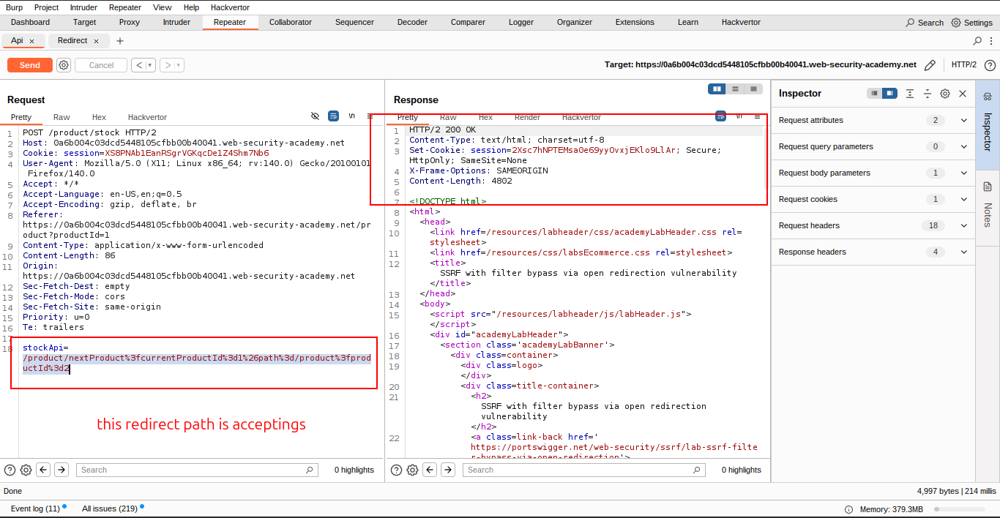
    
    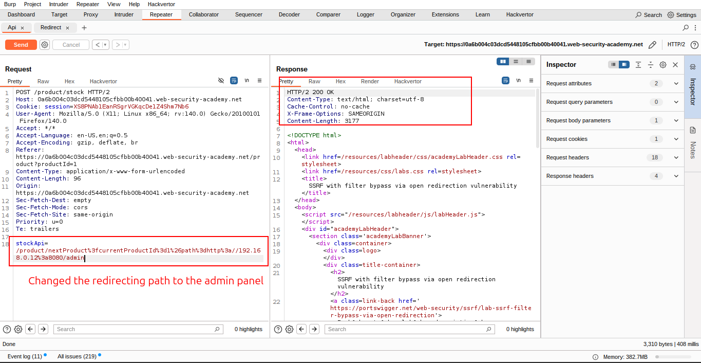
    
    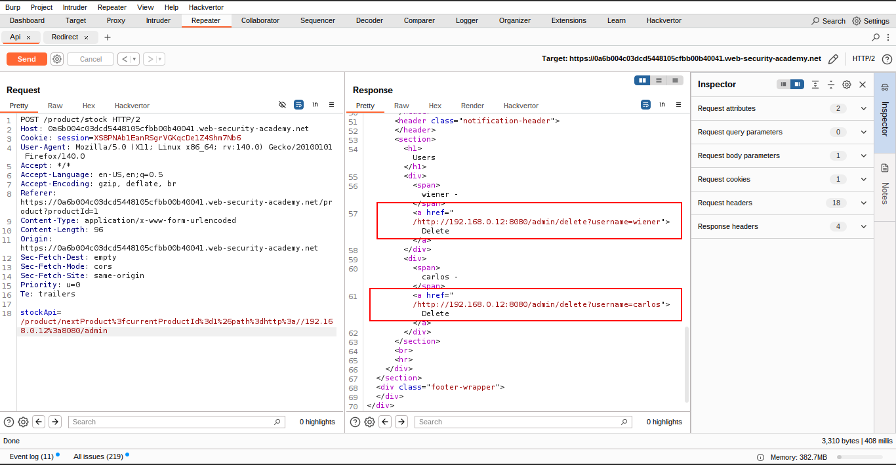
    

### 5️⃣ Delete the Target User

- Amend the URL to perform the deletion:

```
/product/nextProduct?path=http://192.168.0.12:8080/admin/delete?username=carlos
```

- Submit this in the `stockApi` parameter.
- ✅ The server follows the redirect and deletes the user **`carlos`**.
    
    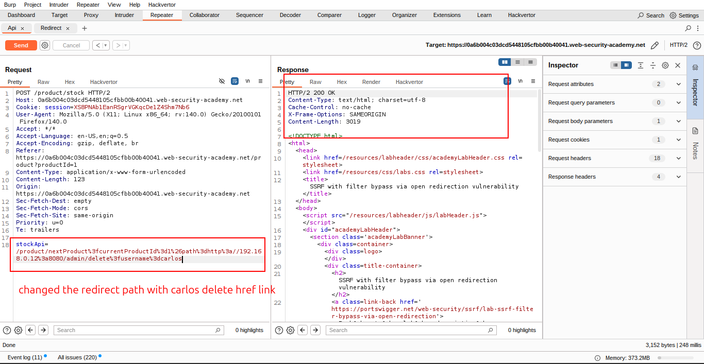
    
    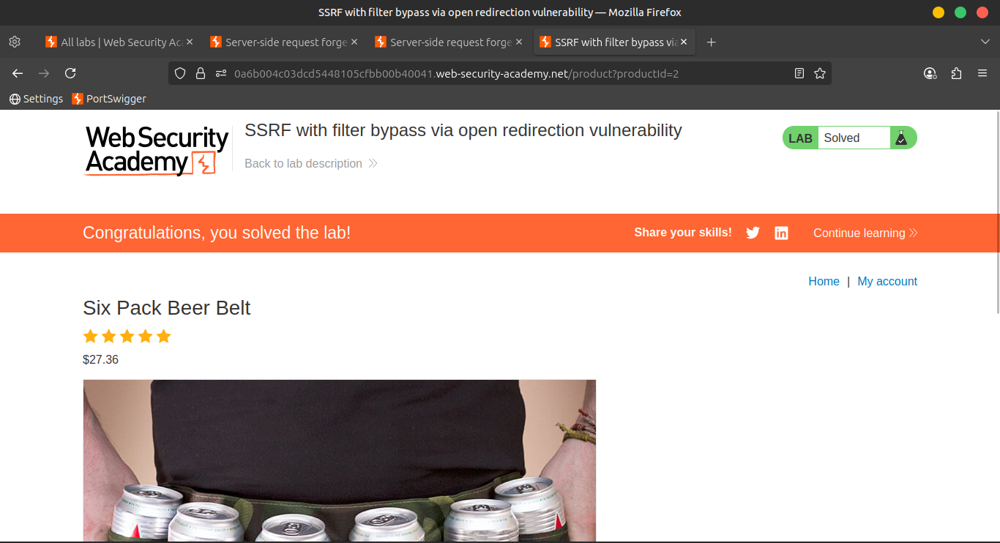
    

---

📹 **Community Solution Video**

> 📺Watch it in action: [YouTube](https://youtu.be/iF1BPVTqM10)
>