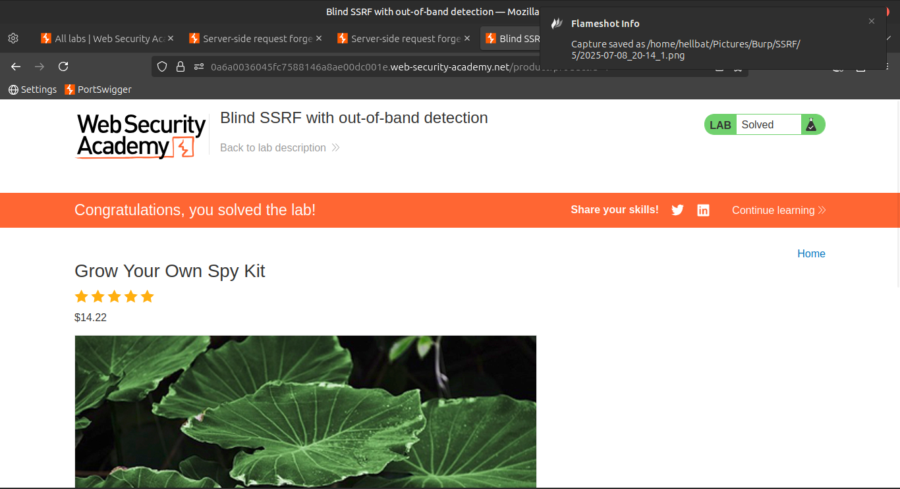

# 05. Lab: Blind SSRF with out-of-band detection

### *(Using Analytics Software for Callback Detection)*

📘 **Lab Scenario:**

This site uses **analytics software** which fetches the URL specified in the **`Referer`** header when a **product page is loaded**.

🛠️ **Goal:**

Use this functionality to cause an **HTTP request to the public Burp Collaborator server**.

> ⚠️ Note:
> 
> 
> To prevent abuse of the Academy platform, firewall rules block interactions with arbitrary external systems.
> 
> To solve the lab, you **must use Burp Collaborator's default public server**.
> 

---

### ✅ Step-by-Step Solution

### 1️⃣ Intercept a Product Request

- Visit any product page on the site.
- Intercept the request using **Burp Suite's Proxy**.
- **Send the request to Repeater**.
    
    
    
    
    
    
    
    
    

### 2️⃣ Modify the `Referer` Header

- In the **Repeater tab**, locate the `Referer` header.
- Right-click on the `Referer` value →
    
    🧩 Select **"Insert Collaborator Payload"**.
    
    This replaces the domain with a **Burp Collaborator-generated domain**.
    
    
    
    
    

### 3️⃣ Send the Request

- Click **Send** to make the request with the modified `Referer` header.

### 4️⃣ Monitor Collaborator

- Go to the **Burp Collaborator** tab.
- Click **"Poll now"** to fetch any interactions.

> 🕒 Note:
> 
> 
> If you don’t see any results immediately, wait a few seconds and click **Poll now** again.
> 
> The analytics software may **fetch the Referer URL asynchronously**.
> 

### 5️⃣ Confirm the SSRF Trigger

- You should see **DNS and HTTP interactions** initiated by the application.
- ✅ This confirms that your Referer injection worked — **Lab Solved!**
    
    
    

---

📹 **Community Solution**

> 🎥 Watch the walkthrough: [YouTube](https://youtu.be/GAQFQhdrM1M)
>